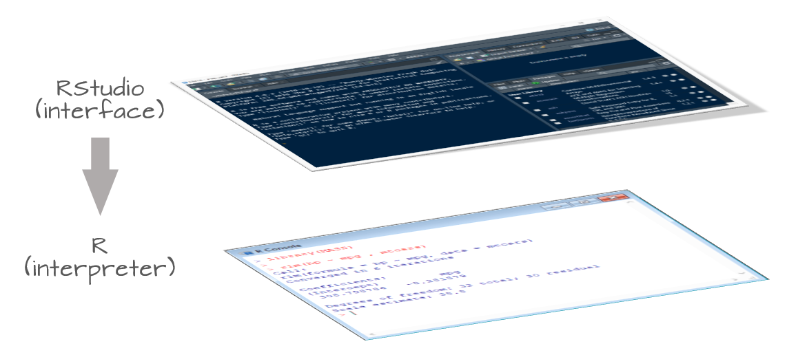

```{r echo=FALSE}
source("libs/Common.R")
```

R and RStudio are two distinctly different applications that serve different purposes. **R**[^1] is the software that performs the actual instructions. It's the workhorse. Without R installed on your computer or server, you would not be able to run any commands.

[^1]: R Core Team (2020). R: A language and environment for statistical computing. R Foundation for Statistical Computing, Vienna, Austria. URL <https://www.R-project.org/>

**RStudio**[^2] is a software that provides an nifty interface to R. It's sometimes referred to as an Integrated Development Environment (IDE). Its purpose is to provide bells and whistles that can improve your experience with the R software.

[^2]: RStudio Team (2021). RStudio: Integrated Development for R. RStudio, PBC, Boston, MA URL <http://www.rstudio.com/>.



RStudio comes in two flavors:

-   A desktop application that installs directly on your computer;

-   A server application that is accessible via a web browser.

Both platforms offer nearly identical experiences. The former runs on top of R installed on your computers, the latter runs off of an instance of R running on a remote server.

# Do I need RStudio to interface with R?

The answer is *No*! Many new users to the R environment conflate R with RStudio. R has been around for decades, long before RStudio was developed. In fact, when you install R on your Windows or Mac computer, you are offered a perfectly functional barebones IDE for R.

{width="301"}

R can even be run in a shell environment like Linux:

{width="286"}

Note that while you do not need RStudio to run R on your computer, the reverse cannot be said. In other words, RStudio is not functional without an installation of R. You therefore need to install R regardless of whether or not you use RStudio.

# Which software do I cite?

You will normally cite R and not RStudio since RStudio does not contribute to the execution of the code (i.e. an R script will run independently of the version of RStudio or of any other IDE used to interface with R).

You can access citation information for R via:

```{r}
citation()
```
