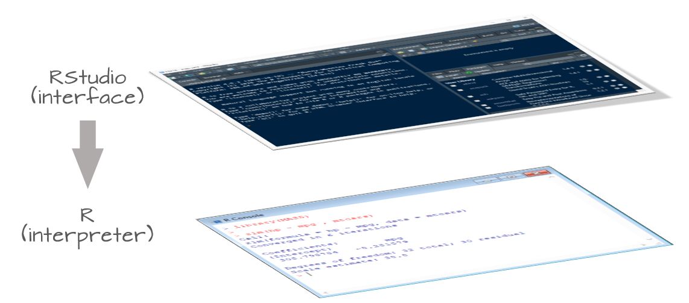
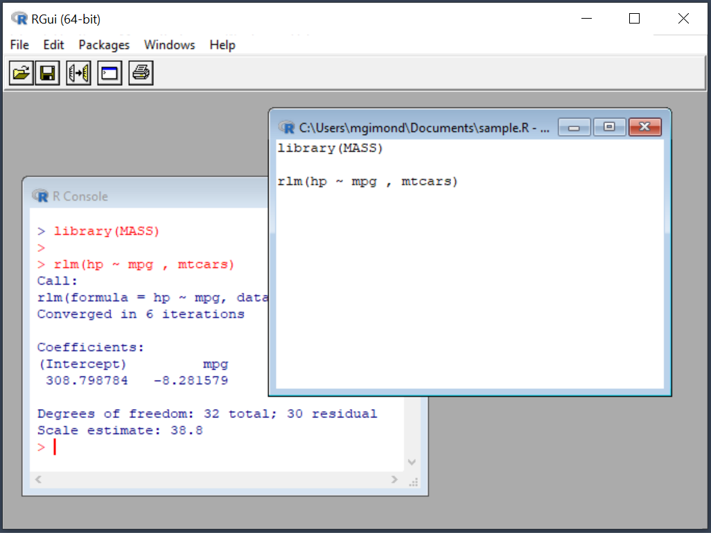
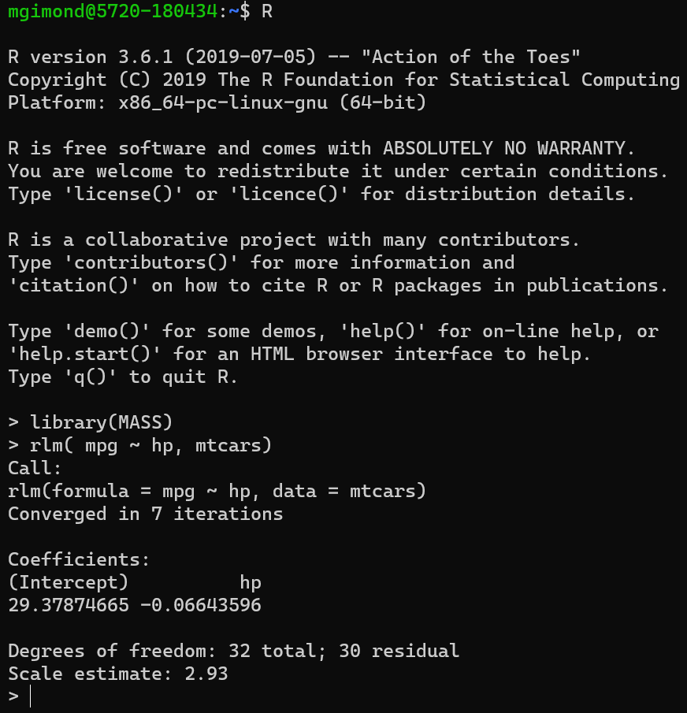
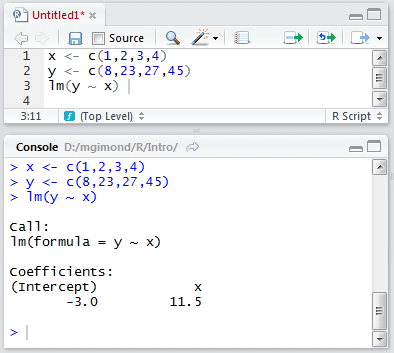
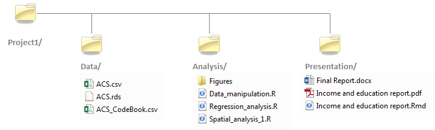
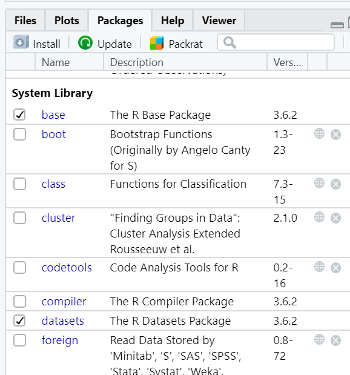
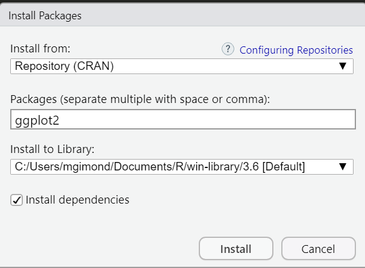

# The R and RStudio Environments

```{r echo=FALSE}
source("libs/Common.R")
```

## R vs RStudio

**R**[^1] and **RStudio**[^2] are  are two distinct applications that serve different purposes. R is the core software that executes commands and performs computations. It's the workhorse. Without R installed on your computer or server, you wouldn't be able to run any commands.

[^1]: R Core Team (2020). R: A language and environment for statistical computing. R Foundation for Statistical Computing, Vienna, Austria. URL <https://www.R-project.org/>

RStudio, on the other hand, is an Integrated Development Environment (IDE) designed to enhance your experience with R. It provides a user-friendly interface with features like syntax highlighting, debugging tools, and visualization capabilities—making R more accessible and efficient to use.

[^2]: RStudio Team (2021). RStudio: Integrated Development for R. RStudio, PBC, Boston, MA URL <http://www.rstudio.com/>.



RStudio comes in two flavors:

+  A desktop application that installs directly on your computer;
+  A server application that is accessible via a web browser.

Both platforms offer nearly identical experiences. The former runs on top of R installed on your computer, the latter runs off of an instance of R running on a remote server.

### Do I need RStudio to interface with R?

The answer is *No*! Many new users to the R environment conflate R with RStudio. R has been around for decades, long before RStudio was developed. In fact, when you install R on your Windows or Mac computer, you are offered a perfectly functional barebones IDE for R.

{width="301"}

R can even be run in a shell environment like Linux:

{width="286"}

Note that while you do not need RStudio to run R on your computer, the reverse cannot be said. In other words, RStudio is not functional without an installation of R. You therefore need to install R regardless of whether or not you use RStudio.

### Which software do I cite?

You will normally cite R and not RStudio since RStudio does not contribute to the execution of the code (i.e. an R script will run independently of the version of RStudio or of any other IDE used to interface with R).

You can access citation information for R via:

```{r}
citation()
```


## Command line vs. script file

### Command line

R can be run from a *R console* or *RStudio* command line environment. For example, we can assign four numbers to the object `x` then have R read out the values stored in `x`:

```{r}
x <- c(1,2,3,4)
x
```


### R script files

If you intend on typing more than a few lines of code in a command prompt environment, or if you wish to save a series of commands as part of a project's analysis, it is probably best that you write and store the commands in an R script file. Such a file is usually saved with a `.R` extension. 

In RStudio, you can run a line of code in a R script file by placing a cursor anywhere on that line (while being careful not to highlight any subset of that line) and pressing the shortcut keys `Ctrl+Enter` on a Windows keyboard or `Command+Enter` on a Mac.

You can also run an entire block of code by selecting all lines to be run, then pressing the shortcut keys `Ctrl+Enter`/`Command+Enter`. Alternatively, you can run the entire R script by pressing `Ctrl+Alt+R` in Windows or `Command+Option+R` on a Mac. 

In the following example, the R script file has three lines of code: two assignment operations and one regression analysis. The lines are run one at a time using the `Ctrl+Enter` keys and the output is displayed in the console window.



## The assignment operator `<-`

When assigning values or output from operations to a variable, the **assignment operator**, `<-`, is placed between the variable name and the value(s) being assigned to that variable. In the preceding example, the values `1,2,3,4` were being assigned to `x`. The assignment operator is constructed by combining the *less then* character, `<`, with the *dash* character, `-`. Given that the assignment operator will be used frequently in an R script, it may be worthwhile to learn its shortcut: `Alt`+`-` on **Windows** and `Option` + `-` on a **Mac**.

Note that, in most cases, you can also use the `=` to assign values as in:

```{}
x = c(1,2,3,4)
```

However, this option is not widely adopted in the R community.  An advantage in using `<-` instead of `=` is in readability. The `<-` operator makes it easier to spot assignments during a quick visual scan of an R script, more so than the `=` operator which is also used in functions when assigning parameters to function variables aas in,

```{}
M <- lm(y ~ x, data = dat, weights = wt)  
```
  
The alternative would be:

```{}
M = lm(y ~ x, data = dat, weights = wt)   
```

Notice how the assignment of `M` does not stand out as well in the second example given the recurrence of `=` on the same line of code (unless, of course, you benefit from colored syntax).


## Understanding directory structures

Because a data file may reside in a different directory than that which houses the R script calling it, you need to explicitly instruct R on *how* to access that file from the R session's *working directory*.

In the example that follows, user Jdoe has a project folder called `Project1` in which resides a `./Data` folder and an `./Analysis` folder.



He opens the R script called `Data_manipulation.R` located in the `Analysis` folder. The script contains the following line of code:

```{r eval=FALSE}
dat <- read.csv("ACS.csv")
```

He executes that line of code and R returns the following error message:

```{r echo=FALSE, error=TRUE}
dat <- read.csv("ACS.csv")
```

The error message states that the file *ACS.csv* cannot be found. This is because the session's working directory is probably set to a directory other than the `D:/Jdoe/Project1/Data` directory which houses the data file. An R session's working directory can be verified by typing the following command:

```{r eval=FALSE}
getwd()
```

`[1] "D:/jdoe/Project1/Analysis"`

The working directory is used to instruct R where to look for a file (or where to create one) *if* the directory path is not explicitly defined. So, in the above example, user Jdoe is asking R to open the file *ACS.csv* without explicitly telling R in which directory to look, so R is defaulting to the current working directory which is `D:/jdoe/Project1/Analysis`.

There are two options to resolving this problem. The first is to set the working directory to the folder that contains the ACS.csv file using the `setwd()` function.

```{r eval=FALSE}
setwd("D:/Jdoe/Project1/Data")
```

The second is to modify the `read.csv` call by specifying the path to the *ACS.csv* file.

```{r eval=FALSE}
dat <- read.csv("D:/Jdoe/Project1/Data/ACS.csv")
```

However, this approach makes it difficult to share the project folder with someone else who may choose to place the project folder under a different folder such as C:\\User\\John\\Documents\\Project1\\. In such a scenario, the user would need to modify every R script that references the directory D:\\Jdoe\\Project1\\. A better solution is to specify the location of the data folder *relative* to the location of the *Analysis* folder such as,

```{r eval=FALSE}
dat <- read.csv("../Data/ACS.csv")
```

The two dots, `..`, tells R to move *up* the directory hierarchy relative to the current working directory. In our working example,  `../` tells R to move out of the `Analysis/` folder and up into the `Project1/` folder. The relative path `../Data/ACS.csv` tells R to move out of the `Analysis/` directory and over into the `Data/` directory before attempting to read the contents of the `ACS.csv` data file.

Using *relative paths* makes your project folder independent of the full directory structure in which it resides thus facilitating the reproducibility of your work on a different computer or a different root directory environment. This assumes, of course, that the user will set the working directory to the project folder location.

## Packages

One of R's attractive features is its rich collection of packages that facilitate collaborative research by enabling the sharing of functions, data, and methodologies among scientists and researchers. While some packages are pre-installed with R, many others can be easily accessed and installed from repositories like [CRAN](https://cran.r-project.org/), [GitHub](https://github.com/), or even individual websites.

### Base packages
R comes installed with a set of default packages. A snapshot of a subset of the installed base packages is shown below:



## Installing packages from CRAN

Many packages can be installed from the CRAN repository. To install a CRAN package from within RStudio, click on the *Packages* tab, select *Install* and choose *Repository (CRAN)* as the source location. In the following example, the library *ggplot2* is installed from CRAN.




Package installation from CRAN's repository can also be accomplished by typing the following line of code in a console:

```{r eval=FALSE}
install.packages("ggplot2")
```

The installation process is typically straightforward. If dependencies are encountered (i.e. other packages required by the primary package), R will automatically install them as long as the *Install dependencies* option is selected. For example, `ggplot2` relies on several supporting packages, such as `RColorBrewer` and `reshape2`, which are automatically installed alongside it.

R packages are typically installed within the user's home directory by default. This offers the advantage of not requiring administrative privileges on the computer. However, this can also be a limitation. If another user logs in on the same machine, they will not have access to the packages you've installed and will need to install them separately in their own home directory, potentially leading to multiple copies of the same package on the system.

### Installing packages from GitHub

Some packages may be in *development* and deemed not *mature* enough to reside on the CRAN repository. Such packages are often found on GitHub--a website that hosts software projects. Installing a package from GitHub requires the use of another package called *remotes* available on CRAN.

For example, to install the latest version of *ggplot2* from GitHub  (i.e. the developmental version and not the stable version available on CRAN) type the following:

```{r eval=FALSE}
install.packages("remotes")  # Install the remotes package (if not already present)
library(remotes)             # Load the remotes package in the current R session
install_github("tidyverse/ggplot2")
```

The argument *tidyverse* points to the name of the repository and *ggplot2* to the name of the package.

### Using a package in a R session

Installing an R package on your computer does not automatically make its functions available for immediate use within an R session. You must explicitly load the package into your current R session before you can use its functions.

For example, after installing the `ggplot2` package, you might want to use one of its functions, `ggplot`, to generate a scatter plot,

```{r eval=FALSE, echo=4}
if("ggplot2" %in% (.packages())){
  detach("package:ggplot2", unload=TRUE) 
}
ggplot(mtcars, aes(mpg, wt)) + geom_point()
```

only to see the following error message:
```{r eval=TRUE, error=TRUE, echo=FALSE}
library(ggplot2)
ggplot(mtcars, aes(mpg, wt)) + geom_point()
```

This is because *ggplot2* package have not been *loaded* into the current R session. To make its functions and/or data available in an R session, you must load its content using the `library()` function:

```{r}
library(ggplot2)
```

Once the package is loaded in the current R session, you should have full access to its functions and datasets.

```{r fig.width=3, fig.height=2}
ggplot(mtcars, aes(mpg, wt)) + geom_point()
```

## Getting a session's info

To ensure the transparency of your analyses, it's important to document all aspects of your analytical environment alongside your data and results. This includes the specific versions of R and all key packages used. This is essential because the behavior of functions and environments can change across versions, either intentionally through updates or unintentionally due to bug fixes. No software, regardless of its origin, is exempt from such changes. To facilitate this documentation, simply call the `sessionInfo()` to capture a snapshot of your current R session, including the installed packages and their versions.

Here's an example of a session's R environment:

```{r}
sessionInfo() 
```


