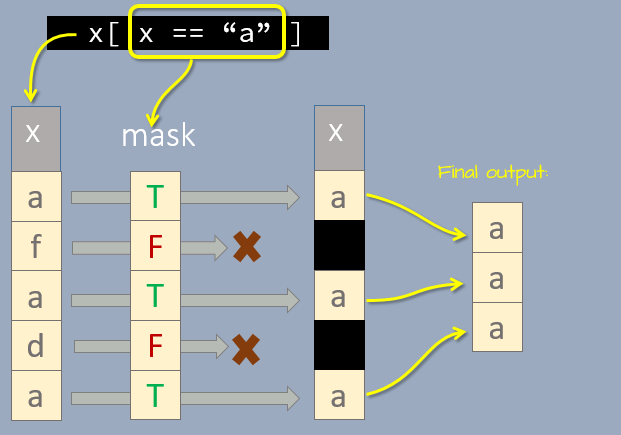
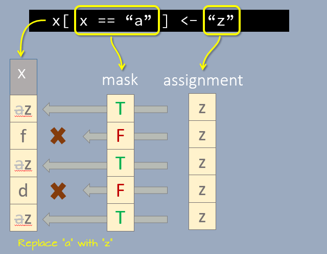

```{r echo=FALSE}
source("libs/Common.R")
options(width = 80)
```

<hr>
```{r echo = FALSE}
R_ver(c)
```
<hr>

# The `subset` function

You can subset a dataframe object by criteria using the `subset` function.

```{r}
subset(mtcars, mpg > 25)
```

You can combine individual criterion using boolean operators when selecting by row.

```{r}
subset(mtcars, (mpg > 25) & (hp > 65)  )
```

You can also subset by column. To select columns, add the `select =` parameter.

```{r}
subset(mtcars, (mpg > 25) & (hp > 65) , select = c(mpg, cyl, hp))
```

# Subset using indices

You've already learned how to identify elements in an atomic vector or a data frame in an [earlier tutorial](https://mgimond.github.io/ES218/Week02a.html). For example, to extract the second and fourth element of the following vector,

```{r}
x <- c("a", "f", "a", "d", "a")
```

type,

```{r}
x[c(2,4)]
```

To subset a dataframe by index, define both dimension's index. For example, to extract the first 20 rows and the first and forth columns of the built-in `mtcars` dataset type,

```{r attr.output='style="max-height: 100px;"'}
mtcars[ 1:20, c(1,4)]
```

Note that we have to add `mtcars$` to the expression since the variable `mpg` does not exist as a standalone object.

You can also reference columns by names as in,

```{r attr.output='style="max-height: 100px;"'}
mtcars[ 1:20, c("mpg", "hp")]
```

# Extracting using logical expression and indices

We can apply conditions to indices in identifying which elements of a vector or a table satisfy one or more criterion.

```{r}
x[ x == "a" ]
```

Let's breakdown the above expression. The output of the expression `x == "a"` is `TRUE FALSE TRUE FALSE TRUE`, a logical vector with the same number of elements as `x`. The logical elements are then passed to the indexing brackets where they act as a "mask" as shown in the following graphic.

{width="318"}

The elements that make it through the *extraction mask* are then combined into a new vector element.

The same operation can be applied to dataframes. For example, to extract all rows where `mpg > 30` type:

```{r}
mtcars[ mtcars$mpg > 30, ]
```

Here, we are "masking" the rows that do not satisfy the criterion using the `TRUE`/`FALSE` logical outcomes from the conditional operation.

# Replacing values using logical expressions

We can adopt the same masking properties of logical variables to **replace** values in a vector. For example, to replace all instances of `a` in vector `x` with `z`, we first *expose* the elements equal to `a`, then assign a new value to the exposed elements.

```{r}
x[ x == "a" ] <- "z"
x
```

You can think of the logical *mask* as a template applied to a street surface before spraying that template with a can of `z` spray. Only the exposed portion of the street surface will be sprayed with the `z` values.

{width="326"}


You can apply this technique to dataframes as well. For example, to replace all elements in `mpg` with `-1` if `mpg < 25`, type:

```{r attr.output='style="max-height: 100px;"'}
mtcars2 <- mtcars 
mtcars2[ mtcars2$mpg < 25, "mpg"]  <-  -1
mtcars2
```

Note that we had to specify the column, `"mpg"`,  into which we are replacing the values. Had we left the second index empty, we would have replaced values across *all* columns.
