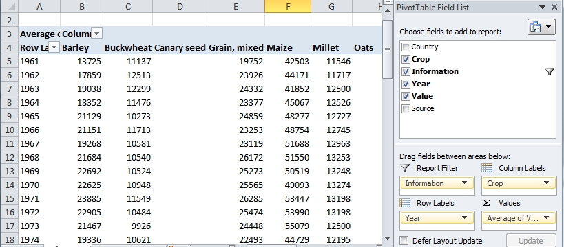

The data file  *FAO_grains_NA.csv* will be used in this exercise. This dataset consists of grain yield and harvest year by north american country. The dataset was downloaded from http://faostat3.fao.org/ in June of 2014. 

Run the following line to load the FAO data file into your current R session.

```{r}
dat <- read.csv("http://mgimond.github.io/ES218/Data/FAO_grains_NA.csv", header=TRUE)
```


# Querying tables using `dplyr`

The basic set of R tools can accomplish many data table queries, but the syntax can be overwhelming and verbose. The package `dplyr` offers some nifty and simple querying functions as shown in the next subsections. `dplyr`'s data manipulation functions are summarized in the following table:

`dplyr` function   | Description
-------------------|-------------
`filter()`         | Subset by row values
`arrange()`        | Sort rows by column values
`select()`         | Subset columns
`mutate()`         | Add columns
`summarise()`      | Summarize columns

Make sure to load the `dplyr` package before proceeding with the following examples. All examples assume that `dplyr` version 0.3 or greater is installed.

```{r, message=FALSE}
library(dplyr)
```

## Subset by rows

Tables can be subsetted by rows based on column values. For example, we may wish to grab all rows associated with `Oats`: 

```{r}
dat.query1 <- filter(dat, Crop == "Oats")
summary(dat.query1)
```

Note that R is case sensitive, so make sure that you respect each letter's case (i.e. upper or lower).

We can expand our query by including both `Oats`, `Buckwheat` and limiting the country to `Canada`.

```{r}
dat.query2 <- filter(dat, Crop == "Oats" | Crop == "Buckwheat", Country == "Canada")
summary(dat.query2)
```

The character `|` is the Boolean operator OR. So in our example, the query can be read as "... crop equals oats OR crop equals buckwheat". Had we used the AND operator, `&`, instead as in `Crop == "Oats" & Crop == "Buckwheat"` the output would have returned zero rows since a `Crop` value cannot be both `Oats` AND `Buckwheat`.

We can expand this query by limiting our output to the years 2005 to 2010

```{r}
library(dplyr)
dat.query3 <- filter(dat, Crop == "Oats" | Crop == "Buckwheat", Country == "Canada", Year >= 2005 & Year <= 2010)
summary(dat.query3)
```

Note the use of the Boolean operator AND, `&`, instead of OR for the `Year` query. We want the `Year` value to satisfy two criteria simultaneously: *greater than or equal to 2005* **AND** *less then or equal to 2010*. Had we used the `|` operator, R would have returned all years since all year values satisfy at least one of the two criteria.

## Sort rows by column value

You can sort a table based on a column's values. For example, to sort `dat` by crop name type:

```{r}
dat.sort1 <- arrange(dat, Crop)
head(dat.sort1)
tail(dat.sort1)
```

By default, `arrange` sorts by ascending order. To sort by descending order, wrap the column name with the function `desc()`. For example, to sort the table by `Crop` in ascending order then by `Year` in descending order, type:

```{r}
dat.sort2 <- arrange(dat, Crop, desc(Year))
head(dat.sort2)
tail(dat.sort2)
```

## Subset by column

You can grab a subset of the table by column(s). To extract the columns `Crop`, `Year` and `Value`, type:

```{r}
dat.subcol <- select(dat, Crop, Year, Value)
head(dat.subcol)
```

## Adding columns

You can add columns (and compute their values) using the `mutate` function. For example, to add a column `Ctr_abbr` and assign it the value `CAN` for Canada and `USA` for the United States of America based on the values in column `Country` type:

```{r}
dat.extended <- mutate(dat, Ctr_abbr = ifelse(Country == "Canada", "CAN", "USA"))
head(dat.extended)
tail(dat.extended)
```

## Summarize columns

You can summarize (or "collapse") one or more columns using the `summarise` function. For instance, to get the minimum and maximum years from the `Year` column, type:

```{r}
summarise(dat, yr_min = min(Year), yr_max=max(Year))
```

## Combining table manipulation functions using `%>%`

In most cases, you will find yourself wanting to combine several of `dplyr`'s data manipulation functions. For example, to summarize the total yield of Oats by country, you could type the following:

```{r}
dat.yield <- filter(dat, Information == "Yield (Hg/Ha)", Crop == "Oats")
dat.grp   <- group_by(dat.yield, Country)
dat.sum   <- summarise(dat.grp, mean_yield = mean(Value))
dat.sum
```

This block of code introduces you to another function called `group_by`. This function creates a new type of object (a list) which breaks the data into different groups for subsequent analysis. This implies that all functions that include `dat.grp` as input will output an object of similar class. So in our example, `dat.sum` is a list object and not a data frame. To force the `dat.sum` object back to a data frame, simply wrap it with the `as.data.frame()` function.

```{r}
as.data.frame(dat.sum)
```

The one downside to this approach of combining data table manipulation functions for complex queries is the use of several intermediate objects (e.g. `dat.yield`, `dat.grp`, `dat.sum`). This can make the workflow difficult to follow and clutter your R session with needless intermediate objects. 

Another approach to combining `dplyr` operations is to use the operator `%>%` which daisy chains `dplyr` functions. So our previous workflow would look like:

```{r}
dat %>%
  filter(Information == "Yield (Hg/Ha)", Crop == "Oats") %>%
  group_by(Country) %>%
  summarise(mean_yield = mean(Value))
```

The chunk of code can be read as "with the `dat` table, `filter` by ..., then `group_by` ...., then `summarise` by ..." with the result from one operation being passed on to the next using the `%>%` operator. Note that the `filter`, `group_by` and `summarise` functions do not include the data table name making the chunk of code less cluttered and easier to read.

This chunk of code will output the results to the screen, if you want to save it to an object called `dat2`, replace the first line with `dat2 <- dat %>%`

Here's a more complicated output whereby the median yield for each USA crop is summarized by year for the years spanning 2005 through 2010 and the output is sorted by crop name (in ascending order) and median yield value (in descending order).

```{r}
dat %>%
  filter(Information == "Yield (Hg/Ha)", Year >= 2005, Year <=2010, 
         Country=="United States of America") %>%
  group_by(Crop, Year) %>%
  summarise(median_yield = round(median(Value))) %>%
  arrange(Crop, desc(median_yield))
```

# Tidying and rehsaping tables using `tidyr`
Reshaping a table involves modifying the layout (or changing the "shape") of a table. For example, a table in this "wide" format,

```{r echo=FALSE, results='asis'}
library(knitr)
x <- data.frame(Case = paste("rec", 1:5, sep=""), b = sample(month.abb, 5, replace = TRUE), 
                c = round(runif(5,0,99)), d = rbinom(5,1,.7))
kable(x)
```

can be recast into "long" format,

```{r echo=FALSE, results='asis', warning=FALSE}
library(tidyr)
library(dplyr)
x.long <- gather(x, Variable, Value, -Case, -b)
kable(x.long)
```

The long table format has just three columns: the record number (or case), the attribute, and the attribute's value. In our example, the attribute columns `b`, `c` and `d` are now combined into a single column, `variable` and their respective values are listed in the `value` column.

The package `tidyr` provides two functions for reshaping data tables: `gather` and `spread`.

In the following examples, we will work off of a query from our original data frame `dat`. Note that we add `as.data.frame()` to the piped commands to force to the output to a data frame. If we don't, the `dplyr` sequence will create an object of multiple data structures (e.g.  `grouped_df`, `tbl_df,` , `tbl` and `data.frame`). This is not usually a problem except with some of the `tidyr` functions that seem to require that the object be only a `data.frame` object.

```{r}
library(dplyr)
dat2 <- dat %>%
  filter(Information == "Yield (Hg/Ha)", Year >= 2005, Year <=2010) %>%
  group_by(Crop, Year, Country) %>%
  summarise(median_yield = round(median(Value))) %>%
  arrange(Crop, desc(median_yield)) %>%
  as.data.frame()
head(dat2)
```

To run the examples in the following subsection, make sure to load the `tidyr` package.

```{r}
library(tidyr)
```

## Recasting from a long format to a wide

We can recast the `dat2` table so that each country is given its own column. In essence, we want to go from

Crop | Year | Country | median yield
-----|------|---------|-------------
...  | | |
...  | | |


to

Crop | Year | Yield for Canada | Yield for USA
-----|------|--------------|-----
...  | | |
...  | | |

We'll use the `spread()` function from `dplyr` where parameter `key` is the column whose unique variables will be assigned their own columns and parameter `value` is the column of values that will be reallocated to their appropriate column (i.e. Canada or US)

```{r, message=FALSE}
dat2.cast1 <- spread(data=dat2,  key=Country, value=median_yield)
head(dat2.cast1)
```

Or, we can recast the table so that crops are listed along columns and countries along rows:

```{r, message=FALSE}
dat2.cast2 <- spread(dat2, key=Crop, value=median_yield)
head(dat2.cast2)
```


## Recasting from a wide to a long format

To *melt* a table (i.e. to go from wide to long format), we use `tidyr`'s `gather()` function. For example, to create a single variable column from the 10 crop columns in `dat2.cast2` we can type:

```{r message=FALSE}
dat2.long2 <- gather(dat2.cast2, key=Crop, value=Median_yield, -Year, -Country)
```

Note the use of the `key` and `value` parameters which we already encountered with the `spread()` function. The difference here is that these paramaters are not pointing to  existing *key* and *value* columns as was the case when we used the `spread()` function, instead these keys tell R what *names* to assign to the new columns that will combine the grain types and their values. 

Also, note the parameters `-Year` and `-Country` in the `gather()` function. This tells R *not* to combine these two columns into a single column. Had we not done this, then country names, years and crops would have been grouped into a single column. See for yourself by typing `gather(dat2.cast2, key=Grain, value=Median_yield)` at a command line.

Here, the parameter `id = c("Country", "Year")` tells the `melt` function that these variables need to maintain their own columns. All other columns (i.e. the crop columns) are grouped into a single column called `variable` and the crop yield values are assigned to the `value` column.

```{r}
head(dat2.long2)
summary(dat2.long2)
```

# Combining `dplyr` with `tidyr` using pipes `%>%`

Several of the examples highlighted thus far mimic (in part) Excel's pivot utility whereby a table is reshaped (reduced in dimensions) by summarizing values. For example, reverting back to the original `dat` data frame, we might want to create a table where each row represents a year and each column represents a crop and the values are the average yields for both countries. 

```{r}
library(dplyr)
library(tidyr)
pivot1 <- dat %>%
  filter(Information == "Yield (Hg/Ha)") %>%
  group_by(Crop, Year) %>%
  summarise(mean_yield = round(mean(Value)) ) %>%
  as.data.frame() %>%
  spread(key=Crop, value=mean_yield)
head(pivot1)

```

An identical data summary using Excel's pivot table utility is shown in the following figure:

