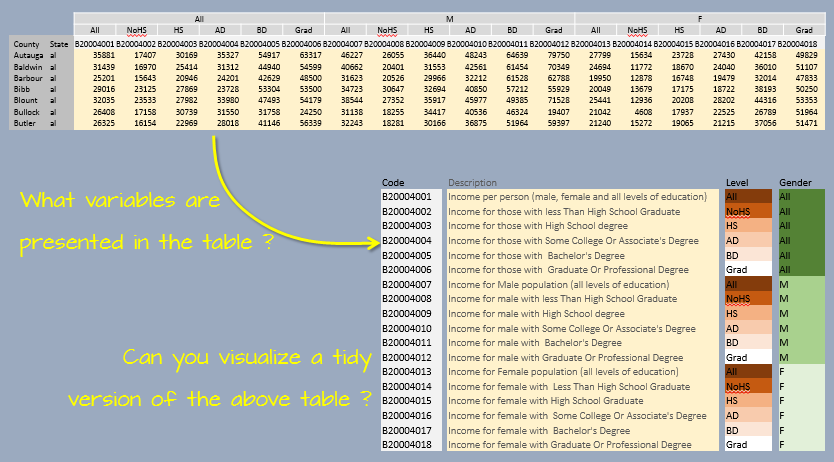

```{r echo=FALSE}
source("libs/Common.R")
```


<div style="color:#ff7535; background-color:#fff0ee ;	border-left-style: solid">
This tutorial makes use of the following R package(s): **`dplyr`**, **`tidyr`** and **`stringr`**
</div>

The following data are used in some of the subsequent tutorials (including the one on `ggplot2`) and make use of some advanced data manipulation routines. The input data file formats are provided as is by their source and are modified to facilitate ingestion into some the plotting routines covered in later exercises. Data used in this tutorial include grain harvest for north america and income/education census data for the US.

```{r cache=TRUE}
dat1 <- read.csv("http://mgimond.github.io/ES218/Data/FAO_grains_NA.csv", header=TRUE)
dat2 <- read.csv("http://mgimond.github.io/ES218/Data/Income_education.csv", header=TRUE)
```

## Dataset `dat1` 

`dat1` consists of grain yields by north american countries and by year. The dataset was downloaded from http://faostat3.fao.org/ in June of 2014.

A subset of `dat1` will be used in later tutorials in both a *wide* form and a *long* form. The wide form will be called `dat1w` and will be a table of year vs. crop yields.

```{r message =FALSE}
library(dplyr)
library(tidyr)

dat1w <- dat1 %>%
         filter(Information == "Yield (Hg/Ha)", 
                Country     =="United States of America", 
                Crop       %in% c("Oats", "Maize", "Barley", "Buckwheat","Rye")) %>%
         select(Year, Crop, Value)                                          %>%
         spread(key = Crop, value="Value")
head(dat1w)
```

The *long* form version of the subset will be called `dat1l` and will be a *long* form representation of `dat1w` (yield by crop and year).

```{r message =FALSE}
dat1l <- gather(dat1w, key = "Crop", value = "Yield", 2:6)
head(dat1l,10)
```

Another subset will be used in subsequent exercises and will consist of total yields for each year by crop and country.

```{r tidy = FALSE}
dat1l2 <- dat1 %>%
          filter(Information == "Yield (Hg/Ha)", 
                 Crop       %in% c("Oats", "Maize", "Barley", "Buckwheat","Rye")) %>%
          select( Year, Crop, Country,  Yield = Value)  # Note that we are renaming the Value field

head(dat1l2,15)
```


## Dataset `dat2`

`dat2` consists of county income and educational attainment for both the male and female population. A codebook [available here](http://mgimond.github.io/ES218/Data/Income_education_codebook.csv) provides descriptions for the different codes. We will remove the cases (rows) from `dat2` for which values are missing (i.e. cases having a `NA` designation) since these rows will serve no purpose (such cases may be associated with counties having no year-round residents or a resident population too small for data dissemination).

```{r}
dat2 <- na.omit(dat2)
```

As with `dat1`, we will create a tidy version of `dat2` for use with packages such as `ggplot2`. 

The `dat2` dataset has income data broken down by educational attainment and gender aggregated at the county level. It would therefore be convenient for plot operations if two variables, `Gender` and (educational) `Level`, were added to the long table version of `dat2`.



We will first generate a lookup table, `Edu.Gend`, of variable elements that will match each census category (e.g. `B20004001`, `B20004002`, ...) to its matching pair of `Level` and `Gender` types. 

We will also create a State/Region lookup table, `st.reg`, that will store two variables: the two letter state abbreviation variable `State` and its matching region variable `Region`. R has a built-in vector called `state.region` that assigns a region to each state. However, you'll note that this vector only has region names but makes no reference to states. It's intended to be used with another built-in data vector called `state.abb` or `state.name`. We will combine `state.abb` with `state.region` to create `st.reg`. We will also need to convert the uppercase state abbreviations to lower case using `tolower` so that they match the `dat2`'s lowercase state abbreviations. Note that  D.C. is not included in the built-in states dataset, so we will add this record the `st.reg` table and assign D.C. to the `South` region.

Finally, the two tables, `Edu.gend` and `st.reg`, will be joined to the long version of `dat2` such that each observation will be assigned a `Level`, `Gender` and `Region`.

```{r message =FALSE}
library(stringr)
# Create a variable/Level/Gender join table
Edu.Gend <- data.frame( 
               variable   = paste("B200040", str_pad(1:18, width=2 , pad="0"),sep="" ),
               Level      = rep(c("All", "NoHS","HS","AD","BD","Grad"), times=3),
               Gender     = rep(c("All", "M","F"), each=6) )

# Create a region/state join table
st.reg <- data.frame(State = tolower(state.abb), Region = state.region)
st.reg <- rbind(st.reg , data.frame(State="dc", Region="South") )

# Start the piping operations
dat2b <- dat2 %>%
  gather(key = "variable", value = "value", -1:-2)  %>%
  inner_join(Edu.Gend, by="variable" )              %>%
  select(State, County, Level, Gender, value)       %>%
  mutate(Level = factor(Level, 
                        levels = c("All","NoHS","HS", "AD", "BD", "Grad"))) %>%
  inner_join(st.reg , by="State")
head(dat2b)
tail(dat2b)
```

Note that we have eliminated references to variable names such as "B20004001" from `dat2b` making it easier to interpret the variable names/values.

In `dat2b` the gender values are lumped under the variable called `Gender`. We may wish to have male and female incomes assigned their own columns so we will need to *widen* `dat2b` so that each gender value is given its own column. We will use the `spread` function from the `tidyr` package to create a new data frame called `dat2.gender`.

```{r}
dat2c <- spread(dat2b, key = Gender, value = value )
```

We will also take this opportunity to add a new field to dat2c called `Region` which will associate each state with a region. R has a built-in vector called `state.region` that assigns a region to each state.

```{r}
state.region
```

However, you’ll note that this vector only has region names but makes no reference to states. It’s intended to be used with another built-in data vector called `state.abb` or `state.name`. We will combine `state.abb` with `state.region` to create a data frame “lookup table”. We will also need to convert the uppercase state abbreviations to lower case using `tolower` so that they match the `dat2b`’s lowercase state abbreviations.

```{r}
st.reg <- data.frame(State = tolower(state.abb), Region = state.region)
```

Our income dataset has data for all 50 states as well as the District of Columbia (D.C.) as shown in the following output:

```{r}
unique(dat2c$State)
```

But D.C. is not included in the built-in states dataset, so we will add this record the the `st.reg` table and assign D.C. to the `South` region.

```{r}
st.reg <- rbind(st.reg , data.frame(State="dc", Region="South") )
```

Now we’ll join this look-up table to the dat2c data frame. We’ll use dplyrs inner_join function.

```{r}
dat2c <- inner_join(dat2c, st.reg, by = "State")
head(dat2c)
```


