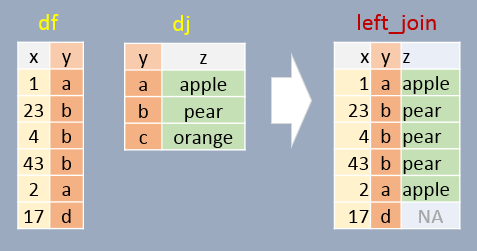
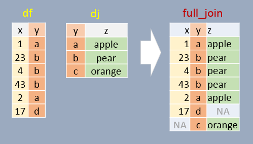

```{r echo=FALSE}
source("libs/Common.R")
```


<div style="color:#ff7535; background-color:#fff0ee ;	border-left-style: solid">
This tutorial makes use of the following R package(s): **`dplyr`**
</div>

We can use `dplyr`'s join operations to join elements from one table to another table. Four such functions (with differing behaviors) are `left_join`, `right_join`, `inner_join`, and `full join`.

To demonstrate these functions, we'll be joining two dataframes: `df` and `dj`. 

```{r, message=FALSE}
library(dplyr)

df <- data.frame( x = c(1, 23, 4, 43, 2, 17),
                  y = c("a", "b", "b", "b", "a", "d"),
                  stringsAsFactors = FALSE)
df

dj <- data.frame( z = c("apple", "pear", "orange"),
                  y = c("a", "b", "c"),
                  stringsAsFactors = FALSE)
dj
```

In the examples that follow, we will join both tables by the common column `y`.

# Left join

In this example, if a join element in `df` does not exist in `dj`, `NA` will be assigned to column `z`. In other words, all elements in `df` will exist in the output regardless if a matching element is found in `dj`. Note that the output is sorted in the same order as `df` (the *left* table).

```{r, warning=FALSE}
left_join(df, dj, by="y")
```



# Right join

If a join element in `df` does not exist in `dj`, that element is removed from the output. A few additional important notes follow:

+ All elements in `dj` appear at least once in the output (even if they don't have a match in `df` in which case an `NA` value is added),
+ The output table is sorted in the order in which the `y` elements appear in `dj`.
+ Element `y` will appear as many times as there matching `y`s in `df.

```{r, warning=FALSE}
right_join(df, dj, by="y")
```


# Inner join

In this example, **only** matching elements in both  `df` and `dj` are saved in the output.

```{r, warning=FALSE}
inner_join(df, dj, by="y")
```


# Full join

In this example, **all** elements in both `df` and `dj` are present in the output. For non-matching pairs, `NA` values are supplied.

```{r warning=FALSE}
full_join(df, dj, by="y")
```




# A note about column names

If the common columns in both tables have different names, you will need to modify the `by =` argument as `by = c("left_col" = "right_col")`. For example,

```{r, message=FALSE}
library(dplyr)

df <- data.frame( x = c(1, 23, 4, 43, 2, 17),
                  y1 = c("a", "b", "b", "b", "a", "d"),
                  stringsAsFactors = FALSE)

dj <- data.frame( z = c("apple", "pear", "orange"),
                  y2 = c("a", "b", "c"),
                  stringsAsFactors = FALSE)

left_join(df, dj, by = c("y1" = "y2"))
```