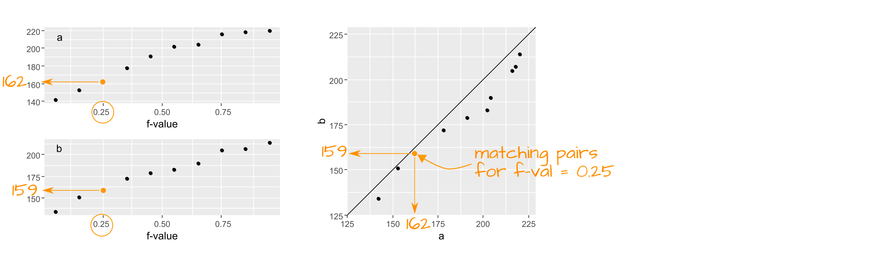

```{r echo=FALSE}
source("libs/Common.R")
```


<div style="color:#ff7535; background-color:#fff0ee ;	border-left-style: solid">
This tutorial makes use of the following R package(s): **`dplyr`**, **`tidyr`**, **`ggplot2`**, **`lattice`** (only for its data).

This material is intended to supplement **section 2.2** of **Cleveland's book**.
</div>


Let's compare singer heights between `Bass 2` and `Tenor 1` group. We will work off of a subset of Cleveland's `singer` dataset.

```{r message=FALSE}
library(dplyr)
library(tidyr)
library(ggplot2)

df  <- lattice::singer
df2 <- filter(df, voice.part == "Bass 2" | voice.part=="Tenor 1") %>% 
       mutate(voice.part = droplevels(voice.part))
```

Let's plot both datasets side-by-side. We will jitter the points about their category groups to expose overlapping points.

```{r fig.height=3, fig.width=4}
ggplot(df2, aes(y=height, x=voice.part, col=voice.part)) + 
            geom_jitter(position = position_jitter(width = .1, height=0))
```

Let's get the count and median values for both batches.

```{r}
df2 %>% group_by(voice.part) %>% summarise(median = median(height), count = n() )
```

The basest tend to be slightly taller than the Tenor--this is one way to compare the batches. But how do their distributions differ? We will explore this in the next section.

## Boxplots

We can compare the batches using side-by-side boxplots.

```{r fig.height=3, fig.width=3}
ggplot(df2) + aes(x=voice.part, y=height) + geom_boxplot()
```

The differences in median values is obvious. What's more, the difference in overall height values is more pronounced with the boxplot than it is with a simple point distributions plot shown earlier. 

Are the spreads between the batches comparable? It's difficult to tell given that the batches are offset by about four inches. So let's level the playing field by subtracting the median values from their respective batches.

```{r fig.height=3, fig.width=3}
df2.med <- df2 %>% 
          group_by(voice.part) %>%
          mutate( NormHeight= height - median(height)) 

ggplot(df2.med, aes(x=voice.part, y=NormHeight)) + geom_boxplot()
```

Leveling the boxplots certainly helps in assessing the difference in spreads. It seems that the `Tenor 1` group has a slightly wider range of heights than the `Bass 2` group. About 50% of singers in the `Tenor 1` group have heights that range five inches whereas the singers in the `Bass 2` group have heights that range four inches. We also note from the that the `Tenor 1` height distribution tends to be skewed towards taller singers whereas the `Bass 2` height distribution tends to be a little less skewed toward smaller heights.

## The quantile-quantile (Q-Q) plot

A quantile-quantile plot (or Q-Q plot for short) combines two separate quantile plots from  different batches of values by pairing the point values by their common $f$-value.



Let's compute the $f$-values for both batches of singer data (`Bass 2` and `Tenor 1`).

```{r}
df.qq <- df2 %>% 
         group_by(voice.part) %>%
         arrange(voice.part, height) %>%
         mutate( f.val = (1:length(height) - 0.5 ) / n())
```

Now let's generate quantile plots for both batches.

```{r fig.height=3, fig.width=5}
ggplot(df.qq, aes(x=f.val, y = height)) + geom_line(col="grey") + geom_point()  + facet_grid( voice.part ~ .) 
```

We can take this a step further and combine the plots to generate a **quantile-quantile** (**q-q**) plot.  If the number of values in both batches are equal, than the plotting process is straightforward: sort (from smallest value to largest value) both batches, then pair up the sorted values and plot one batch vs. the other batch.

If the two batches differ in size (as is the case with our example where we have 21 tenors and 26 bassists), we won't be able to match sorted values. For example, in the above graph, you'll note that one of the singer's height in the `Bass 2` batch is associated with an $f$-value of 0.75, however, there are no singer heights associated with an $f$-value of 0.75 in the `Tenor 1` batch. 

To overcome the problem with batch size mismatch, we limit the number of points in the q-q plot to the number of values associated with the smallest sized batch (21 in our working example). This requires that we find matching singer height values to the set of $f$-values associated with a batch of 21 values, or:

```{r}
# Generate and index
i  <- 1:21
# Compute the f-values
fi <- (i - 0.5) / 21
# view rounded values
round(fi,2)
```


To find matching values for the singer heights in `Bass2`, we need to interpolate values. In practice, a linear interpolation is sought unless theory justifies otherwise. 

We will explore two methods: a **manual** approach to constructing a q-q plot and the `qqplot` function from the base installation. **Note that both methods can produce slightly different q-q plots**; this is to be expected since they may adopt different quantile algorithms. 

In all three cases, we will add a 45° line (i.e. the `Bass 1` $=$ `Tenor 1` line) that shows where we would expect the points to be plotted if both distributions were identical.

### Manual construction of a q-q plot 

To find a value in the larger dataset (i.e. `Bass 2`) that matches the 21 quantiles of the smaller dataset, `Tenor 1`, we can use the `approx()` function. 

First, we will extract all values associated with `Bass 2` from the dataset.

```{r}
df.bass <- df.qq %>%  filter( voice.part == "Bass 2")
```

Next, we will interpolate a new set of height values for `Bass 2` that match the 21 quantile values in `fi`.

```{r}
b.hgt.interp <- approx(df.bass$f.val, df.bass$height, fi)
```

The output generates two columns: the 21 quantiles, `fi`, and the 21 `Bass 2` interpolated height values.

Finally, we will combine the interpolated `Bass 2` values (which is already in an ascending order) with  **sorted** heights for the `Tenor 1` singers. Then, we will plot the paired values using `ggplot`. We will also add an 45° line to facilitate comparison.

```{r, fig.width=3, fig.height=3}
s.qq <- data.frame( Bass  = b.hgt.interp$y,
                    Tenor = sort( df[ df$voice.part == "Tenor 1", 1 ] ) )

ggplot(s.qq, aes( x= Tenor, y = Bass)) + geom_point() + geom_abline( intercept=0, slope=1)
```

Note that the range of values for both axes may not match; this may influence our visual assessment of the differences. To remedy this, we can force a fixed aspect ratio between both axes.

```{r, fig.width=3, fig.height=3}
# Get the range of both datasets
xylim <- range( c(s.qq$Bass, s.qq$Tenor) )

# Add a 5% buffer to the xy limits
# (This avoids having the points plotted on the edge of the plot)
xylim <- xylim + c(-0.05 * diff(xylim), + 0.05 * diff(xylim))

ggplot(s.qq, aes( x= Tenor, y = Bass)) + 
             geom_point() + 
             geom_abline( intercept=0, slope=1) +
             coord_fixed(ratio = 1, xlim=xylim, ylim = xylim)
```


### Using the base `qqplot`

This approach is quicker and requires fewer lines of code, but it does not afford the insight into the inner workings of a q-q plot as does the manual approach from the previous sub-section.

`qqplot` is a base package that will generate a q-q plot using the base plotting environment. It requires that the two batches be loaded as separate vector objects. 


```{r fig.height=3, fig.width=3, echo=2:5}
OP <- par(mar=c(4,4,0,0))
Tenor <- df[ df$voice.part == "Tenor 1", 1 ]
Bass  <- df[ df$voice.part == "Bass 2", 1 ]
qqplot(x=Tenor, y=Bass, asp=1)
abline( c(0,1))
par(OP)
```

`qqplot` offers the option to output the q-q plot values (this includes the interpolated values) as a **list**  by setting the parameter `plot.it=FALSE`. We then need to convert this list object to a dataframe using `as.data.frame`. The output can then be used in a call to `ggplot`.

```{r fig.height=3, fig.width=3}
qq.out <- qqplot(x=Tenor, y=Bass, plot.it=FALSE)
qq.out <- as.data.frame(qq.out)

xylim <- range( c(qq.out$x, qq.out$y) )
xylim <- xylim + c(-0.05 * diff(xylim), + 0.05 * diff(xylim))
ggplot(qq.out, aes( x= x, y = y)) + 
               geom_point() + 
               geom_abline( intercept=0, slope=1) +
               coord_fixed(ratio = 1, xlim=xylim, ylim = xylim) +
               xlab("Tenor") + ylab("Bass")
```


## q-q plots are *not* scatter plots

It's important to note the difference between a quantile-quantile plot and a [scatter plot](https://en.wikipedia.org/wiki/Scatter_plot). The latter is used when the pairing of values between variables is explicit  (for example average male and female incomes for a specific US county). The q-q plot does not assume any pairing of observations (e.g. the height measurement for a singer in `Bass 2` is not linked to a height measurement in `Tenor 2`).  This is made more evident with our working example which has unequal number of singers in both groups being compared since such a dataset could not be plotted using a scatter plot.


## The Tukey mean-difference plot

Cleveland notes on page 23 that our eyes are better suited at judging deviations from a horizontal line than from a 45° line.  All that is required is to subtract the y-value, `Bass2`, from the x-value, `Tenor 2`, then compare the difference to the mean of the two values:

$$
Y = Bass- Tenor 
$$
$$
X = \frac{Bass + Tenor}{2}
$$

This forces the 45° line in the previous q-q plots to a 0° slope. The final plot is a **Tukey mean-difference** plot or **m-d** for short.

### Generating an m-d plot using `ggplot`

We continue with the `qq.out` dataset generated from the `qqplot` function.

```{r fig.height=3, fig.width=3}
md.y  <- (qq.out$y - qq.out$x) 
md.x  <- (qq.out$y + qq.out$x) * 0.5
df.md <- data.frame(md.x, md.y)

ggplot(df.md,  aes(x = md.x, y = md.y)) + geom_point() + geom_abline( slope=0 ) +
               xlab("Mean height (in)") + ylab("Difference in height (in)")
```

The units on both axes are in inches. It's clear from this plot that differences in heights are pretty much consistent across the quantiles with an additive shift of about 2.5 inches, except near the higher quantiles for a few lone points.

## Pairwise q-q plots

A **pairwise q-q plot** allows one to view all combinations of batch pairs. This requires that we first find the smallest batch of height values, then interpolate all other batch values to match the smallest batch quantiles. Note that the pairwise plot is symmetrical about the diagonal.


```{r fig.width=6, fig.height=6} 
library(lattice)
# Find smallest batch
f.rng <- min(tapply(singer$height, singer$voice.part, length))

# Define quantile function
fun1  <- function(x,f.rng) {approx(1:length(x), sort(x), n = f.rng )$y}

# Compute quantiles for all factors
t1    <- aggregate(singer$height ~ singer$voice.part, FUN=fun1, f.rng=f.rng )

# Flip table and name columns
t2    <- as.data.frame(t(t1[,-1]))
names(t2) <- t1[,1]

# Label columns of qmat using names of voice parts.
splom(~t2,  axis.text.cex=0.6, pch = 20,
      varname.cex=0.8,
      pscales=3,
      xlab="Heights (inches)",
      prepanel.limits = function(x) (range(t2)), # force all axes the same
      panel = function(x,y,...){
        panel.grid()
        panel.splom(x,y,...)
        panel.abline(0,1,col="grey")
      })
```