```{r echo = FALSE, message = FALSE}
knitr::knit_hooks$set(small.mar = function(before, options, envir) {
    if (before) par(mar = c(4, 4, 1, 1))  # smaller margin on top and right
})

knitr::opts_chunk$set(
  comment = "",
  message = FALSE,
  tidy = FALSE,
  dev=c('CairoPNG', 'CairoPDF'),
  cache = FALSE,
  warning = FALSE,
  encoding = "UTF-8")
```

# Anatomy of a two-way table

Let's decompose the following table which represents infant mortality rates (per 1000 live births) by region and by a father's education attainment for the years 1964 through 1966 (Hoaglin *et al.*).


A two way table is composed of three variables: 

  * a **row factor** which has four  levels in our working example: Northeast, North Central, South and West,
  * a **column factor** which has five levels in our working example: ≤8, 9-11, 12, 13-15 and 16≥ years of education,
  * **response variables** of which we have 4 (rows) x 5 (columns) = twenty all together.

A two-way table is an extension of univariate analyses conducted earlier in the course where a continuous variable (e.g. singer height) is grouped by category (e.g. tenor). Here, we explore a variable across *two * categories.

We can represent the relationship between the response variable, $y$, and the two categories as:

$$
y_{ij} = \mu + \alpha_i + \beta_j + \epsilon_{ij}
$$

where $y_{ij}$  is the **response variable** for row $i$ and column $j$, $\mu$ is the overall typical value (hereafter referred to as the common value), $\alpha_i$ is the **row effect**, $\beta_j$ is the **column effect** and  $\epsilon_{ij}$ is the **residual** or value left over after *all* effects are taken into account.

The goal of this analysis is to decompose the response variables into their respective effects (education of father and region) via an iterative process where row medians and column medians are removed from the response variables repeatedly until the row and column medians approach zero.  

# Analysis workflow

Let's first create the dataframe.

```{r}
df <- data.frame(row.names = c("NE","NC","S","W"),
                 ed8       = c(25.3,32.1,38.8,25.4), 
                 ed9to11   = c(25.3,29,31,21.1),
                 ed12      = c(18.2,18.8,19.3,20.3),
                 ed13to15  = c(18.3,24.3,15.7,24),
                 ed16      = c(16.3,19,16.8,17.5)
                 )

```

## Visualizing the data

It's often easier to look at a graphical representation of the data than a tabular one. Even a table as small as this can benefit from a plot. 

We will adopt Cleveland's dot plot for this purpose (see course text page 302). R has a built-in dotplot function called `dotchart`. It requires that the table be stored as a matrix instead of a dataframe; we will therefore convert `df` to a matrix by wrapping it with a `as.matrix` function.

```{r small.mar=TRUE, fig.width=3, fig.height=3.8}
dotchart( as.matrix(df), cex=0.7)
```

The plot helps visualize any differences in mortality rates across different father educational attainment levels. There seems to be a gradual decrease in child mortality with increasing father educational attainment. 

But the plot does help spot differences across regions (except for the `ed12` group). We can generate another plot where region becomes the main grouping factor and educational attainment sub-levels. We do this my wrapping the matrix with the transpose function `t()`.

```{r small.mar=TRUE, fig.width=3, fig.height=3.8}
dotchart( t(as.matrix(df)), cex=0.7)
```

There seems to be higher death rates for the `NC` and `S` regions and relatively lower rates for the `W` and `NE` regions. 

Next, we'll generate side-by-side boxplots to compare the effects between both categories. Note that we'll need to create a *long* version of the table using the `tydir` package.

```{r small.mar=TRUE, fig.width=6, fig.height=3, fig.show='hold'}
library(tidyr)
library(dplyr)

df.l <- df %>%
  mutate(Region = as.factor(row.names(.)) )  %>%
  gather(key=Edu, value = Deaths, -Region)

# side-by-side plot
OP <- par(mfrow=c(1,2))
plot(Deaths ~ Region + Edu, df.l)
par(OP)
```

So at this point the plots suggest that there may be a father's educational attainment effect as well as a regional effect on infant mortality with the former effect being possibly more important. 

Next we will attempt to quantify these effects using the Tukey's **median polish**.

## Median polish

### Step 1: Compute the row medians

For each row, we will compute the median response variables (i.e. the median mortality for each region). The resulting median values are shown in red in the following figure.

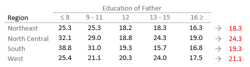


### Step 2: Create a residual table from the row medians

Next, a **residual table** is created (highlighted in light green in the following figure). Each new cell in the residual table takes on the value of the subtraction of the row median from each response variable in that row.

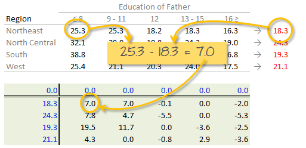

The row medians are then copied to the left hand side of the new residual table. These values represent the “row effect” in this first iteration. 

Note that at this point, we are assigning values of zero to the column effect row since column effects have not yet been computed.

### Step 3: Compute the column medians

Next, column medians are computed  (shown in red in the following figure) from the residual table. Note that you are NOT computing the column medians from the original response variables.

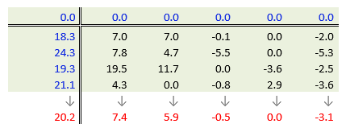

### Step 4: Create a new residual table from the column medians

A new residual table (shown in light orange in the following figure) is created from the column median where each new cell in this second residual table takes on the value of the subtraction of the column median from each response variable in that column.

Next, the column medians (red) are copied to the column effect row (shown in blue). These values represent the “column effect” in this first iteration.

At this stage of the workflow, we subtract each row effect values in the light-green table by the median value of the common row effects (`20.2` in this working example). This will re-center the row effect values thus aiding us in assessing the effect each region factor has on the observed variables.

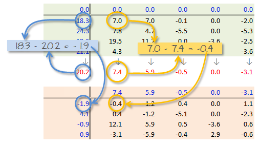

Before moving on to the next step, we need to include the row effect median value, `20.2`, to the common effect variable. This will ensure that the additive formula remains balanced (the “why” will become clearer later in this tutorial). 

Compute the common effect value by summing the original common effect (whose initial value was `0`) and the median value from the row effect, `20.2`.

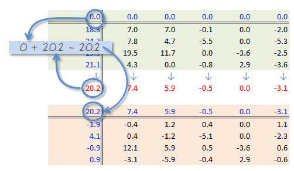

The above step completes the first iteration. We now need to repeat the process in a second iteration.

### Step 5: 2nd smoothing iteration

Steps 1 through 4 are repeated with the last residual table. We start by computing new row medians.

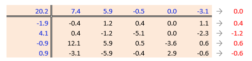

We then create a new residual table from the row medians.

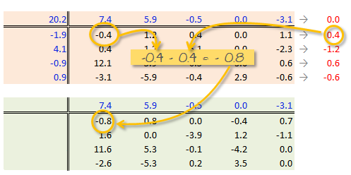

Next, the new row median values are added to the old row effect values. Note that the displayed values are rounded to one significant digit but that the computation is performed using many more significant digits.

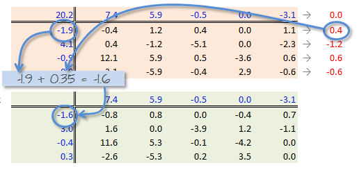

The common effect value must also be updated by adding the column effects median to the original common effect variable.

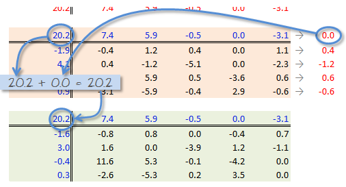

Next, we compute new column medians and subtract those values from the column values to give us a new set of residual values shown in the light-orange table. We also add to the *row effect* values the column median (which is `0` in this iteration).


To complete this 2nd iteration, we update the *common value* by adding the *row effect* median (which is `0.0`).


### When do we stop iterating?

The goal is to iterate through the row and column smoothing operations until the row and column effect medians are close to 0. However, Hoaglin **et al.** (1983) warn against “using unrestrained iteration” and suggest that a few steps should be more than adequate in most instances. In our working example, a third iteration may be warranted. The workflow for this third iteration will not be shown here, but its mechanism is identical to the last sets of row/column smoothing operations. The final version of the table (along with the column and row values) is shown below:

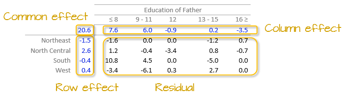


## Interpreting the median polish

As noted in the introduction, a two-way table represents the relationship between the response variable, $y$, and the two categories as:

$$
y_{ij} = \mu + \alpha_i + \beta_j + \epsilon_{ij}
$$

In our working example, $\mu$ = 20.6; $\alpha_i$ = -1.5, 2.6   -0.4, and 0.4 for $i$ = `NE`, `Nc`, `S` and `W` respectively; $\beta_j$ = 7.6, 6.0, -0.9, 0.2 and -3.5 respectively.

The residuals represent the potion of the mortality rates that can't be explained by either factors. 

So the mortality rate in the upper left-hand cell from the original table can be deconstructed as:

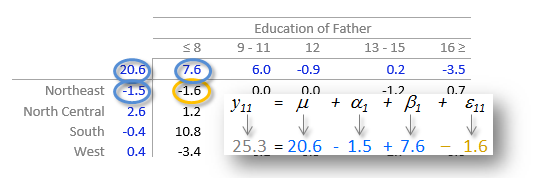

The examination of the table suggests that that the infant mortality rate is greatest for fathers who did not attain more than 8 years of school (i.e. who has not completed high school) as noted by the high column effect value of 7.6. This is the rate of infant mortality relative to the overall median (i.e. on average, 20.6 infants per thousand die every year and the rate goes up to 7.6 + 20.6 for infants whose father has not passed the 8th grade).  Infants whose father has completed more than 16 years of school (i.e. who as completed college) have a lower rate of mortality as indicated by the low effect value of -3.5 (i.e. 3.5 fewer depths than average). The effects from regions also show higher infant mortality rates for North Central and Western regions (with effect values of 2.6 and 0.4 respectively) and lower rates for the northeastern and southern regions; however the regional effect does not  appear to be as dominant as that of the father’s educational attainment. 

It’s also important to look at the distribution of the residual numbers across the two-way table. One should identify unusually high or low residuals in the table. Such residuals may warrant further investigation (e.g. the high southern region residual value of 10.8 may need further exploration).

## Test for non-additivity

Thus far, we have assumed an additive relationship between the effects (factors). But this additive model may not be the best fit for our data. A good way to test this is by generating a **Tukey Additivity Plot** where we plot residuals vs. the **comparison value**, $cv_{ij}$, defined as $\alpha_i \beta_i / \mu$. If the plot is devoid of any obvious trend or pattern we can conclude that our dataset is consistent with an additive model. Such seems to be the case with our working example as shown in the following plot.

```{r fig.width=3, fig.height=3, echo=FALSE, small.mar=TRUE}
plot( medpolish(df,maxiter=3), pch=20)
```

If the diagnostic plot revealed a trend, its shape—or more specifically, its slope--could be used in helping define an appropriate transformation for the data.  A rule of thumb is to apply a $(1 – slope)$ power transformation to the original data. If the resulting power is not appropriate for the dataset then the $cv_{ij}$ can be added to the additive model as follows:

$$
y_{ij} = \mu + \alpha_i + \beta_j + \alpha_i \beta_i / \mu  + \epsilon_{ij}
$$

# Implementing the median polish in R

The steps outlined in the previous section can be easily implemented using pen and paper or a spreadsheet environment for larger datasets. R has a built-in function called `medpolish()` which does this for us. We can define the maximum number of iterations by setting  the `maxiter=` parameter but note that `medpolish` will automatically estimate the best number of iterations for us. We'll set it to `3` to match the three iterations conducted in the previous selection.

```{r}
df.med <- medpolish( df , maxiter=3)
```

The three values printed to the console gives us the sum of absolute residuals at each iteration; we will ignore these numbers. The output from the model is stored in the `df.med` object. To see its contents , simply type it at the command line.

```{r}
df.med
```

All three effects are displayed as well as the residuals (note that the precision returned is greater than that used in our earlier analysis).

To generate the Tukey additivity plot, simply wrap the median polish object with the `plot` command as in:

```{r fig.width=3, fig.height=3, small.mar=TRUE}
plot( df.med )
```


# What if we use the mean instead of the median?

The procedure is similar with some notable differences. First, we compute the global mean (the common effect) then subtract it from all values in the table. Next, we compute the row means (the row effect) then subtract each mean from all values in its associated row. We finally compute the column means (from the residuals) to give us the column effect. That's it, unlike the median polish, we do not iterate the smoothing sequences. An example of a "mean" polish applied to our data follows:


The results differ slightly from the those produced using the median polish. Recall that the mean is sensitive to outliers and medians are not. If a robust estimate of the effects is sought, stick with the median polish.

So what can we gain from the "mean" polish? Well, as it turns out, it serves as the basis of the **two-way ANOVA**, hence it's popularity.

# Reference

*Understanding Robust and Exploratory Data Analysis*, D.C. Hoaglin, F. Mosteller and J.W. Tukey, 1983.


