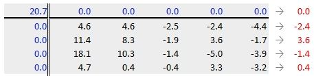
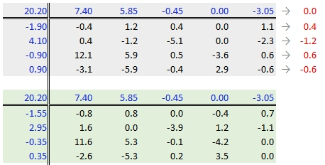
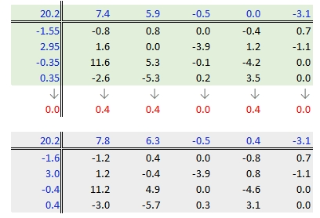
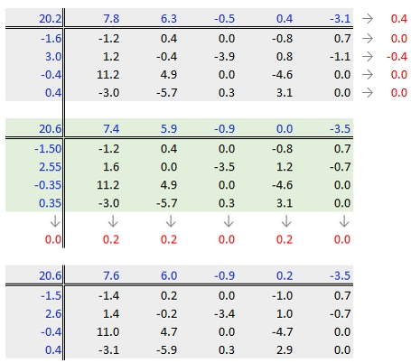
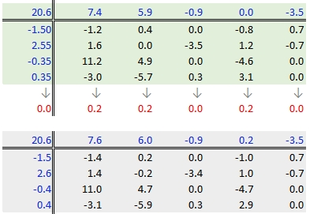
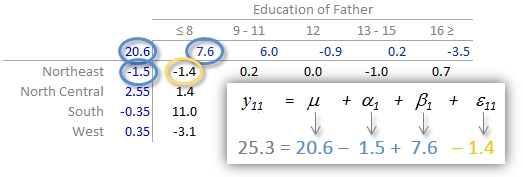
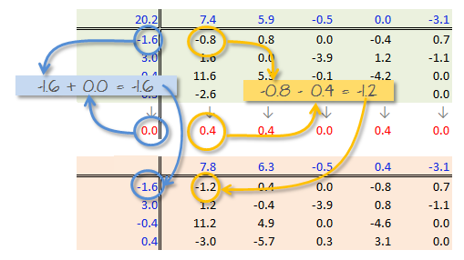
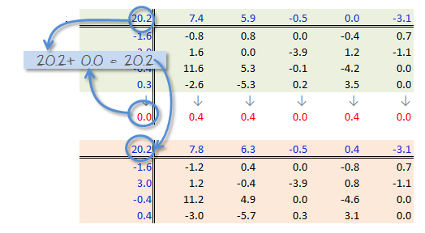

```{r echo=FALSE}
source("libs/Common.R")
```

<div style="color:#ff7535; background-color:#fff0ee ;	border-left-style: solid">
This tutorial makes use of the following R package(s): **`tidyr`** and **`dplyr`**.
</div>

# Introduction

Before tackling two-way tables, let's explore a simpler one-way table. The following dataset shows mean annual income by occupation for the year 2014 (*src: [Bureau of Labor Statistics](http://www.bls.gov/oes/#tables)*)

```{r echo=FALSE, results='asis'}
library(xtable)
df <- data.frame( row.names =c("Architecture and Engineering", 
"Arts, Design, Entertainment, Sports, and Media", "Building and Grounds Cleaning and Maintenance", 
"Business and Financial Operations", "Community and Social Service", 
"Computer and Mathematical", "Construction and Extraction", "Education, Training, and Library", 
"Farming, Fishing, and Forestry", "Food Preparation and Serving Related", 
"Healthcare Practitioners and Technical", "Healthcare Support", 
"Installation, Maintenance, and Repair", "Legal", "Life, Physical, and Social Science", 
"Management", "Office and Administrative Support", "Personal Care and Service", 
"Production", "Protective Service", "Sales and Related", "Transportation and Material Moving"),
Income = c(112490, 72410, 83970, 81520, 70070, 45310, 101110, 52210, 
55790, 76010, 28820, 43980, 21980, 26370, 24980, 38660, 
35530, 25160, 46600, 45220, 35490, 34460)
)

print(xtable(df, digits=0),include.rownames=TRUE, type="html", scalebox=0.5)
```

So, what can we glean from this dataset other than the raw values associated with each occupation type? For starters, we may be interested in coming up with a summary of income values such as the median, or $`r sprintf("%i",median(df$Income))` in our working example. This is a single value that can be used to characterize the overall income value. However, the income values in our batch are not all equal to $`r sprintf("%i",median(df$Income))`--they vary above or below this median value. A good way to measure the variability about the median is to subtract the median income value from each occupation income value. We can do this in a table, but will choose a dotplot chart instead to facilitate comparison.

```{r small.mar=TRUE, fig.width=8,fig.height=3.5, echo=FALSE}
options(scipen=3)
dotchart( as.matrix(df)- median(df$Income), pch=16,cex=0.6)
abline(v = 0, col="red")
```

We have separated the income values into two parts: an **overall** value and the difference between each value and the overall (which we will refer to as the **residuals**). This can be written in the following algebraic form:

$$
Income_{Occupation} = Income_{median} + Income_{residual}
$$

For example, 'Healthcare Support' average income of  $`r sprintf("%i",df$Income[12])` can be separated into the sum of the median, $`r sprintf("%i",median(df$Income))`, and the residual, $`r sprintf("%i",df$Income[12]-median(df$Income))`. 

So in addition to gleaning a median income value from this batch of values, we have also devised a way to facilitate the comparison of the income values to one another. Alternatively, we could have assigned colors to each cell of the table reflecting their values *relative* to the overall median.

```{r small.mar=TRUE, fig.width=4,fig.height=5, echo=FALSE}
library(RColorBrewer)
library(ggplot2)
cl <- brewer.pal(4, "RdYlGn")
qtl <- quantile(df$Income)
intv <- findInterval(df$Income, qtl[-1], rightmost.closed = TRUE) +1

ggplot(df) + aes(x=rownames(df), y=1, fill=Income) +geom_tile(aes(fill=cl[intv])) + 
  coord_flip() + scale_fill_identity(labels=sort(unique(intv)), breaks=cl) +
  geom_text(aes( label = format(df$Income, decimal.mark = ",")), size=4) +
  theme(axis.text.x=element_blank(), axis.title=element_blank(),
        panel.background=element_blank(), axis.ticks=element_blank(),
        text = element_text(size = 10))
```

The income value can be thought of as the **response** to the occupation type (also known as a **factor**). In other words, the factor determines the value in our table. We can re-write the last equation in a more formal way:

$$
y_{i} = \mu + \epsilon_i 
$$

where $y_{i}$  is the **response variable** (e.g. income) for **factor** $i$ (e.g. occupation), $\mu$ is the overall typical value (hereafter referred to as the **common value**) and is usually the mean or median, and $\epsilon_i$ is the **residual**. Next, we will see how the idea of separating the values into components can be expanded to **two-way** (aka **two-factor**) tables.

# Anatomy of a two-way table

Let's decompose the following table which represents infant mortality rates (per 1000 live births) by region and by a father's educational attainment for the years 1964 through 1966 (Hoaglin *et al.*).


A two-way table is composed of three variables: 

  * a **row factor** which has **four levels** in our working example: Northeast, North Central, South and West,
  * a **column factor** which has **five levels** in our working example: under 8, 9-11, 12, 13-15 and 16 and greater years of education,
  * **response variables** of which we have 4 (rows) x 5 (columns) = 20 all together.

A two-way table is an extension to the one-way table described in the introduction where instead of grouping a continuous variable by a single factor category we explore the variable across **two** factor categories.

We can represent the relationship between the response variable, $y$, and the *two* factors as:

$$
y_{ij} = \mu + \alpha_i + \beta_j + \epsilon_{ij}
$$

where $y_{ij}$  is the **response variable** for row $i$ and column $j$, $\mu$ is the overall typical value (hereafter referred to as the *common value*), $\alpha_i$ is the **row effect**, $\beta_j$ is the **column effect** and  $\epsilon_{ij}$ is the **residual** or value left over after *all* effects are taken into account. 

The goal of this analysis is to decompose the response variable into its respective effects--i.e. the two contributing factors: *education of father* and *region*--via an iterative process where row medians and column medians are removed from the response variables repeatedly until the row and column medians approach zero.  

# Analysis workflow

Let's first create the dataframe.

```{r}
df <- data.frame(row.names = c("NE","NC","S","W"),
                 ed8       = c(25.3,32.1,38.8,25.4), 
                 ed9to11   = c(25.3,29,31,21.1),
                 ed12      = c(18.2,18.8,19.3,20.3),
                 ed13to15  = c(18.3,24.3,15.7,24),
                 ed16      = c(16.3,19,16.8,17.5)
                 )
```

## Visualizing the data

It's often easier to look at a graphical representation of the data than a tabular one. Even a table as small as this can benefit from a plot. 

We will adopt Cleveland's dot plot for this purpose (see course text page 302). R has a built-in dotplot function called `dotchart`. It requires that the table be stored as a matrix instead of a dataframe; we will therefore convert `df` to a matrix by wrapping it with the `as.matrix()` function.

```{r small.mar=TRUE, fig.width=3, fig.height=3.8}
dotchart( as.matrix(df), cex=0.7)
```

The plot helps visualize any differences in mortality rates across different father educational attainment levels. There seems to be a gradual decrease in child mortality with increasing father educational attainment. 

But the plot does not help spot differences across regions (except for the `ed12` group). We can generate another plot where region becomes the main grouping factor. We do this by wrapping the matrix with the transpose function `t()`.

```{r small.mar=TRUE, fig.width=3, fig.height=3.8}
dotchart( t(as.matrix(df)), cex=0.7)
```

At first glance, there seems to be higher death rates for the `NC` and `S` regions and relatively lower rates for the `W` and `NE` regions. But our eyes may be fooled by outliers in the data.

Next, we'll generate side-by-side boxplots to compare the effects between both categories. Note that we'll need to create a *long* version of the table using the `tidyr` package.

```{r small.mar=TRUE, fig.width=6, fig.height=3, fig.show='hold'}
library(tidyr)
library(dplyr)

df.l <- df %>%
  mutate(Region = as.factor(row.names(.)) )  %>%
  gather(key=Edu, value = Deaths, -Region) %>% 
  mutate(Edu = as.factor(Edu))

# side-by-side plot
OP <- par(mfrow=c(1,2))
plot(Deaths ~ Region + Edu, df.l)
par(OP)
```

So at this point the plots suggest that there may be a father's educational attainment effect as well as a regional effect on infant mortality with the former effect being possibly more important. 

Next we will attempt to quantify these effects using Tukey's **median polish**.

## Median polish

### Step 1: Compute overall median and residual table

First, we will compute the median value for *all* values in the dataset; this will be our first estimate of the **common** value. The resulting median value is placed in the upper left-hand margin of the table. A **residual table** is created by taking the difference between the original value and the overall median.


You'll also note that the row and column effect values are initially populated with 0 values.


### Step 2: Compute the row  medians

Next, row medians are computed  (shown in red in the following figure) from the residual table. 



Note that in addition to computing the row median values for the response variable, we are also computing the median value for the *column effects* in the upper margin (which happens to be zero since we have no column effect values yet).

### Step 3: Create a new residual table from the row medians

The row medians are added to the left hand margin of the new residual table (shown in green). These values represent the *row effects* in this first iteration. A new set of residual values is created from the row medians where each cell takes on the value of the subtraction of the row median from each response variable in that row.


The subtraction is also done for the *column effect* values (even though all values remain zero) **and** the global median (common effect value).

### Step 4: Compute the column medians

Next, column medians are computed  (shown in red in the following figure) from the residual table. Note that you are NOT computing the column medians from the original response variables.  Note too that we are also computing the median value for the row effect values (left margin).


### Step 5: Create a new residual table from the column medians

A new residual table is created from the column median where each new cell takes on the value of the subtraction of the column median from each initial residual value in that column.  For example, the first upper-left cell's residual is $7.0 - 7.4 = -0.4$.

The column medians are also added to the column effect margin. Note that we are also adding the row effect median value, `-0.5`, to the *common effect* cell in the upper left-hand corner.


We have now completed our first row and column smoothing iteration. However, there may be more row and column effects that can be pulled from the residuals. We therefore move on to a second iteration.

### Step 6: Second iteration -- row effects

Next, we compute the row medians from the residuals, then add the *column effect* median to the top margin (and the common value) and subtract the row medians from the residuals. as in step 3.



### Step 7: Second iteration -- column effects

To wrap-up the second iteration, we compute the column median values from the residuals then subtract the medians from those residuals. We also add the medians to the row effect values and the common value.



### When do we stop iterating?

The goal is to iterate through the row and column smoothing operations until the row and column effect medians are close to 0. However, Hoaglin **et al.** (1983) warn against “using unrestrained iteration” and suggest that a few steps should be more than adequate in most instances. In our working example, a third iteration may be warranted. The complete workflow for this third iteration follows. 



The final version of the table (along with the column and row values) is shown below:



An animation of the median polish iterations follows. Note how, at the end of the iterations, the *common factor* ends up contributing the largest effect. Also note the one abnormally high residual in the southern region associated with 8^th^ grade education.

```{r clock, fig.width=6, fig.height=4, fig.show='animate', warning=FALSE, message=FALSE, echo=FALSE, results='hide', aniopts="controls"}

library(tidyr)
library(dplyr)
library(ggplot2)

rnames = c("Effects", "NE","NC","S","W")

df2 <- data.frame(Regions    = factor(rnames,levels=rnames),
                 Effects    = c(0,0,0,0,0),
                 ed8       = c(0,25.3,32.1,38.8,25.4), 
                 ed9to11   = c(0,25.3,29,31,21.1),
                 ed12      = c(0,18.2,18.8,19.3,20.3),
                 ed13to15  = c(0,18.3,24.3,15.7,24),
                 ed16      = c(0,16.3,19,16.8,17.5)
)


# Original table

df2.l <- df2  %>%
  gather(key=Edu, value = Deaths, -Regions) %>%
  mutate( Regions = factor(Regions, levels=rev(rnames)),
          Edu = factor(Edu, 
                       levels=c("Effects","ed8","ed9to11","ed12","ed13to15","ed16" )))
ggplot(df2.l) + aes(x=Edu, y=Regions, fill=Deaths) +geom_tile() +
  geom_text(aes(fill = df2.l$Deaths, label = round(df2.l$Deaths, 1))) +
    scale_fill_gradient(low = "white", high = "red") +
   labs(title = "Raw Table", cex=2) +
  theme(plot.title = element_text(size = rel(3)))
   

# Iteration 1
M1 <- medpolish(as.matrix(df2[-1,-1:-2]), maxiter = 1)
dfa <- rbind( t(as.data.frame(M1[3]))  , as.data.frame(M1$residuals) )
dfb <- cbind( Regions    = factor(rnames,levels=rnames), Effects=c(M1$overall, M1$row) , dfa)

df2.l <- dfb  %>%
  gather(key=Edu, value = Deaths, -Regions) %>%
  mutate( Regions = factor(Regions, levels=rev(rnames)),
          Edu = factor(Edu, 
                       levels=c("Effects","ed8","ed9to11","ed12","ed13to15","ed16" )))
ggplot(df2.l) + aes(x=Edu, y=Regions, fill=Deaths) +geom_tile() +
  geom_text(aes(fill = df2.l$Deaths, label = round(df2.l$Deaths, 1))) +
    scale_fill_gradient(low = "white", high = "red") +
   labs(title = "1st Iteration", cex=2) +
  theme(plot.title = element_text(size = rel(3)))

# Iteration 2
M1 <- medpolish(as.matrix(df2[-1,-1:-2]), maxiter = 2)
dfa <- rbind( t(as.data.frame(M1[3]))  , as.data.frame(M1$residuals) )
dfb <- cbind( Regions    = factor(rnames,levels=rnames), Effects=c(M1$overall, M1$row) , dfa)

df2.l <- dfb  %>%
  gather(key=Edu, value = Deaths, -Regions) %>%
  mutate( Regions = factor(Regions, levels=rev(rnames)),
          Edu = factor(Edu, 
                       levels=c("Effects", "ed8","ed9to11","ed12","ed13to15","ed16" )))
ggplot(df2.l) + aes(x=Edu, y=Regions, fill=Deaths) +geom_tile() +
  geom_text(aes(fill = df2.l$Deaths, label = round(df2.l$Deaths, 1))) +
    scale_fill_gradient(low = "white", high = "red") +
   labs(title = "2nd Iteration", cex=2) +
  theme(plot.title = element_text(size = rel(3)))

# Iteration 3
M1 <- medpolish(as.matrix(df2[-1,-1:-2]), maxiter = 3)
dfa <- rbind( t(as.data.frame(M1[3]))  , as.data.frame(M1$residuals) )
dfb <- cbind( Regions    = factor(rnames,levels=rnames), Effects=c(M1$overall, M1$row) , dfa)

df2.l <- dfb  %>%
  gather(key=Edu, value = Deaths, -Regions) %>%
  mutate( Regions = factor(Regions, levels=rev(rnames)),
          Edu = factor(Edu, 
                       levels=c("Effects", "ed8","ed9to11","ed12","ed13to15","ed16")))
ggplot(df2.l) + aes(x=Edu, y=Regions, fill=Deaths) +geom_tile() +
  geom_text(aes(fill = df2.l$Deaths, label = round(df2.l$Deaths, 1))) +
    scale_fill_gradient(low = "white", high = "red") +
   labs(title = "3rd Iteration", cex=2) +
  theme(plot.title = element_text(size = rel(3)))

```

## Interpreting the median polish

As noted earlier, a two-way table represents the relationship between the response variable, $y$, and the two categories as:

$$
y_{ij} = \mu + \alpha_i + \beta_j + \epsilon_{ij}
$$

In our working example, $\mu$ = 20.6; $\alpha_i$ = -1.5, 2.6   -0.4, and 0.4 for $i$ = `NE`, `Nc`, `S` and `W` respectively; $\beta_j$ = 7.6, 6.0, -0.9, 0.2 and -3.5 for $j$ = `ed8`, `ed9to11`, `ed12`, `ed13to15` and `ed16` respectively.

The residuals represent the portion of the mortality rates that can't be explained by either factors. 

So the mortality rate in the upper left-hand cell from the original table can be deconstructed as:



The examination of the table suggests that the infant mortality rate is greatest for fathers who did not attain more than 8 years of school (i.e. who has not completed high school) as noted by the high column effect value of 7.6. This is the rate of infant mortality **relative to the overall median** (i.e. on average, 20.6 infants per thousand die every year and the rate goes up to 7.6 + 20.6 for infants whose father has not passed the 8^th^ grade).  Infants whose father has completed more than 16 years of school (i.e. who as completed college) have a lower rate of mortality as indicated by the low effect value of -3.5 (i.e. 3.5 fewer depths than average). The effects from regions also show higher infant mortality rates for North Central and Western regions (with effect values of 2.6 and 0.4 respectively) and lower rates for the northeastern and southern regions; however the regional effect does not  appear to be as dominant as that of the father’s educational attainment. 

It’s also important to look at the distribution of the residual numbers across the two-way table. One should identify unusually high or low residuals in the table. Such residuals may warrant further investigation (e.g. the high southern region residual value of 10.8 may need further exploration).

## Test for non-additivity

Thus far, we have assumed an additive relationship between the effects (factors). But this additive model may not be the best fit for our data. A good way to test this is by generating a **Tukey Additivity Plot** where we plot residuals vs. the **comparison value**, $cv_{ij}$, defined as $\alpha_i \beta_i / \mu$. If the plot is devoid of any obvious trend or pattern we can conclude that our dataset is consistent with an additive model. Such seems to be the case with our working example as shown in the following plot.

```{r fig.width=3, fig.height=3, echo=FALSE, small.mar=TRUE, message=FALSE, results='hide'}
plot( medpolish(df,maxiter=3), pch=20)
```

If the diagnostic plot revealed a trend, its shape--or more specifically, its slope--could be used in helping define an appropriate transformation for the data.  A rule of thumb is to apply a $(1 – slope)$ power transformation to the original data. If the resulting power is not appropriate for the dataset then the $cv_{ij}$ can be added to the additive model as follows:

$$
y_{ij} = \mu + \alpha_i + \beta_j + \alpha_i \beta_i / \mu  + \epsilon_{ij}
$$

# Implementing the median polish in R

The steps outlined in the previous section can be easily implemented using pen and paper or a spreadsheet environment for larger datasets. R has a built-in function called `medpolish()` which does this for us. We can define the maximum number of iterations by setting  the `maxiter=` parameter but note that `medpolish` will, by default, automatically estimate the best number of iterations for us. We'll set it to `3` to match the three iterations conducted in the previous selection.

```{r}
df.med <- medpolish( df , maxiter=3)
```

The three values printed to the console gives us the sum of absolute residuals at each iteration; we will ignore these numbers. The output from the model is stored in the `df.med` object. To see its contents , simply type it at the command line.

```{r}
df.med
```

All three effects are displayed as well as the residuals (note that the precision returned is greater than that used in our earlier analysis).

To generate the Tukey additivity plot, simply wrap the median polish object with the `plot` command as in:

```{r fig.width=3, fig.height=3, small.mar=TRUE}
plot( df.med )
```

# What if we use the mean instead of the median?

The procedure is similar with some notable differences. First, we compute the global mean instead of the medians (the common effect) then subtract it from all values in the table. Next, we compute the row means (the row effect) then subtract each mean from all values in its associated row. We finally compute the column means (from the residuals) to give us the column effect. That's it, unlike the median polish, we do not iterate the smoothing sequences. An example of a "mean" polish applied to our data follows:



The results differ slightly from those produced using the median polish. Recall that the mean is sensitive to outliers and medians are not. If a robust estimate of the effects is sought, stick with the median polish.

So what can we gain from the "mean" polish? Well, as it turns out, it serves as the basis of the **two-way ANOVA**. 

## Two-way ANOVA

A two-way ANOVA assesses whether the factors (categories) have a significant effect on the outcome. Its implementation can be conceptualized as a regression analysis where each row and column level is treated as a dummy variable. The computed regression coefficients are the same as the levels computed using the "mean" polish outlined in the previous step except for one notable difference: the ANOVA adds one of the column level values and one of the row level values to the grand mean then subtracts those values from their respective row/column effects.



The resulting row/column levels are the regression coefficients:

```{r}
M <- lm(Deaths ~ Edu + Region, df.l)
coef(M)
```

The regression formula takes on the form:

$$
Deaths = 32.21 - 3.8(ed9to11) -11.25(ed12) -9.83(ed13to15) -13(ed16) \\
         -3.96(RegionNE) -0.320(RegionS)  -2.980(RegionW) + \epsilon_{ij}
$$

So, for example, to compute the first value in the raw table (death rate = 25.3) from the formula, substitute the variables as follows:

$$
Deaths = 32.21 - 3.8(0) -11.25(0) -9.83(0) -13(0) \\
         -3.96(1) -0.320(0)  -2.980(0) - 3.0 \\
       = 32.21 -3.96 -3.0 \\
       = 25.3
$$

To assess if any of the factors have a significant effect on the `Death` variables, simply wrap the regression with an `anova()` function.


```{r}
anova(M)
```

The results suggest that the father's educational attainment has a significant effect on infant mortality (p = 0.0025) whereas the region does not (p = 0.338).


# References

*Understanding Robust and Exploratory Data Analysis*, D.C. Hoaglin, F. Mosteller and J.W. Tukey, 1983.


