# Base plotting environment


::: {.cell}

:::

::: {.cell}
::: {.cell-output-display}
`````{=html}
<table data-quarto-disable-processing="true" class="table" style="width: auto !important; ">
 <thead>
  <tr>
   <th style="text-align:left;color: rgba(85, 85, 85, 255) !important;background-color: rgba(221, 221, 221, 255) !important;text-align: center;border: 1px solid white !important;
             font-family: 'Source Code Pro', 'Open Sans';
             padding:1px !important;
             padding-left:4px !important;
             padding-right:4px !important;
             font-size: 0.8em;
             border-radius: 5px;width:5px;">   </th>
   <th style="text-align:left;color: rgba(85, 85, 85, 255) !important;background-color: rgba(221, 221, 221, 255) !important;text-align: center;border: 1px solid white !important;
             font-family: 'Source Code Pro', 'Open Sans';
             padding:1px !important;
             padding-left:4px !important;
             padding-right:4px !important;
             font-size: 0.8em;
             border-radius: 5px;width:5px;"> version </th>
  </tr>
 </thead>
<tbody>
  <tr>
   <td style="text-align:left;color: darkred !important;background-color: rgba(250, 232, 232, 255) !important;text-align: center;border: 1px solid white;
             font-family: 'Open Sans', Arial;
             padding:1px !important;
             padding-left:4px !important;
             padding-right:4px !important;
             font-size: 0.8em;
             border-radius: 5px;width:5px;"> R </td>
   <td style="text-align:left;color: darkred !important;background-color: rgba(250, 232, 232, 255) !important;text-align: center;border: 1px solid white;
             font-family: 'Open Sans', Arial;
             padding:1px !important;
             padding-left:4px !important;
             padding-right:4px !important;
             font-size: 0.8em;
             border-radius: 5px;width:5px;"> 4.4.2 </td>
  </tr>
</tbody>
</table>

`````
:::
:::


## Loading the data

The data files used in this tutorial can be downloaded from the course's website as follows:


::: {.cell}

```{.r .cell-code}
load(url("https://mgimond.github.io/ES218/Data/dat1_2.RData"))
```
:::


This should load several data frame objects into your R session (note that not all are used in this exercise). The `dat1l` dataframe is a long table version of the crop yield dataset.


::: {.cell}

```{.r .cell-code}
head(dat1l, 3)
```

::: {.cell-output .cell-output-stdout}

```
  Year   Crop    Yield
1 1961 Barley 16488.52
2 1962 Barley 18839.00
3 1963 Barley 18808.27
```


:::
:::


The `dat1w` dataframe is a wide table version of the same dataset.


::: {.cell}

```{.r .cell-code}
head(dat1w, 3)
```

::: {.cell-output .cell-output-stdout}

```
  Year   Barley Buckwheat    Maize     Oats      Rye
1 1961 16488.52  10886.67 39183.63 15171.26 11121.79
2 1962 18839.00  11737.50 40620.80 16224.60 12892.77
3 1963 18808.27  11995.00 42595.55 16253.04 11524.11
```


:::
:::


The `dat2` dataframe is a wide table representation of income by county and by various income and educational attainment levels. The first few lines and columns are shown here:


::: {.cell}

```{.r .cell-code}
dat2[1:3, 1:7]
```

::: {.cell-output .cell-output-stdout}

```
   County State B20004001 B20004002 B20004003 B20004004 B20004005
1 Autauga    al     35881     17407     30169     35327     54917
2 Baldwin    al     31439     16970     25414     31312     44940
3 Barbour    al     25201     15643     20946     24201     42629
```


:::
:::


&nbsp;&nbsp;

## Base plotting functions
&nbsp;&nbsp;

### Point and line plots

The most commonly used plot function in R is `plot()` which is a generic function used for different plot types. For example, to plot male population median income (`dat2$B20004007`) vs female population median income (`dat2$B20004013`) for each county, type:


::: {.cell}

```{.r .cell-code}
plot(B20004007 ~ B20004013, dat = dat2)
```

::: {.cell-output-display}
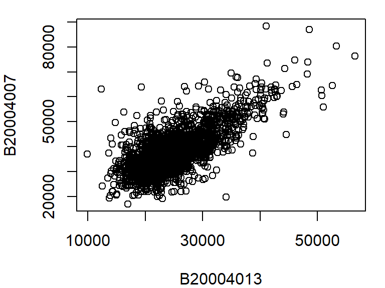{width=384}
:::
:::


The above `plot` command takes two arguments: `B20004007 ~ B20004013` which is to be read as "*plot variable B20004007 as a function of B20004013*", and `dat = dat2` which tells the plot function which data frame to extract the variables from. Another way to call this command is to type:


::: {.cell}

```{.r .cell-code}
plot(dat2$B20004007 ~ dat2$B20004013)
```
:::


The `plot` function can take on many other arguments to help tweak the default plot options. For example, we may want to change the axis labels to something more descriptive than the table column names:


::: {.cell}

```{.r .cell-code}
plot(B20004007 ~ B20004013, dat = dat2, 
      xlab = "Female median income ($)", 
      ylab = "Male median income ($)")
```

::: {.cell-output-display}
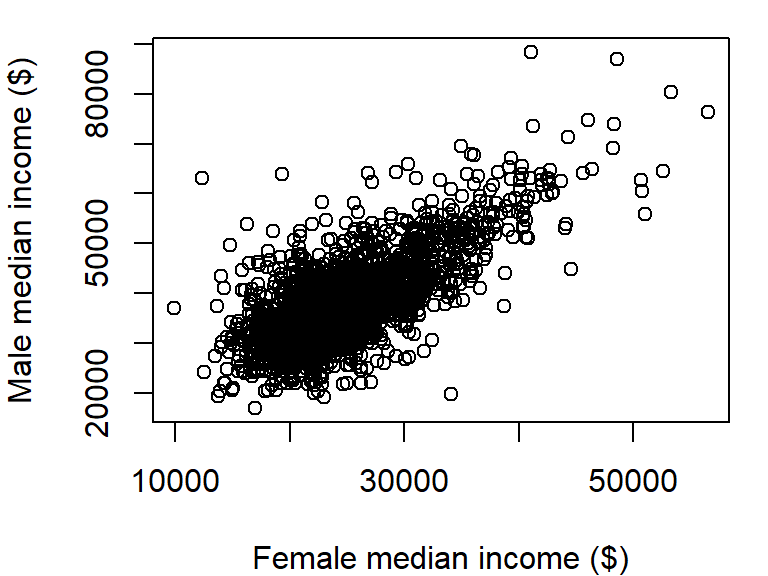{width=384}
:::
:::


There are over 3000 observations in this dataset which makes it difficult the see what may be going on in the cloud of points. We can change the symbol type to solid fill,`pch = 20`, and set its color to 90% transparent (or 10% opaque) using the expression `col = rgb(0, 0, 0, 0.10)`. The `rgb()` function defines the intensities for each of the display's primary colors (on a scale of 0 to 1). The primary colors are red, green and blue. The forth value is optional and provides the fraction opaqueness with a value of `1` being completely opaque.


::: {.cell}

```{.r .cell-code}
plot(B20004007 ~ B20004013, dat = dat2, 
     xlab = "Female median income ($)", 
     ylab = "Male median income ($)", 
     pch = 20, col = rgb(0, 0, 0, 0.10) )
```

::: {.cell-output-display}
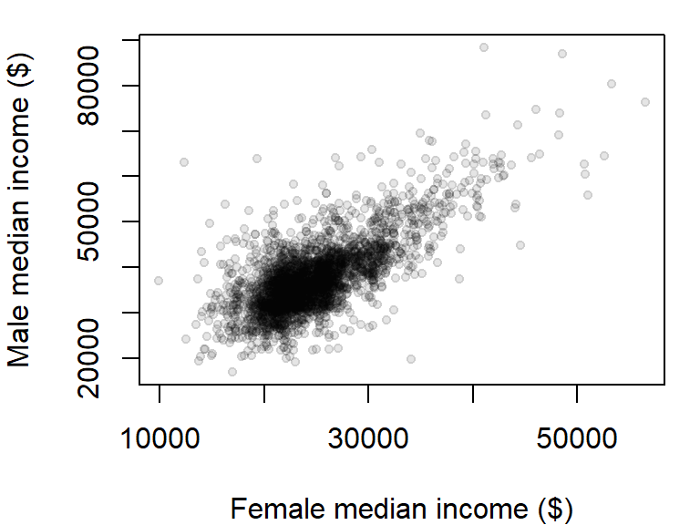{width=384}
:::
:::


The plot could use additional tweaking, but it may be best to build the plot from scratch as will be demonstrated a few sections down.

By default, the `plot` command will plot points and not lines. To plot lines, add the `type="l"` parameter to the `plot` function. For example, to plot oats crop yield as a function of year from our `dat1w` dataset, type:


::: {.cell}

```{.r .cell-code}
plot(Oats ~ Year, dat = dat1w, type="l", 
     ylab = "Oats yield (Hg/Ha)" )
```

::: {.cell-output-display}
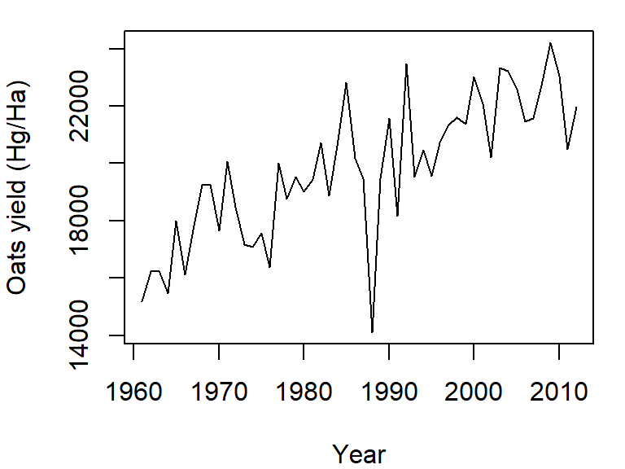{width=384}
:::
:::


To plot both points and line, set the `type` parameter to `"b"` (for *both*). We'll also set the point symbol to `20`.


::: {.cell}

```{.r .cell-code}
plot(Oats ~ Year, dat = dat1w, type = "b", pch = 20, 
     ylab = "Oats yield (Hg/Ha)" )
```

::: {.cell-output-display}
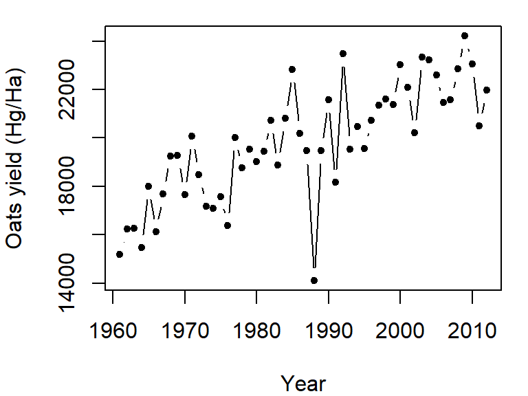{width=384}
:::
:::


The `plot` command can only graph on variable. If you want to add another variable, you will need to call the `lines` function. We will assign a different line type to this second variable (`lty = 2`):


::: {.cell}

```{.r .cell-code}
plot(Oats ~ Year, dat = dat1w, type = "l", 
     ylab = "Oats yield (Hg/Ha)" )
lines(Barley ~ Year, dat = dat1w, lty = 2)
```

::: {.cell-output-display}
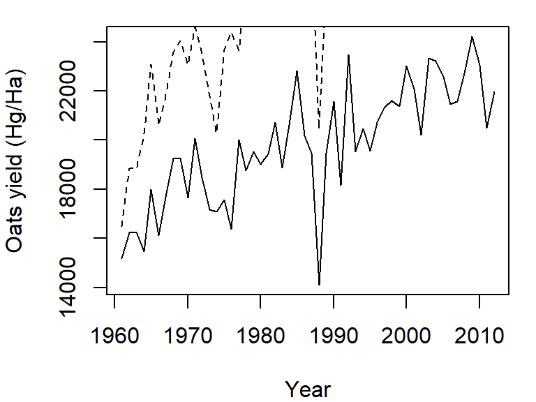{width=384}
:::
:::


Note how the plot does not automatically re-scale to accommodate the new line. The plot is a static object meaning that we need to define the axes limits before calling the original plot function. Both axes limits can be set using the `xlim` and `ylim` parameters. We don't need to set the x-axis range since both variables cover the same year range. We will therefore only focus on the y-axis limits. We can grab both the minimum and maximum values for the variables `Oats` and `Barley` using the `range` function, then pass the range to the `ylim` parameter in the call to `plot`.


::: {.cell}

```{.r .cell-code}
y.rng <- range( c(dat1w$Oats, dat1w$Barley) )
plot(Oats ~ Year, dat = dat1w, type = "l", ylim = y.rng,
     ylab = "Oats yield (Hg/Ha)")
lines(Barley ~ Year, dat = dat1w, lty = 2)
```

::: {.cell-output-display}
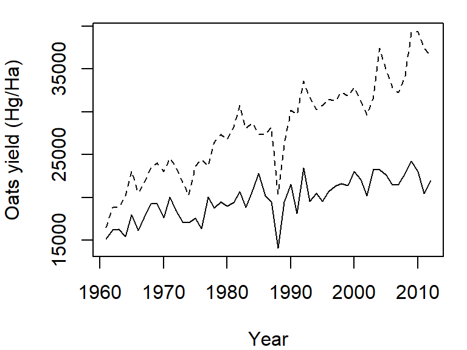{width=384}
:::
:::


Point plots from different variables can also be combined into a single plot using the `points` function in lieu of the `lines` function. In the following example, male vs. female income for population having a high school degree (blue dots) and a Bachelor's degree (red dots) will be overlaid on the same plot. We'll also add a legend in the top-right corner.


::: {.cell}

```{.r .cell-code}
y.rng <- range( c(dat2$B20004009, dat2$B20004011) , na.rm = TRUE) 
x.rng <- range( c(dat2$B20004015, dat2$B20004017) , na.rm = TRUE) 

# Plot income for HS degree
plot(B20004009 ~ B20004015, dat = dat2, pch = 20, col = rgb(0, 0, 1, 0.10),
     xlab = "Female median income ($)", 
     ylab = "Male median income ($)", 
     xlim = x.rng, ylim = y.rng)

# Add points for Bachelor's degree
points(dat2$B20004011 ~ dat2$B20004017, dat = dat2, pch = 20, 
       col = rgb(1,0,0,0.10))

# Add legend
legend("topright", c("HS Degree", "Bachelor's"), pch = 20, 
       col = c(rgb(0, 0, 1, 1), rgb(1, 0, 0, 1) ))
```

::: {.cell-output-display}
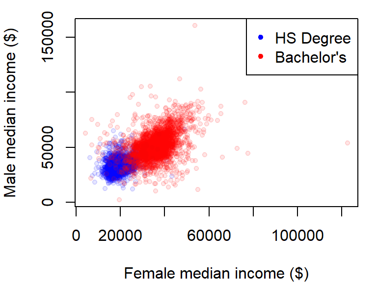{width=384}
:::
:::


The `na.rm = TRUE` option is added as a parameter in the `range` function to prevent an `NA` value in the data from returning an `NA` value in the range.

### Customizing point symbols

The point size can be adjusted using the `cex` argument. The default value is `1`. Values less than `1` decrease the point size, while values greater than `1` increase it. 

Point symbols are defined by a numeric code. The following figure shows the list of point symbols available in R along with their numeric designation as used with the `pch` argument. The symbol's color can be defined using the `col` parameter. For symbols 21 through 25, which have a two-color scheme, `col` applies to the outline color (blue in the following figure) and `bg` parameter applies to the fill color (red in the following figure).


::: {.cell}
::: {.cell-output-display}
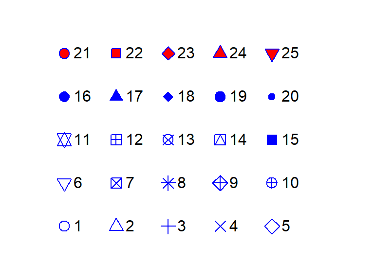{width=384}
:::
:::


You can define the color using the `rgb()` function, or by a color name such as `col = "red"` or `col = "bisque"`. For a full list of color names, type `colors()` at a command prompt.

### Customizing line symbols

The line width can be adjusted using the `lwd` argument. The default value is `1`. Values less than `1` make the line thinner, while values greater than `1` make it thicker. 

Line types can also be customized in the `plot` function using the `lty` argument. There are six different line types, each identified by a number:


::: {.cell}
::: {.cell-output-display}
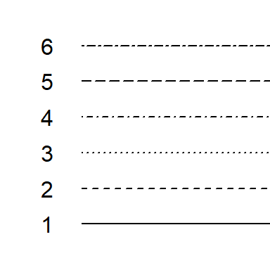{width=192}
:::
:::


### Boxplots

A boxplot is one of many graphical tools used to summarize the distribution of a data batch. The graphic consists of a "box" that depicts the range covered by 50% of the data (aka the interquartile range, IQR), a horizontal line that displays the median, and "whiskers" that depict 1.5 times the IQR or the largest (for the top half) or smallest (for the bottom half) values.

For example, we can summarize the income range for all individuals as follows:


::: {.cell}

```{.r .cell-code}
boxplot(dat2$B20004001, na.rm = TRUE)
```

::: {.cell-output-display}
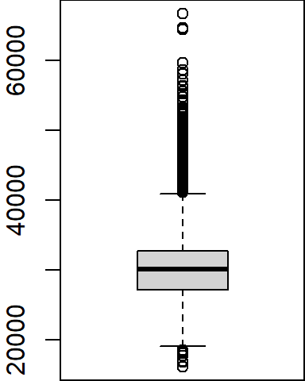{width=192}
:::
:::


Note that the `boxplot` function has no option to specify the data frame as is the case with the `plot` function; we must therefore pass it both the data frame name and the variable as a single argument (i.e. `dat2$B20004001`). 

Several variables can be summarized on the same plot. 


::: {.cell}

```{.r .cell-code}
boxplot(dat2$B20004001, dat2$B20004007, dat2$B20004013, 
        names = c("All", "Male", "Female"), main = "Median income ($)")
```

::: {.cell-output-display}
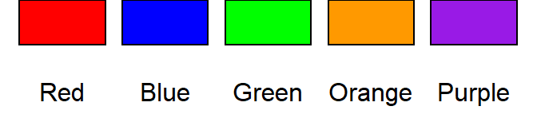{width=288}
:::
:::


The `names` argument labels the x-axis and the `main` argument labels the plot title.

The outliers can be removed from the plot, if desired, by setting the `outline` parameter to `FALSE`:


::: {.cell}

```{.r .cell-code}
boxplot(dat2$B20004001, dat2$B20004007, dat2$B20004013, 
        names = c("All", "Male", "Female"), main = "Median income ($)", 
        outline = FALSE)
```

::: {.cell-output-display}
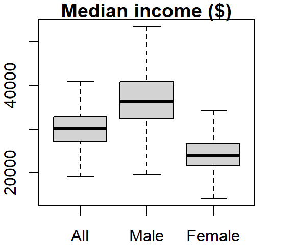{width=288}
:::
:::


The boxplot graph can also be plotted horizontally by setting the `horizontal` parameter to `TRUE`:


::: {.cell}

```{.r .cell-code}
boxplot(dat2$B20004001, dat2$B20004007, dat2$B20004013, 
        names = c("All", "Male", "Female"), main = "Median income ($)", 
        outline = FALSE, horizontal = TRUE)
```

::: {.cell-output-display}
{width=288}
:::
:::


The last two plots highlight one downside in using a table in a wide format: the long series of column names passed to the boxplot function. It's more practical to store such data in long form. To demonstrate this, let's switch back to the crop data. To plot all columns in `dat1w`, we would need to type:


::: {.cell}

```{.r .cell-code}
boxplot(dat1w$Barley, dat1w$Buckwheat, dat1w$Maize, dat1w$Oats,dat1w$Rye,
        names=c("Barley", "Buckwheat", "Maize", "Oats", "Rye"))
```

::: {.cell-output-display}
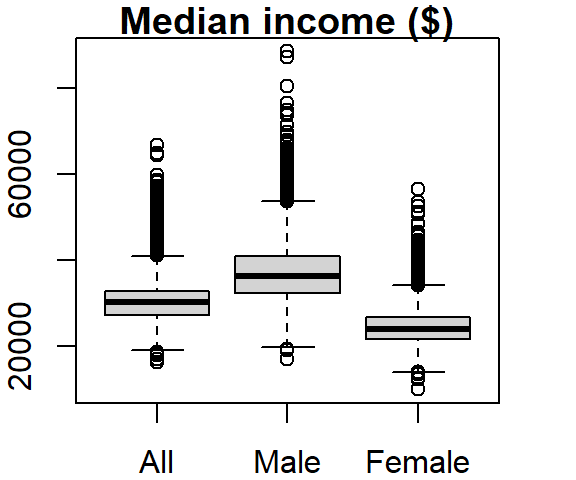{width=480}
:::
:::


If you use the long version of that table, the command looks like this:


::: {.cell}

```{.r .cell-code}
boxplot(Yield ~ Crop, dat1l)
```

::: {.cell-output-display}
{width=480}
:::
:::


where `~ Crop` tells the function to split the boxplots across unique `Crop` levels.

One can order the boxplots based on the median values. By default, `boxplot` will order the boxplots following the factor's level order. In our example, the crop levels are ordered alphabetically. To reorder the levels following the median values of yields across each level, we can use the `reorder()` function:


::: {.cell}

```{.r .cell-code}
dat1l$Crop.ord <- reorder(dat1l$Crop, dat1l$Yield, median)
```
:::


This creates a new variable called `Crop.ord` whose values mirror those in variable `Crop` but differ in the underlying level order:


::: {.cell}

```{.r .cell-code}
levels(dat1l$Crop.ord)
```

::: {.cell-output .cell-output-stdout}

```
[1] "Buckwheat" "Rye"       "Oats"      "Barley"    "Maize"    
```


:::
:::


If we wanted the order to be in descending order, we would prefix the value parameter with the negative operator as in `reorder(dat1l$Crop, -dat1l$Yield, median)`.

The function `reorder` takes three arguments: the factor whose levels are to be reordered (`Crop`), the value whose quantity will determine the new order (`Yield`) and the statistic that will be used to summarize the values across each factor's level (`median`).

The modified boxplot expression now looks like:


::: {.cell}

```{.r .cell-code}
boxplot(Yield ~ Crop.ord, dat1l)
```

::: {.cell-output-display}
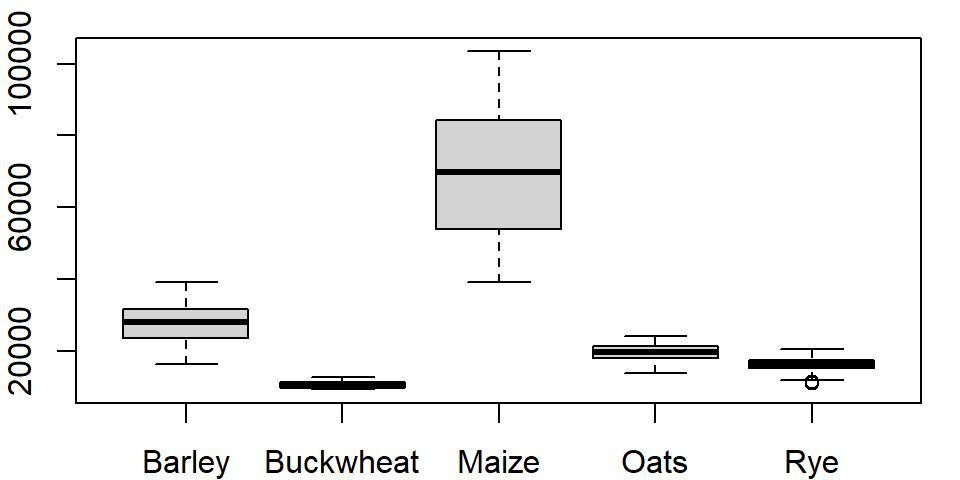{width=480}
:::
:::


Alternatively, you could have embedded the `reorder` function directly in the plotting function.


::: {.cell}

```{.r .cell-code}
boxplot(Yield ~ reorder(Crop, Yield, median), dat1l)
```

::: {.cell-output-display}
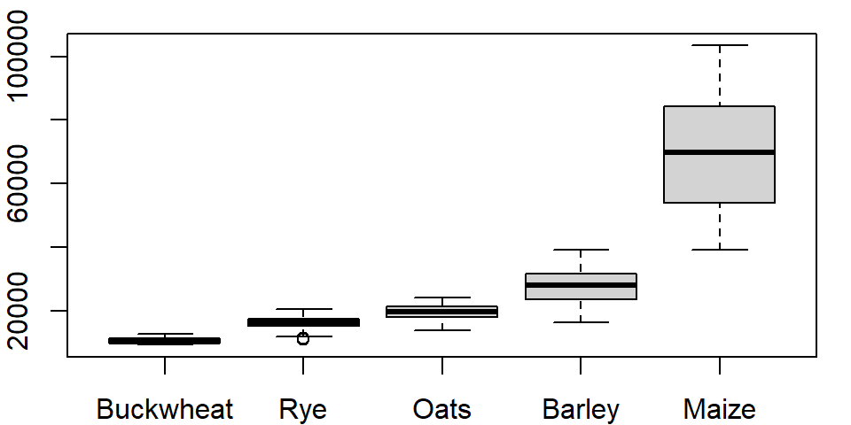{width=480}
:::
:::


### Histograms

The histogram is another form of data distribution visualization. It consists of partitioning a batch of values into intervals of equal length then tallying their count in each interval. The height of each bar represents these counts. For example, we can plot the histogram of maize yields using the `hist` function as follows:


::: {.cell}

```{.r .cell-code}
hist(dat1w$Maize, xlab = "Maize", main = NA)
```

::: {.cell-output-display}
{width=384}
:::
:::


The `main = NA` argument suppresses the plot title.

To control the number of bins add the `breaks` argument. The `breaks` argument can be passed different types of values. The simplest value is the desired number of bins. Note, however, that you might not necessarily get the number of bins defined with the `breaks` argument. For example assigning the value of `10` to `breaks` generates a 14 bin histogram.


::: {.cell}

```{.r .cell-code}
hist(dat1w$Maize, xlab = "Maize", main = NA, breaks = 10)
```

::: {.cell-output-display}
{width=384}
:::
:::


The documentation states that the breaks value *"is a suggestion only as the breakpoints will be set to `pretty` values"*. `pretty` refers to a function that rounds values to powers of 1, 2 or 5 times a power of 10.

If you want total control of the bin numbers, manually create the breaks as follows:


::: {.cell}

```{.r .cell-code}
n <- 10  # Define the number of bin
minx <- min(dat1w$Maize, na.rm = TRUE)
maxx <- max(dat1w$Maize, na.rm = TRUE)
bins <- seq(minx, maxx, length.out = n +1)

hist(dat1w$Maize, xlab = "Maize", main = NA, breaks = bins)
```

::: {.cell-output-display}
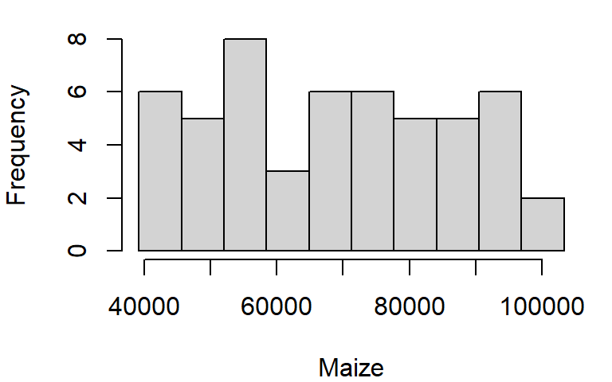{width=384}
:::
:::


### Density plot

Histograms have their pitfalls. For example, the number of bins can drastically affect the appearance of a distribution. One alternative is the density plot which, for a series of x-values, computes the density of observations at each x-value. This generates a "smoothed" distribution of values.

Unlike the other plotting functions, `density` does not generate a plot but instead, it generates a list object. The output of `density` can be wrapped with a `plot` function to generate the plot.


::: {.cell}

```{.r .cell-code}
dens <- density(dat1w$Maize)
plot(dens, main = "Density distribution of Maize yields")
```

::: {.cell-output-display}
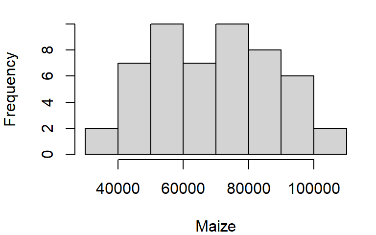{width=384}
:::
:::


You can control the bandwidth using the `bw` argument. For example:


::: {.cell}

```{.r .cell-code}
dens <- density(dat1w$Maize, bw = 4000)
plot(dens, main = "Density distribution of Maize yields")
```

::: {.cell-output-display}
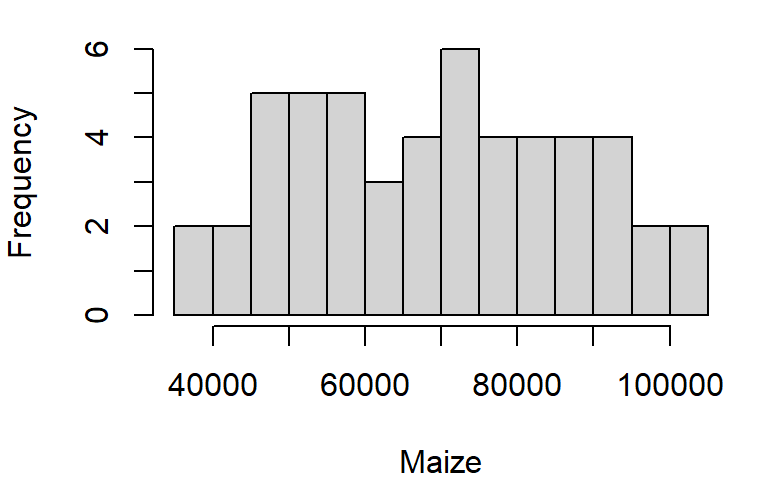{width=384}
:::
:::


The bandwidth parameter adopts the variable's units.

## Customizing plots

So far, you have learned how to customize point and line symbols, but this may not be enough. You might want to modify other graphic elements such as the axes layout and label formats for publication. Let's see how we can further customize a plot of median income  for male and female population having attained a HS degree.

First, we plot the points but omit the axes and its labels with the parameters `axes = FALSE, xlab = NA, ylab = NA`. We will want both axes to cover the same range of values, so we will use the `range` function to find min and max values for both male and female incomes.

Next, we draw the x axis using the `axis` function. The first parameter to this function is a number that indicates which axis is to be drawn (i.e. 1=bottom x, 2=left y, 3=top x and 4=right y). We will then use the `mtext` function to place the axis label under the axis line.


::: {.cell}

```{.r .cell-code}
# Plot the points without the axes
rng <- range(dat2$B20004009, dat2$B20004015, na.rm = TRUE)
plot(B20004009 ~ B20004015, dat = dat2, pch = 20, col = rgb(0,0,0,0.15), 
     xlim = rng, ylim = rng, axes = FALSE, xlab = NA, ylab = NA )

# Plot the x-axis
lab <- c("5,000", "25,000", "45,000", "$65,000")
axis(1, at = seq(5000, 65000, length.out = 4),  label = lab)

# Plot x label
mtext("Female median income (HS degree)", side = 1, line = 2)
```

::: {.cell-output-display}
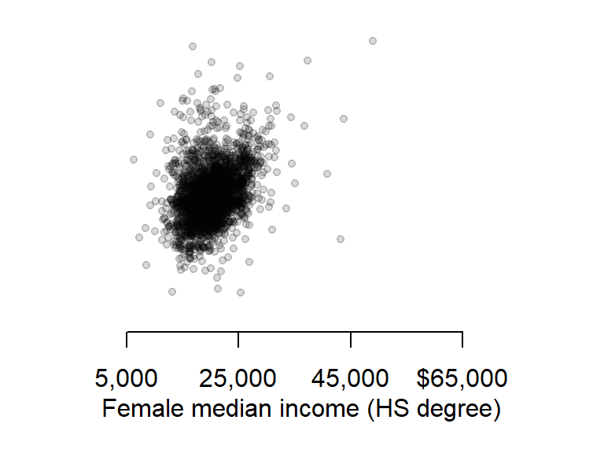{width=384}
:::
:::


Next, we will tackle the y-axis. We will rotate both the tic labels and axis label horizontally and place the axis label at the top of the axis. This will involve a different approach to that used for the x-axis. First, we need to identify each plot region's corner coordinate values using the `par` function. Second, we will use the `text` function instead of the `mtext` function to place the axis label.

First, let's plot the y-axis with the custom tic labels.


::: {.cell}

```{.r .cell-code}
# Plot the y-axis
axis(2, las = 1, at = seq(5000,65000, length.out = 4), label = lab)
```

::: {.cell-output-display}
{width=384}
:::
:::


Now let's extract the plot's corner coordinate values.


::: {.cell}

```{.r .cell-code}
loc <- par("usr")
loc
```

::: {.cell-output .cell-output-stdout}

```
[1]  3850 68650  3850 68650
```


:::
:::


The corner location coordinate values are in the plot's x and y units. We want to place the label in the upper left hand corner whose coordinate values are `loc[1]=` 3850 and `loc[2]=` 68650.


::: {.cell}

```{.r .cell-code}
text(loc[1], loc[4], "Male median\nincome", pos = 3, adj = 1, xpd = TRUE)
```

::: {.cell-output-display}
{width=384}
:::
:::


The string `\n` in the text `"Median\nIncome"` is interpreted in R as being a carriage return--i.e it forces the text that follows this string to be printed on the next line. The other parameters of interest are `pos` and `adj` that position and adjust the label location (type `?axis` for more information on axis parameters) and the parameter `xpd=TRUE` allows for the `text` function to display text outside of the plot region.

## R colors

R has built-in color palettes that can be used in your plotting functions. Note that the palettes are finite implying that if you have more unique categories than unique colors in a given palette, R will recycle the colors starting with the first color.

The built-in palettes are listed below:


::: {.cell}
::: {.cell-output-display}
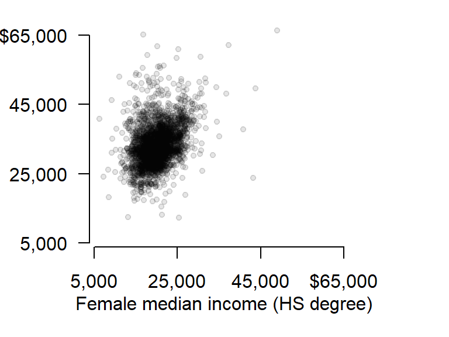{width=768}
:::
:::


The default palette is `R4`.

For example, the following generates a point plot using the first 5 colors of `R4`.


::: {.cell}

```{.r .cell-code}
plot(1:5, rep(1,5), type = "p", pch = 16, cex = 3, col = 1:5)
```

::: {.cell-output-display}
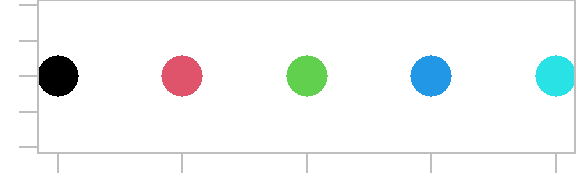{width=288}
:::
:::


To change palette, you will need to pass the palette name as a parameter to the `palette()` function. For example, to color the points using the `Accent` palette, type:


::: {.cell}

```{.r .cell-code}
palette("Accent")
plot(1:5, rep(1,5), type = "p", pch = 16, cex = 3, col = 1:5)
```

::: {.cell-output-display}
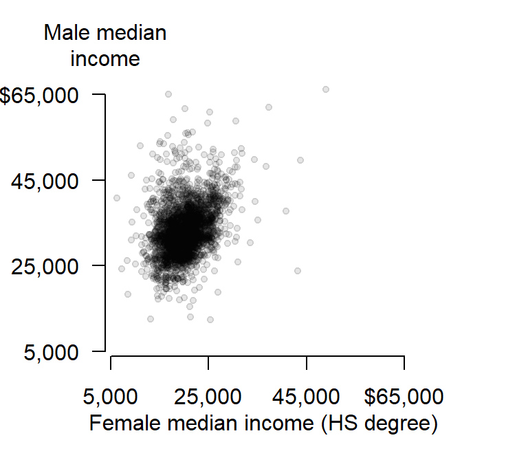{width=288}
:::
:::


To revert back to the default palette, reset the palette via the `palette("R4")` command.

You can also create a continuous color scheme using R's built-in color ramp tools.

A flexible color ramp function is `colorRampPalette`. It takes as arguments the desired sequence of colors and the number of unique color swatches. For example, to generate 20 color swatches that range from blue to white to red, type:


::: {.cell}

```{.r .cell-code}
col1 <- colorRampPalette(c("blue", "white", "red"))(20)
plot(1:20, rep(1,20), type = "p", pch = 16, cex = 3, col = col1)
```

::: {.cell-output-display}
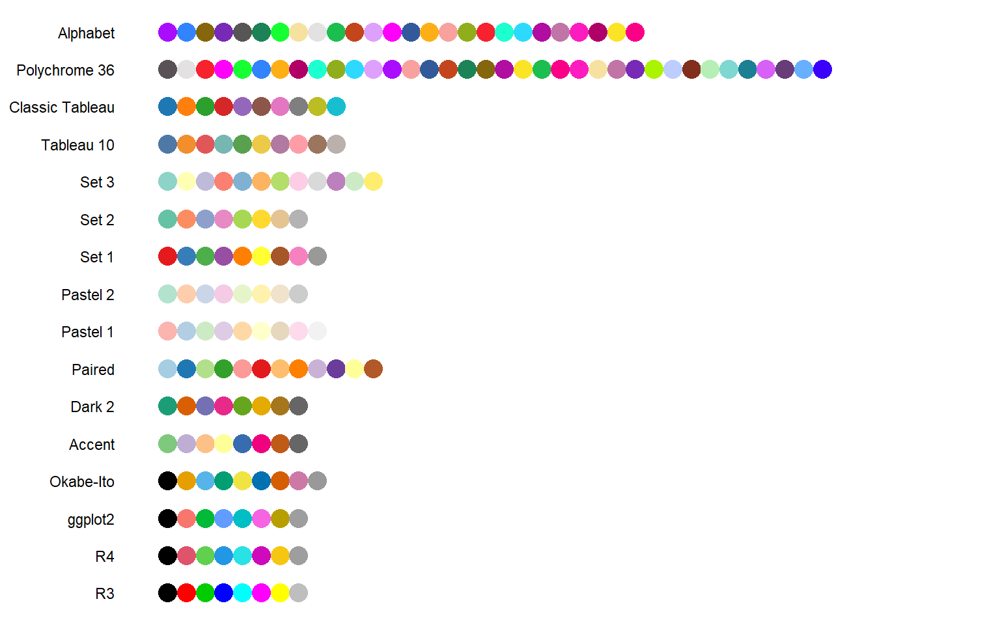{width=576}
:::
:::


You also have access to built-in color ramp functions. These include `terrain.colors`, `heat.colors`, `rainbow`, `cm.colors` and `topo.colors`. These functions take as arguments the number of colors to generate. For example, to generate 20 shades of `terrain.colors` type:


::: {.cell}

```{.r .cell-code}
col2 <- terrain.colors(20)
plot(1:20, rep(1,20), type = "p", pch = 16, cex = 3, col = col2)
```

::: {.cell-output-display}
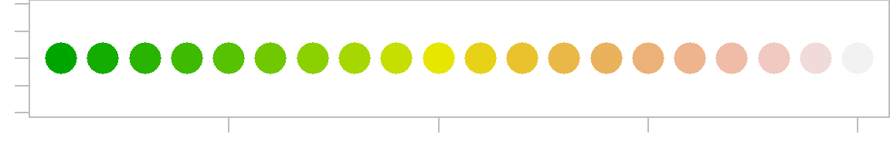{width=576}
:::
:::


You can also leverage the built-in perceptually-based HCL color schemes. These schemes include `qualitative`, `sequential` and `diverging`. For example, to list the color palettes associated with a divergent color scheme, type:


::: {.cell}

```{.r .cell-code}
hcl.pals("diverging")
```

::: {.cell-output .cell-output-stdout}

```
 [1] "Blue-Red"      "Blue-Red 2"    "Blue-Red 3"    "Red-Green"     "Purple-Green"  "Purple-Brown"  "Green-Brown"   "Blue-Yellow 2" "Blue-Yellow 3" "Green-Orange"  "Cyan-Magenta"  "Tropic"        "Broc"          "Cork"          "Vik"           "Berlin"        "Lisbon"        "Tofino"       
```


:::
:::


You can then pass any one of the listed color palettes to the `hcl.colors` function. The function takes two arguments: the desired number of color swatches and the color palette name. For example, to create the `"Vik"` divergent color scheme (note the upper-case `V`), type:


::: {.cell}

```{.r .cell-code}
col2 <- hcl.colors(20, "Vik")
plot(1:20, rep(1,20), type = "p", pch = 16, cex = 3, col = col2)
```

::: {.cell-output-display}
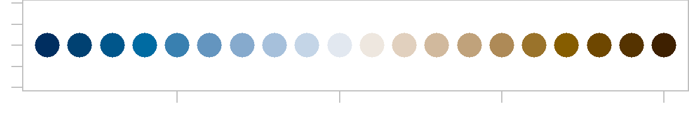{width=576}
:::
:::


## Exporting plots to image file formats

You might need to export your plots as standalone image files for publications. R will export to many different raster image file formats such as jpg, png, gif and tiff, and several vector file formats such as PostScript, svg and PDF. You can specify the image resolution (in dpi), the image height and width, and the size of the margins.

The following example saves the last plot as an uncompressed tiff file with a 5"x6" dimension and a resolution of 300 dpi. This is accomplished by simply book-ending the plotting routines between the `tiff()` and `dev.off()` functions:


::: {.cell}

```{.r .cell-code}
tiff(filename = "fig1.tif", width = 5, height = 6, units = "in",
     compression = "none", res = 300)

  # Plot the points without the axes
  rng <- range(dat2$B20004009, dat2$B20004015, na.rm = TRUE)
  plot(B20004009 ~ B20004015, dat = dat2, pch = 20, col = rgb(0,0,0,0.10), 
       xlim = rng, ylim = rng, axes = FALSE, xlab = NA, ylab = NA )
  # Plot the x-axis
  lab <- c("5,000", "25,000", "45,000", "$65,000")
  axis(1, at = seq(5000,65000, length.out = 4),  label = lab)
  # Plot x label
  mtext("Female median income (HS degree)", side = 1, line = 2)
  # Plot the y-axis
  axis(2, las = 1, at = seq(5000,65000, length.out = 4), label = lab)
  text(loc[1], loc[4], "Male median\nincome", pos = 3, adj = 1, xpd = TRUE)

dev.off()
```
:::


To save the same plot to a pdf file format, simply substitute `tiff()` with `pdf()` and adjust the parameters as needed:


::: {.cell}

```{.r .cell-code}
pdf(file = "fig1.pdf", width = 5, height = 6)

  # Plot the points without the axes
  rng <- range(dat2$B20004009, dat2$B20004015, na.rm = TRUE)
  plot(B20004009 ~ B20004015, dat = dat2, pch = 20, col = rgb(0,0,0,0.15), 
       xlim = rng, ylim = rng, axes = FALSE, xlab = NA, ylab = NA )
  # Plot the x-axis
  lab <- c("5,000", "25,000", "45,000", "$65,000")
  axis(1, at = seq(5000,65000, length.out=4),  label = lab)
  # Plot x label
  mtext("Female median income (HS degree)", side = 1, line = 2)
  # Plot the y-axis
  axis(2, las = 1, at = seq(5000,65000, length.out = 4), label = lab)
  text(loc[1], loc[4], "Male median\nincome", pos = 3, adj = 1, xpd = TRUE)

dev.off()
```
:::

