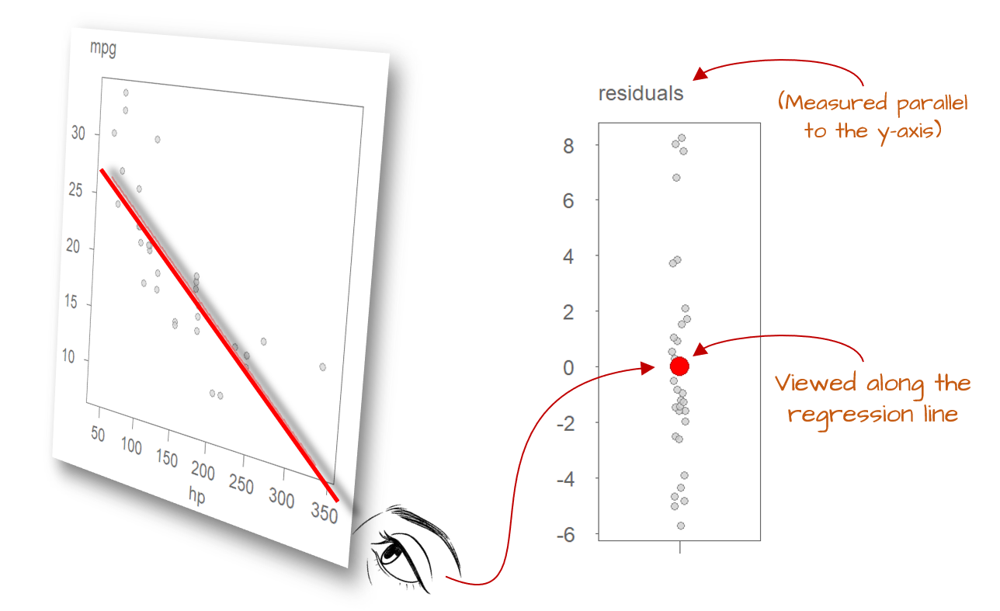

# Model Residuals

```{r echo=FALSE}
source("libs/Common.R")
```

```{r echo = FALSE, eval=knitr::is_html_output()}
pkg_ver(c("ggplot2"))
```

-----------------------------------

In our earlier exploration of univariate analysis, we learned how residuals could provide insights into the underlying patterns and processes. Examining the relationship between residuals and fitted models proved essential for answering many exploratory data analysis (EDA) questions and refining our understanding of the data’s structure.

Residuals play an equally pivotal role in bivariate analysis. At their core, residuals help evaluate and refine model fitting strategies. Beyond this, they are indispensable in confirmatory analysis, where they serve as tools to assess the significance and predictive power of an independent variable in explaining variations in a continuous dependent variable. In this way, residuals bridge the gap between model diagnostics and the broader goals of statistical inference.

In this chapter, we will explore ways residuals can help fine-tune the formulation and fitting of models.

## Residual-dependence plot

Regardless of the type of model, it is uncommon for a model to fit every data point perfectly, even with non-parametric approaches like loess. In fact, achieving a perfect fit can be undesirable when the goal is to gain insights into the underlying process, as noise is often an inherent byproduct of measurements.

Ideally, residuals should appear as random scatter with no discernible pattern. Any visible structure (such as curvature or changing spread) suggests that the model may not fully capture the relationship between variables.

The residuals reflect the difference between the observed value ,$y_{\ observed}$, and what the model predicts, $y_{\ predicted}$ .

$$
\epsilon = y_{\ observed} - y_{\ predicted} 
$$
You may also see the following notation used in statistical texts:

$$
\epsilon = y - \hat{y} 
$$
where $y$ is the observed values and $\hat{y}$ is the predicted or estimated value.

In the miles-per-gallon vs. horsepower dataset explored in the previous chapter, a few models were explored including the first order polynomial model.

$$
\hat{mpg} = \hat{a} + \hat{b}(hp) + \epsilon
$$

The `lm` function is used to fit the model to the data.

```{r}
M1 <- lm(mpg ~ hp, mtcars)
```

The `M1` object is a list that stores many model components including the residuals which can be extracted from the object using the `residuals()` function. 

```{r}
mtcars$res1 <- residuals(M1)
```

The residuals can be explored in a **residual-dependence plot** (R-D plot) where the residuals are mapped to the y-axis and the independent variable, $x$, is mapped to the x-axis. An example of the plot is  generated using `ggplot`. To help identify a pattern (if any), a loess is fitted to the residuals. 

> Note: The loess curve in a residual plot is not used to model the data, but rather to help visualize any remaining structure. A relatively flat loess line suggests that the residuals are randomly scattered, indicating a well-fitted model.


```{r fig.height=2.5, fig.width=2.5, small.mar=TRUE}
library(ggplot2)

ggplot(mtcars, aes(x = hp, y = res1)) + geom_point() +
             stat_smooth(method = "loess", se = FALSE, span = 1, 
                         method.args = list(degree = 1) )

```

A well defined model will result in a residuals point pattern that should appear uniformly distributed across the range of dependent values. The fitted loess should show no prominent trends in the residuals. 

The first-order polynomial residuals follow a parabolic suggesting that the linear model did not capture the true shape of the point pattern. We say that the residuals show *dependence* on the x values. 

Next, we'll look at the residuals from a second order polynomial model, `M2`, that we will fit to the data.

```{r fig.height=2.5, fig.width=2.5, small.mar=TRUE}
M2 <- lm(mpg ~ hp + I(hp^2), mtcars)

mtcars$res2 <- residuals(M2)

ggplot(mtcars, aes(x = hp, y = res2)) + geom_point() +
               stat_smooth(method = "loess", se = FALSE, span = 1, 
                           method.args = list(degree = 1) )

```

The parabolic pattern observed in the first-order model residuals is no longer present in this set of residuals. This suggests that the second-order model does a better job in capturing the pattern generated by this bivariate dataset.


## Residual-fit plot

A  **residual-fit plot** (R-F plot) is another type of residual plot where the **modeled** (or **fitted**) values, $y_{predicted}$, are plotted on the x-axis, and the residuals, $\epsilon$,  are plotted on the y-axis. Similar to the residual-dependence plot, the R-F plot visually conveys how closely the observed points align with the modeled relationship.

```{r fig.height=2.5, fig.width=2.5, small.mar=TRUE}
mtcars$fit2 <- fitted(M2)

ggplot(mtcars, aes(x = fit2, y = res2)) + geom_point() +
               stat_smooth(method = "loess", se = FALSE, span = 1, 
                           method.args = list(degree = 1) ) +
               xlab("Fitted values")

```

The distinction between an R-F plot and an R-D plot is often minimal, especially when the fitted model is a first-order polynomial. For instance, if the modeled slope is positive, both plots will exhibit nearly identical point patterns. In the following plots, points are colored consistently across the three visualizations to highlight their alignment:


```{r fig.width = 10, fig.height = 3, echo = FALSE, results='hide'}
library(tukeyedar)
col <- colorRampPalette(c("#4575b4", "#d73027"))(20)

# Positive slope
set.seed(321)
x <- sort(rnorm(20, 10, 1))
y <- 1 + x * 2 + rnorm(20, 0, 0.1)

df <- data.frame(x,y)

OP <- par(mfrow = c(1,3),cex = 1)
MM1 <- lm(y ~ x, df)
df$residuals <- MM1$residuals
df$fit <- predict(MM1)
E1 <- eda_lm(df, x, y,  show.par = FALSE, sd = FALSE, mean = FALSE, lm.col = "gray")
points(x,y,col = col, pch =16, cex = 1.2)
#eda_lm(df, x, residuals, lm=NULL, show.par = FALSE, sd = FALSE, mean = FALSE, loe = TRUE, loe.col = "gray")
plot(E1, loe.col = "grey")
with(df, points(x, residuals, col = col, pch =16, cex = 1.2))
#eda_lm(df, fit, residuals, lm=NULL, show.par = FALSE, sd = FALSE, mean = FALSE, loe = TRUE, loe.col = "gray")
plot(E1, plot = "rf", loe.col = "grey")
with(df, points(fit, residuals, col = col, pch =16, cex = 1.2))
par(OP)
```

As shown, the point patterns in both residual plots are identical.

If the modeled slope is negative, the point pattern in the R-F plot becomes a mirror image of the R-D plot. This is evident in the re-arrangement of the colored points in the R-F plot:

```{r fig.width = 10, fig.height = 3, echo = FALSE, results='hide'}
## Negative slope
set.seed(543)
y <- 1 + - x * 2 + rnorm(20, 0, 0.1)
df <- data.frame(x,y)
OP <- par(mfrow = c(1,3), cex = 1)
MM1 <- lm(y ~ x, df)
df$residuals <- MM1$residuals
df$fit <- predict(MM1)
E2 <- eda_lm(df, x, y, , show.par = FALSE, sd = FALSE, mean = FALSE, lm.col = "gray")
points(x,y,col = col, pch =16, cex = 1.2)

#eda_lm(df, x, residuals, lm=NULL, show.par = FALSE, sd = FALSE, mean = FALSE, loe = TRUE, loe.col = "gray")
plot(E2, loe.col = "grey")
with(df, points(x, residuals, col = col, pch =16, cex = 1.2))

#eda_lm(df, fit, residuals, lm=NULL, show.par = FALSE, sd = FALSE, mean = FALSE, loe = TRUE, loe.col = "gray")
plot(E2, plot = "rf", loe.col = "grey")
with(df, points(fit, residuals, col = col, pch =16, cex = 1.2))
par(OP)
```

Despite the flipped orientation, the insights derived from either plot, such as potential model adjustments, remain consistent.

When the fitted model is curvilinear, however, the differences between the two residual plots become more pronounced and potentially meaningful. This is demonstrated in the following series of plots:

```{r fig.width = 10, fig.height = 3, echo = FALSE, results='hide'}
## Polynomial model

set.seed(123)
#set.seed(212)
x <- sort(runif(20, min = -10, max = 10))
residuals <- rnorm(20, mean = 0, sd = 0.5 * abs(x+10))
y <- x + x^2 + residuals
x <- x + 10
df <- data.frame(x,y)

OP <- par(mfrow = c(1,3), cex = 1)
MM1 <- lm(y ~ x + I(x^2), df)
df$residuals <- MM1$residuals
df$fit <- MM1$fitted.values

E3 <- eda_lm(df, x, y, poly = 2, show.par = FALSE, sd = FALSE, mean = FALSE, lm.col = "gray")
points(x,y,col = col, pch =16)
#eda_lm(df, x, residuals, lm=NULL, show.par = FALSE, sd = FALSE, mean = FALSE, loe = T, loe.col = "gray")
plot(E3, loe.col = "grey")
with(df, points(x, residuals, col = col, pch =16))
#eda_lm(df, fit, residuals, lm=NULL, show.par = FALSE, sd = FALSE, mean = FALSE, loe = T, loe.col = "gray")
plot(E3, plot = "rf", loe.col = "grey")
with(df, points(fit, residuals, col = col, pch =16))

par(OP)
```

Both residual plots suggest that the second-order polynomial model is a good fit for the data. However, the point patterns in the two plots differ significantly, as highlighted by the reorganization of the colored points in the R-F plot.

One notable difference is the clearer visibility of the increasing spread of residuals with larger $x$ values in the R-D plot--this is less noticeable in the R-F plot. This phenomenon, known as heteroskedasticity, will be discussed in detail in the next chapter along with techniques and plots designed to better identify and analyze it.

## Where are the residuals, exactly?

You might wonder, **“How can we determine the residuals along the fitted line when, for any given value of $X$, there may be at most a single observation?”**

To answer this, it’s important to recognize that most datasets represent a finite set of observations. However, when fitting a model to bivariate data, we implicitly assume that the relationship between $X$ and $Y$ is continuous within the range of observed values. This assumption allows us to generalize beyond the specific data points collected.

For instance, when modeling the relationship between miles-per-gallon and horsepower, our goal isn't to explain only the cars in our dataset. Instead, we're trying to understand a general trend that applies to *all* cars. The fitted model should be able to predict fuel efficiency for a new vehicle with a given horsepower-even if that specific combination wasn't represented in the original data.

This brings us to the concept of residual spread, which reflects the variability we’d expect if we could observe multiple values of $Y$ for the same value of $X$. The model gives us an expected (mean) value of  $Y$, but real-world observations rarely fall exactly on that line. Imagine observing 10 different vehicles, all with the same horsepower: due to factors like design differences or driving conditions, their fuel efficiencies would vary. This variability turns $Y$ into a *random variable*, influenced by factors beyond horsepower alone.

However, in most real-world datasets, we don’t have repeated observations for the same value of $X$, let alone across the full range. So how do we estimate the residual spread? We rely on the **distribution of residuals across all observed data points**. If we were to view the regression line from its end, all the individual residuals would appear to collapse into a **single bundle of deviations from the line**. This aggregate pattern is what we use to estimate the model’s variability.

{width=600}

This is why the assumption of **uniform spread** is so important: it allows us to use all residuals to estimate a single measure of dispersion. By **pooling** information from the entire range of $X$, we increase the reliability of this estimate, enhancing our ability to draw meaningful conclusions about the model’s performance.

## Summary

Residuals play an important role in both exploratory and confirmatory data analysis. They represent the difference between observed and predicted values and their patterns reveal how well a model captures the underlying structure of the data.

In this chapter, we explored residual-dependence (R-D) and residual-fit (R-F) plots, which help identify issues such as curvature, nonlinearity and, to some degree, heteroskedasticity. We also discussed how residuals can be used to estimate model variability, even in the absence of repeated observations.

By examining residuals carefully, we can refine our models, validate assumptions, and improve our understanding of the data-generating process.
