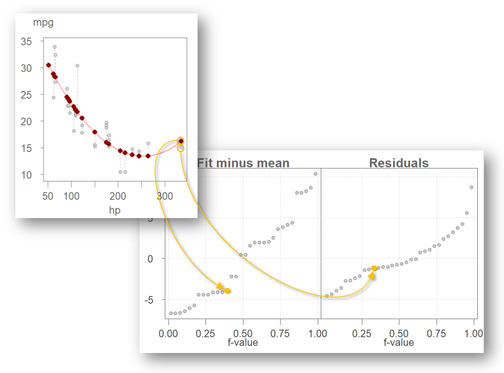

# Bivariate Residual-Fit Spread Plot

```{r echo=FALSE}
source("libs/Common.R")
```

```{r echo = FALSE, eval=knitr::is_html_output()}
pkg_ver(c("dplyr", "tidyr", "ggplot2", "tukeyedar"))
```

------------------------------------------------------------------------

William Cleveland's *residual-fit spread* (RFS) plot was introduced earlier in this course in the univariate context. The plot provides a visual means of comparing the variability explained by a fitted model—such as group means—to the variability of the residuals. The RFS plot can also be applied to bivariate models offering insight into the relationship between a model's effects and its residual variability.

In the previous chapter, we used the variability decomposition (VD) plot to visually separate explained and unexplained variation. The residual-fit spread (RFS) plot builds on this idea by aligning the quantiles of the fitted values and residuals, offering a more detailed, quantile-based comparison of model fit.

## Constructing a residual-fit spread plot

Let’s revisit the `mtcars` dataset and fit a 2^nd^ order polynomial model to predict miles-per-gallon (mpg) from horsepower (hp):

```{r echo=FALSE, fig.height=3, fig.width=3, results='hide'}
library(tukeyedar)

M <- eda_lm(mtcars, hp, mpg, show.par = FALSE, mean.l = FALSE, sd = FALSE,  poly=2)

error_segs <- lapply(1:nrow(mtcars),
       FUN = \(i) data.frame(x = mtcars$hp[i], y = c(M$fitted.values[i], mtcars$mpg[i]),
                             row.names = NULL))
OP2 <- par(mar = c(0,0,0,0))
  lapply(error_segs, \(x) lines(x, col = "grey", lty = 2))
  points(x = mtcars$hp, y = M$fitted.values, pch = 16, col = "darkred")
par(OP2)
```

The vertical dashed lines represent residuals. The fitted values range from about 13.5 to 30.5 mpg, a span of roughly 17 mpg.

To assess how much of the variability in mpg is explained by the model, we turn to the RFS plot:

```{r echo=FALSE, fig.height=3, fig.width=4, results='hide'}
eda_rfs(M)
```

The RFS plot consists of two side-by-side quantile plots:

+  **Fit-minus-mean**: quantiles of the fitted values, centered by subtracting the overall mean.
+  **Residuals**: quantiles of the residuals.

Each point in the RFS plot corresponds to a data point in the original scatterplot. For example, the car with the highest horsepower (335) has a fitted mpg value of 16.2, which ranks as the 13^th^ largest among the fitted values (note that many hp values are tied). After centering by the overall mean, its fit-minus-mean value becomes −4.4. Its residual, −1.2, is the 11^th^ largest among the residuals. These two values appear in the left and right panels of the RFS plot, respectively, illustrating how the plot partitions each observation into its explained and unexplained components.

{width="586"}

By plotting the quantiles of both the estimated values and the residuals, the RFS plot allows for the comparison of their respective magnitudes.

By comparing the spread of the two panels, we can evaluate the model’s explanatory power. In this case, the fitted values span approximately 17 mpg. If we exclude the most extreme residuals, the central 90% of residuals cover a range of about 9 mpg. This suggests that the model accounts for a substantial portion of the variation in mpg. The following plot highlights this comparison by shading the central 90% of the residuals and marking the corresponding range in the fit-minus-mean panel.

```{r echo=FALSE, fig.height=3, fig.width=4, results='hide'}
eda_rfs(M, q = TRUE, inner = 0.9)
```

To better understand the RFS plot, consider a null model that fits only the mean:

```{r echo=FALSE, fig.height=3, fig.width=3, results='hide'}
M <- eda_lm(mtcars, hp, mpg, show.par = FALSE, poly = 0,
            mean.l = FALSE, sd = FALSE)
```

Since the mean is a constant, it explains none of the variability in `mpg`. The residuals must account for all of it:

```{r echo=FALSE, fig.height=3, fig.width=4, results='hide'}
eda_rfs(M)
```

In this case, the residuals span the full range of the data, while the fit-minus-mean plot is flat. This contrast highlights the value of including horsepower as a predictor.

## Constructing an RFS plot with `eda_rfs`

The `eda_rfs()` function from the `tukeyedar` package can be used to generate RFS plots from any lm model:

```{r class.source="eda", fig.height=3, fig.width=4, results='hide'}
library(tukeyedar)

M <- lm(mpg ~ hp + I(hp^2), mtcars)
eda_rfs(M)
```

## Constructing an RFS plot with `ggplot`

Some data manipulation is needed to construct an RFS plot in `ggplot`. Using the regression model `M` from the previous code chunk, the RFS dataset can be constructed as follows:


```{r fig.height=2.8, fig.width=4.5, results='hide'}
library(dplyr)
library(tidyr)
library(ggplot2)

df <- data.frame(Residuals = residuals(M),
                 `Fit minus mean` = predict(M) - mean(mtcars$mpg),
                 check.names = FALSE)
 
rf <- df %>% 
  pivot_longer(names_to = "type", values_to = "value", cols=everything()) %>% 
  group_by(type) %>% 
  arrange(value) %>% 
  mutate(fval = (row_number() - 0.5) / n())

ggplot(rf, aes(x = fval, y = value)) + 
  geom_point(alpha = 0.3, cex = 1.5) +
  facet_wrap(~ type) +
  xlab("f-value") +
  ylab("mpg") 

```

## Why use an RFS plot instead of a VD plot?

While both the VD and RFS plots compare explained and unexplained variation, the RFS plot offers several advantages:

+  **Quantile-based detail**: Unlike the VD plot, which summarizes spread using boxplots, the RFS plot shows the full distribution of fitted values and residuals using quantiles. This reveals more about the shape and tails of each distribution.
+  **Aligned comparison**: The RFS plot aligns both distributions on a shared vertical axis, making it easier to visually compare their magnitudes.
+  **Diagnostic power**: The RFS plot can highlight skewness or outliers in the residuals that may not be apparent in a VD plot.

In short, the RFS plot complements the VD plot by offering a more granular and visually intuitive assessment of model fit.

## Summary

The RFS plot provides a powerful visual tool for comparing explained and unexplained variation in a model. When applied to bivariate models, it helps quantify how much structure is captured by the predictor and how much remains in the residuals. This complements the VD plot and deepens our understanding of model fit.
