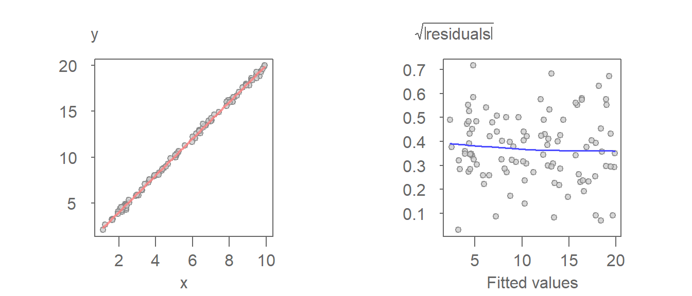
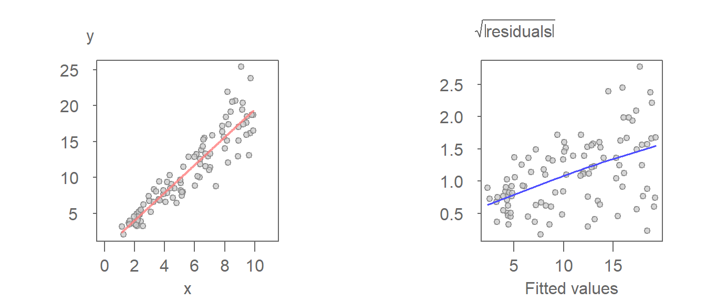
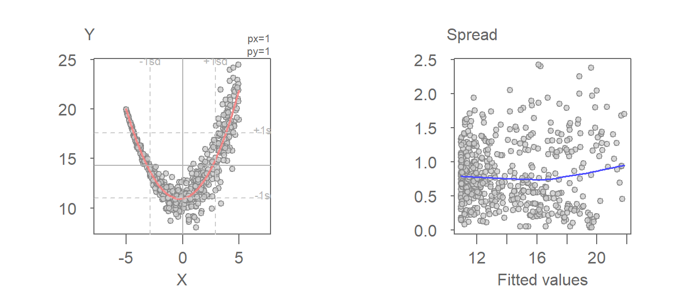
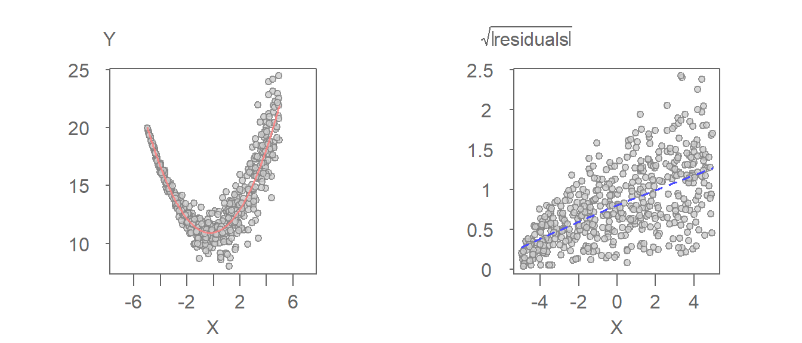
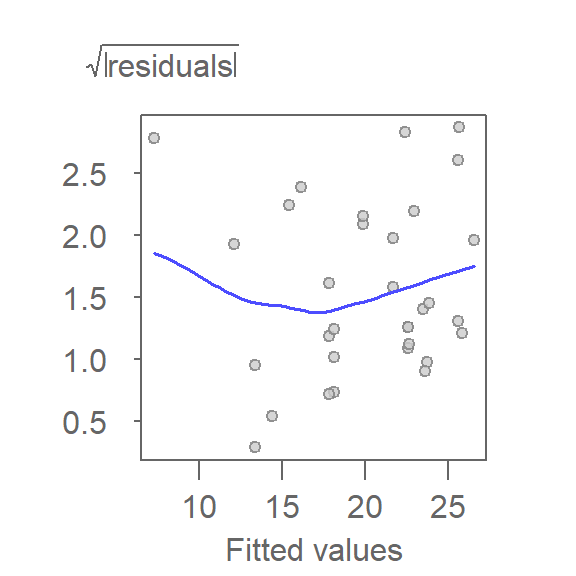
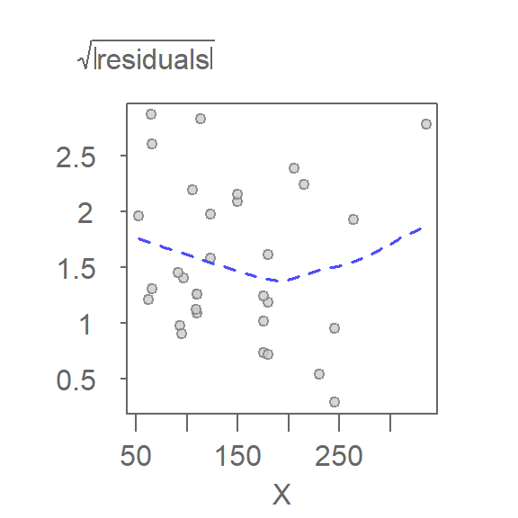
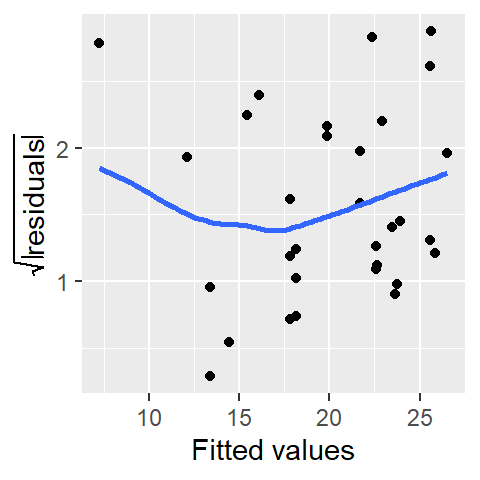

# Exploring spread in the residuals


::: {.cell}

:::

::: {.cell}
::: {.cell-output-display}
`````{=html}
<table data-quarto-disable-processing="true" class="table" style="width: auto !important; ">
 <thead>
  <tr>
   <th style="text-align:left;color: rgba(85, 85, 85, 255) !important;background-color: rgba(221, 221, 221, 255) !important;text-align: center;border: 1px solid white !important;
             font-family: 'Source Code Pro', 'Open Sans';
             padding:1px !important;
             padding-left:4px !important;
             padding-right:4px !important;
             font-size: 0.8em;
             border-radius: 5px;"> ggplot2 </th>
   <th style="text-align:left;color: rgba(85, 85, 85, 255) !important;background-color: rgba(221, 221, 221, 255) !important;text-align: center;border: 1px solid white !important;
             font-family: 'Source Code Pro', 'Open Sans';
             padding:1px !important;
             padding-left:4px !important;
             padding-right:4px !important;
             font-size: 0.8em;
             border-radius: 5px;"> tukeyedar </th>
  </tr>
 </thead>
<tbody>
  <tr>
   <td style="text-align:left;color: darkred !important;background-color: rgba(250, 232, 232, 255) !important;text-align: center;border: 1px solid white;
             font-family: 'Open Sans', Arial;
             padding:1px !important;
             padding-left:4px !important;
             padding-right:4px !important;
             font-size: 0.8em;
             border-radius: 5px;"> 3.5.1 </td>
   <td style="text-align:left;color: darkred !important;background-color: rgba(250, 232, 232, 255) !important;text-align: center;border: 1px solid white;
             font-family: 'Open Sans', Arial;
             padding:1px !important;
             padding-left:4px !important;
             padding-right:4px !important;
             font-size: 0.8em;
             border-radius: 5px;"> 0.4.0 </td>
  </tr>
</tbody>
</table>

`````
:::
:::


-----------------------------------

So far, we’ve focused on modeling the typical value of $y$ as a function of $x$. The fitted model represents a measure of location (e.g., the mean) of $y$ for infinitesimally thin slices of $x$. In the previous chapter, we used residual-dependence plots and residual-fit plots to refine the model’s fit and evaluate its accuracy.

In the univariate analysis portion of this course, we emphasized the importance of maintaining a consistent spread of residuals across groups. A uniform residual spread simplified comparisons between groups by reducing the analysis to a comparison of their means.

Similarly, ensuring a *consistent* spread of residuals across the full range of the independent variable in bivariate analysis is crucial. This consistency not only offers explanatory clarity but is also critical for many statistical procedures that assume *homoscedasticity* (constant variance) in the residuals. Violations of this assumption can compromise the validity of these methods, emphasizing the importance of carefully evaluating residual behavior during model assessment.

## The spread-location plot

While inconsistency in spread across the full range of dependent variables can be sometimes observed in a residual-dependence plot, certain patterns in the data can make such an assessment more challenging in such a plot.

A **spread-location plot** (S-L plot) is designed to explore changes in spreads as a function of increasing $x$ values. The plot pits an expression of spread, typically the square root of the residuals' absolute value, as a function of the fitted values. To help gauge the shape of this distribution, a non-parametric curve, such as the loess, is fitted to the data.

An example of a *homoscedastic* set of residuals follows. The plot on the left is the regression model and the plot on the right is the resulting residuals S-L plot.


::: {.cell}
::: {.cell-output-display}
{width=672}
:::
:::


Here, the residuals are constant across the full range of fitted values. This is confirmed by the loess fit which shows no significant deviation from a horizontal line.

This next example is that of a model that generates a *heteroscedastic* set of residuals.


::: {.cell}
::: {.cell-output-display}
{width=672}
:::
:::


The increasing spread as a function of increasing fitted value is apparent in the S-L plot (right-plot). It can also be observed in the $Y$ vs. $X$ plot (left plot). Note that the residual is the distance between the fitted line and each point when measured *parallel* to the $Y$ axis.

## The spread-dependence plot

For bivariate models, an alternative to the S-L plot is the **spread-dependence** (S-D) plot where the independent variable, $X$, is plotted on the x-axis instead of the fitted values. This alternate form of the S-L plot is better suited for models that take on a quadratic form. For example, the following fitted model shows a monotonic increase in spread with increasing x-value. However, the S-L plot does a poor job in picking the heteroscedasticity in the residuals.


::: {.cell}
::: {.cell-output-display}
{width=672}
:::
:::


The heteroscedasticity in the residuals is far more pronounced when plotting  the spread as a function of the independent variable.


::: {.cell}
::: {.cell-output-display}
{width=672}
:::
:::


## Generating an S-L plot with `eda_sl`

If a regression model was generated using the base `lm` function or `tukeyedar`'s `eda_lm` function, the resulting model can be passed to the `eda_sl` function as follows:


::: {.cell}

```{.r .eda .cell-code}
library(tukeyedar)

M <- lm(mpg ~ hp, mtcars)
eda_sl(M)
```

::: {.cell-output-display}
{width=288}
:::
:::


To generate an S-D plot, set the argument `type` to `"dependence"`.


::: {.cell}

```{.r .eda .cell-code}
eda_sl(M, type = "dependence")
```

::: {.cell-output-display}
{width=288}
:::
:::


## Generating an S-L plot with base plot or `ggplot`

Before generating an S-L plot using the base plotting environment or `ggplot`, the spread will need to be computed from the model output.


::: {.cell small.mar='true'}

```{.r .cell-code}
library(ggplot2)

sl2 <- data.frame( std.res = sqrt(abs(residuals(M))), 
                   fit     = predict(M))

ggplot(sl2, aes(x = fit, y  =std.res)) + geom_point() +
              stat_smooth(method = "loess", se = FALSE, span = 1, 
                          method.args = list(degree = 1) ) +
              ylab(expression(sqrt(abs(residuals)))) +
              xlab("Fitted values")
```

::: {.cell-output-display}
{width=240}
:::
:::


The function `predict()` extracts the fitted y-values from the model `M` and is plotted along the x-axis. 


