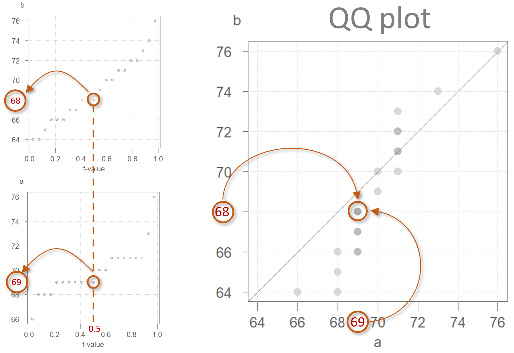
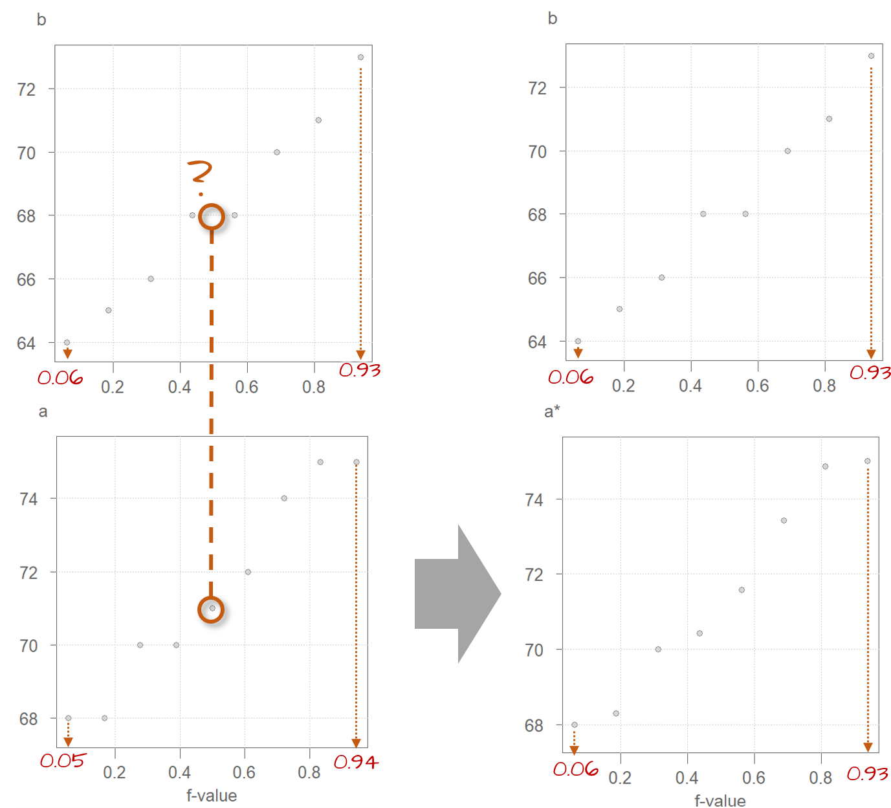

# The empirical QQ plot

```{r echo=FALSE, message=FALSE}
source("libs/Common.R")
library(gridExtra)
```


```{r echo = FALSE}
pkg_ver(c("dplyr", "ggplot2", "lattice", "tukeyedar" )) 
```

-----

In the previous chapter, we explored various plots used to visualize and understand the distribution of a single variable. However, we frequently seek to compare the distributions of *two or more* variables. For instance, we might want to compare the distribution of a contaminant in a polluted site to that of an unpolluted site. Additionally, we may wish to assess how well a variable's distribution aligns with a theoretical one, a topic we'll delve into in the next chapter.

While histograms and density plots can provide a general overview of distributions, their comparative power is limited. **Empirical quantile-quantile plots** (or **QQ plot** for short) offer a more precise and informative comparison by plotting the quantiles of one distribution against the quantiles of another. This allows us to identify systematic differences in shape, scale, and tail behavior, making QQ plots a powerful tool for understanding distributional relationships.

## The empirical quantile-quantile (QQ) plot

An **empirical quantile-quantile** plot (or **QQ plot** for short) combines [quantile functions](univariate_plots.html#quantile-plots) from two different batches of values by pairing their quantile values with their common $f$ fractions. The word *empirical* implies that we are comparing observational values. This serves to differentiate it from the *theoretical* QQ plot that will be covered in the next chapter.



In the above figure, batches `a` and `b` have the same number of observations, 21 this example. As such, they have the same set of $f$-values. If the number of observations in both batches are equal, then the plotting process is straightforward: both batches are sorted from smallest value to largest value, then they are paired up by their common $f$-values generating the scatter plot shown on the right in the above figure. For example, for an $f$-value of 0.5 (i.e. the median), batch `a` has a quantile value of 69 and batch `b` has a quantile value of 68. These values are paired up and assigned a single point in the QQ plot. 

You'll note the addition of a diagonal line to the plot. This line represents the part of the plot where $x$ = $y$. If the quantiles for $x$ and $y$ are equal for a given $f$-value, the point will fall on the $x$=$y$ line. Points falling under the line indicate that the $x$ value is *larger* than the $y$ value for a given $f$-value. Points falling above the line indicate that the $x$ value is *smaller* than the $y$ value for a given $f$-value.

Note that if there are ties in the quantile values, the QQ plot may not necessarily display the expected number of points. In the above example, there are 6 ties resulting in what appears to be just 15 points in the QQ plot when in fact, we are observing overlapping points. The above figure applies a transparency to the points. What may appear as a point with a darker shade of grey is actually overlapping points. For example, batch `a` has 7 observations associated with a value of 69. These 7 observations are paired with 7 observations in batch `b` that also have ties--these are 66, 67 and 68. This results in two overlapping points in the QQ plot where `a` has a value of 69 and `b` a value of 66, another two overlapping points where `a` has a value of 69 and `b` a value of 67, and three overlapping points where `a` has a value of 69 and `b` a value of 68.

If the two batches differ in size (i.e. have different number of observations), we won't be able to match their sorted values from the outset because their $f$-values will not match (recall from the previous chapter that the computed $f$-value is a function of the number of observation in the batch).

{width=700}

For example, in the above figure, you'll note that batch `b` has a value associated with an $f$-value of `0.44`, however, there is no value associated with an $f$-value of `0.44` in batch `a`. Batch `a` consists of 9 observations while batch `b` consists of just 8 observations. This results in an $f$-value that ranges from 0.056 to 0.0944 for batch `a` and a range of 0.063 to 0.938 for batch `b`.

To overcome the problem of batch size mismatch, we limit the number of points in the QQ plot to the number of values associated with the *smallest* sized batch (8 in our working example). This requires that we find the `a` quantiles for the set of $f$-values associated with batch `b` via interpolation techniques. This results in the $f$-quantile plot shown on the right hand side of the figure. The interpolated batch is labelled `a*` that now has the same number of observations as `b` thus the same set of $f$-values.

It's worth recalling from chapter 16 that the quantile function is, as its name implies, a function. As such, a batch of continuous values whose quantile function we are defining can take on any values within the range defined by the function. We choose to have the largest batch of values downsized to the smallest batch so as to avoid issues of extrapolation at the tail ends of the distribution--an issue we would have encountered had we expanded the smaller batch of values to match the number of observations in the larger batch.

### QQ plots vs. bivariate scatter plots

It's important to note the difference between a quantile-quantile plot and a *bivariate* [scatter plot](https://en.wikipedia.org/wiki/Scatter_plot). With the latter, the pairing of values between variables is explicitly defined  (for example average male and female income values may be paired by county) whereas in a QQ plot, the pairing is driven by the matching $f$ values.
 
## The Tukey mean-difference plot

Our eyes are better suited at judging deviations from a horizontal line than from a 45&deg; line. It can therefore be helpful to visually "rotate" the QQ plot 45&deg; so as to render what was a diagonal line a horizontal one. To tackle this requires that we subtract the x-value  (`a`) from the y-value (`b`), and compare this difference to the mean of the two values. The resulting $x$ and $y$ values are expressed as:

$$
Y = y - x 
$$
$$
X = \frac{x + y}{2}
$$

While the axes values change, the layout of the points relative to the line changes very little. Such a plot was first introduced by John Tukey--hence his surname in the plot name. However, you are more likely to see the plot referenced simply as the *mean-difference* plot.

A comparison of the QQ plot (left) and the mean-difference plot (right) are shown next.

```{r fig.height=3.5, fig.width=7, echo = FALSE, results='hide'}
library(dplyr)
library(tukeyedar)

singer <- lattice::singer

a <- sort(singer %>% filter(voice.part %in% c("Tenor 2")) %>% pull(height))
b <- sort(singer %>% filter(voice.part %in% c("Tenor 1")) %>% pull(height))

OP <- par(mfrow = c(1,2))
  eda_qq(a,b, md = FALSE, show.par = FALSE, q = FALSE, med = FALSE)
  eda_qq(a,b, md = TRUE, show.par = FALSE, q = FALSE, med = FALSE)
par(OP)
```

The $x=y$ line becomes the $y=0$ line. The deviation between the point  pattern and the line is  measured along the y-axis.

## What can we learn from a QQ plot?

To understand what a QQ plot can tell us about the relationship between two distributions, we need to first explore key ways in which distributions may differ.  

The $x=y$ diagonal line in the QQ plot represents the location on the plot where the quantiles between both batches are equal. If all points fall on this line, we say that the shape of the distributions between both batches are equal. Such a scenario is rare with observational data. Our interest is in understanding how the batches differ. Comparing the point pattern in the QQ plot to the $x=y$ line can tell us a fair amount about the differences in distributions.

In what follows, we explore the **additive** and **multiplicative** ways batches can differ in shape. 

### Additive offset

A valuable by-product of an empirical QQ plot is the mathematical relationship between the batches of values. If the distributions are identical (i.e. all the points of a QQ plot fall on the $x=y$ line) then we could characterize the relationship as `batch1 = batch2`. 

If, on the other hand, the points follow a *pattern* mimicking a line parallel to the $x=y$ line as in the following plot, then we say that there is an **additive shift** between `batch1` and `batch2`. An additive shift between batches results in an offset in distributions when viewed through the lens of a density plot (see plot on the right). Note that the *shape* of the distributions remain comparable dispite the additive offset.

```{r echo=FALSE, fig.width=7,fig.height=3.5, results = "hide"}
library(tukeyedar)
set.seed(132)
set.seed(132)
batch1  <- sort(runif(50,10,20))
batch2  <- sort(batch1 + 2 + rnorm(length(batch1), 0,1))
s1 <- data.frame(batch1, batch2)

OP <- par(mfrow=c(1,2))
eda_qq(batch1, batch2, show.par = FALSE, q=FALSE)
eda_dens(batch2, batch1, show.par = FALSE, bw=2)
par(OP)
```

The offset from the $x=y$ line can usually be eyeballed in the plot. If we measure this offset along the y-axis of our working example, we get an offset of around 2 units suggesting a relationship in the form of `batch2 =  batch1 + 2`. To confirm this, we can add `2` to `batch 1` and generate a new QQ plot as follows:

```{r echo=FALSE, fig.width=7,fig.height=3.5, results = "hide"}
OP <- par(mfrow=c(1,2))
eda_qq(batch1, batch2,fx = "x + 2"  ,show.par = FALSE, q=FALSE, xlab = "batch1 + 2")
eda_dens(batch2, batch1,fy = "y + 2", show.par = FALSE, bw = 2, 
          ylab = "batch1+2")
par(OP)
```

Adding 2 to `batch1` lines the points up along the $x=y$ line confirming our estimate additive offset of 2 units. 

An additive offset offers a succinct way in characterizing the differences in shape. It implies that across *all* quantiles (this includes the median and upper and lower quartiles), `a` is generally 2 units greater than `b`.

### Multiplicative offset

When the points follow a line at an angle to the $x=y$ line, then we say that there is a **multiplicative shift** between the batches. When viewed through the lens of a density plot, the multiplicative shift between the batches results in a change in shapes with one batch's density being shorter and wider (`batch2` in this example) than that of the other batch  (`batch1` in this example).

```{r echo=FALSE, fig.width=7,fig.height=3.5, results = "hide"}
batch2  <- sort(batch1 * 2 + rnorm(length(batch1), 0,1))
OP <- par( mfrow=c(1,2) )
eda_qq(batch1, batch2 , show.par = FALSE, q=FALSE)
eda_dens(batch2, batch1, show.par = FALSE, bw = 2)
par(OP)
```

The multiplier can be a bit difficult to glean graphically so trial and error may be the best approach whereby we multiply one of the batches by a multiplier. For example, after some experimenting, we arrive at a multiplier of 2 which seems to do a good job in aligning the QQ points along the $x=y$ line. We can thus define the relationship as being `batch2 = batch1 * 2`. A QQ plot of `batch2` vs `batch1 * 2` is shown next.
 
```{r echo=FALSE, fig.width=7,fig.height=3.5, results = "hide"}
OP <- par(mfrow=c(1,2))
eda_qq(batch1, batch2, fx = "x * 2", show.par = FALSE, q=FALSE, 
       xlab = "batch1 * 2")
eda_dens(batch2, batch1, fy = "y * 2", show.par = FALSE, bw = 2,
        ylab = "batch1*2")
par(OP)
```

Notice in the density plot how applying a multiplier not only renders comparable shapes for both batches, but it also corrects the offset observed between both density distributions in the previous figure.

## Additive and multiplicative offsets

Sometimes, you might encounter a relationship that is both additive *and* multiplicative in which case you should first resolve the multiplicative part of the pattern until the points are close to being parallel with the $x=y$ line. Once the multiplicative component is corrected for, you then resolve the additive offset. 

Here's an example of a pair of distributions exhibiting both types of offset.

```{r echo=FALSE, fig.width=7,fig.height=3.5, results = "hide"}
set.seed(132)
batch1  <- sort(runif(10,10,20))
batch2  <- sort(batch1 * 1.5 + 4 + rnorm(length(batch1), 0,1))

OP <- par(mfrow=c(1,2))
eda_qq(batch1, batch2 ,show.par = FALSE, q=FALSE)
eda_dens(batch2, batch1, show.par = FALSE, bw = 3)
par(OP)
```        

We first decompose the offset into its multiplicative component. After some trial and error, a `batch1` multiplier of around 1.5 seems to do a good job in rendering a point pattern parallel to the $x=y$ line.

```{r echo=FALSE, fig.width=7,fig.height=3.5, results = "hide"}
OP <- par(mfrow=c(1,2))
eda_qq(batch1, batch2 , fx = "x * 1.5", show.par = FALSE, q=FALSE, 
       xlab = "batch1 * 1.5")
eda_dens(batch2, batch1, fy = "y*1.5", show.par = FALSE, bw =3,
         ylab = "batch1*1.5") 
par(OP)

``` 

With the multiplicative offset identified, we tackle its additive component. When measured along the y-axis we estimate an  offset of about four units:
 
```{r echo=FALSE, fig.width=7,fig.height=3.5, results = "hide"}
OP <- par(mfrow=c(1,2))
 eda_qq(batch1, batch2 , fx = "x * 1.5 + 4", show.par = FALSE, q=FALSE, 
        xlab = "batch1 * 1.5 + 4")
 eda_dens(batch2, batch1, fy = "y * 1.5 + 4", show.par = FALSE, bw =3 , 
          ylab = "batch1*1.5+4")
par(OP)

``` 

The relationship between both batches can thus be mathematically defined by `batch2 = batch1 * 1.5 + 4`.

## Generating a QQ plot with `eda_qq`

In the working example that follows, we will compare the distribution between two singer groups: The `tenor1` group and the `bass2` group from the `singer` dataset found in the `lattice` package.

First, we extract the height values for both singer groups from the `singer` dataset. 

```{r}
library(dplyr)

df  <- lattice::singer
Bass2  <- filter(df, voice.part == "Bass 2")  %>% pull(height)
Tenor1 <- filter(df, voice.part == "Tenor 1") %>% pull(height)
```

We will make use of the `eda_qq()` function found in the `tukeyedar` package. The function can take, as input, two vectors (each representing the two batches) or, it can take as input a dataframe with a variable column and a category column. In the example that follows we will pass it the two singer height vectors created in the previous code chunk.

```{r class.source="eda", fig.height=3, fig.width=3, results='hide'}
eda_qq(Tenor1, Bass2)
```

By default, the plot includes the following features:

 +  Shaded regions representing each batch's mid 75% range.
 +  Dashed lines inside the shaded boxes representing each batch’s median values.
 +  The power transformation applied to both batches shown in the upper right-hand corner of the plot. Power transformations will be covered in later chapters.

Note that if the two batches differ in size, `eda_qq` will interpolate the larger batch to match the number of observations in the smaller batch. 

If you want a plain vanilla QQ plot, simply add the arguments `med = FALSE`, `q = FALSE` and `show.par = FALSE`.

```{r class.source="eda", fig.height=3, fig.width=3, results='hide'}
eda_qq(Tenor1, Bass2, med = FALSE, q = FALSE, show.par = FALSE)
```

To create a Tukey mean-difference plot, simply add the argument `md = TRUE`.

```{r class.source="eda", fig.height=3, fig.width=3, results='hide'}
eda_qq(Tenor1, Bass2, med = FALSE, q = FALSE, show.par = FALSE, md = TRUE)
```

The `eda_qq` function makes use of the `quantile` function behind the scenes. It adopts the `qtype = 5` option when computing the $f$-value. You can change the type via the `q.type` argument in `eda_qq`.

To learn more about the `eda_qq` function, see [here](https://mgimond.github.io/tukeyedar/articles/qq.html).

## Generating a QQ plot with the base `qqplot` function

Base R has a QQ plot function called `qqplot()`. This function will, however, not add the $x=y$ line requiring that we follow up with a call to `abline(0,1)`. For example:

```{r fig.height = 3, fig.width = 3, echo=2:3}
OP <- par(mar = c(3.9,3.9,1,1))
qqplot(Tenor1, Bass2)
abline(0,1)
par(OP)
```

The `qqplot` function will default to `qtype = 7` in the `quantile` function.

You'll note that the x and y axis ranges will not necessarily match (this explains why the $x=y$ line does not connect the two corners of the plot). You can equalize the axes ranges by adding the `xlim` and `ylim` arguments. For example:

```{r fig.height = 3, fig.width = 3, echo=2:4}
OP <- par(mar=c(3.9,3.9,1,1))
rng <- range(Tenor1, Bass2)
qqplot(Tenor1, Bass2, xlim = rng, ylim = rng, asp = 1)
abline(0,1)
par(OP)
```


## Generating a QQ plot with `ggplot`

`ggplot` does not have a built-in empirical QQ plot function. Instead, the data need to be prepped beforehand. This includes any interpolation that may be required if the batch sizes do not match.

The easiest way to ensure that the batches match in size is to use the `qqplot()` function with the argument `plot.it = FALSE`. The output is a list of the two batches matching in size. The `qqplot` function will name the output columns `x` and `y.` We therefore will need to reassign the voice part names to the dataframe columns in the same order that they were passed to in the `qqplot` function.

```{r}
qq.out <- qqplot(x=Tenor1, y=Bass2, plot.it=FALSE)
qq.out <- as.data.frame(qq.out)

names(qq.out) <- c("Tenor1", "Bass2")  # Add batch names to output

```

We can now generate the QQ plot using `ggplot`.

```{r fig.height=3, fig.width = 3}
library(ggplot2)

# Set the x and y limits
xylim <- range( c(qq.out$Tenor1, qq.out$Bass2) )

# Generate the QQ plot
ggplot(qq.out, aes( x= Tenor1, y = Bass2)) + 
               geom_point() + 
               geom_abline( intercept=0, slope=1) +
               coord_fixed(ratio = 1, xlim=xylim, ylim = xylim) 

```

## Is the relationship between tenor and bass singers additive or multiplicative?

When measured along the y-axis, an additive shift of about 2.5 inches is apparent in the QQ plot, but a multiplicative shift not so much. To check, we'll add 2.5 to the `Tenor1` values. This can be done in the `eda_qq` function with the `fx` argument. We'll enable the `show.par` argument given that the expression applied to the x variable will be displayed in the upper right-hand corner of the plot along with the power transformation. Having this extra bit of information on the plot will help remind us that the plot is that of a modified set of x values.

```{r class.source="eda", fig.width=3, fig.height=3, results = "hide"}
eda_qq(Tenor1, Bass2, med = FALSE, q = FALSE, fx = "x + 2.5")
```

Adding `2.5` inches to the `Tenor` group helps align the points along the $x=y$ line. There is no indication of a multiplicative offset between the distributions. The outliers in the upper right-hand corner of the plot should not mislead us into assuming that a multiplicative offset is warranted here. 

If you want to apply an offset to the y-axis values, use the `fy` argument. Recall from basic algebra that $y = ax + b \Leftrightarrow x = (y - b) / a$. Don't forget to reference the `y` variable instead of the `x` variable in the formula.

```{r class.source="eda", fig.height=3, fig.width=2.5, results='hide'}
eda_qq(Tenor1, Bass2, med = FALSE, q = FALSE, fy = "y - 2.5")
```

The point pattern is identical to that in the previous plot. The one notable difference is the range of x and y values. This is to be expected since the y values are now being modified  instead of the x values.

You'll note that the `eda_qq` function returns a "suggested" offset in the console. This suggested offset is computed from the raw data, i.e. it ignores any offsets specified in the `fx` or `fy` arguments. Note that the proposed offset may not always faithfully capture the nature of the pattern in the QQ plot, hence why it's always good practice to use graphical techniques to help fine tune the relationship between variables.

For example, you may have noticed the following output in the console when running the above code chunks:

```{r echo = FALSE}
eda_qq(Tenor1, Bass2, show.par = FALSE, plot=FALSE)
```

Applying the suggested offset to the x-axis variable gives us the following plot:

```{r class.source="eda", fig.height=3, fig.width=2.5, results='hide'}
eda_qq(Tenor1, Bass2, med = FALSE, q = FALSE, fx = " x * 0.8571 + 12.4286 ")
```

This seems to improve very little over the simpler `x + 2` offset expression. We'll therefore stick with the simpler `Bass2 = Tenor1 + 2` description of the comparative distributions given that it's always best to seek a parsimonious relationship between batches when possible. 


## Comparing multiple batches using a QQ plot matrix

Some analytical workflows may require that more than one pair of distributions be compared. For example, we might want to assess if the `height` distributions across all singer groups (`voice.part`) differ additively and not multiplicatively. The `singer` dataset consists of eight `voice.part` groups. This requires making $8 * (8-1) /2 = 28$ comparisons, something that is best done by generating a QQ plot matrix. We'll make use of `tukeyedar`'s `eda_qqmat()` function. It accepts most of the same arguments used in the `eda_qq()` function, however, it will only accept a dataframe with one column storing the continuous variable and the other column storing the categorical variable.

```{r fig.height = 7, fig.width = 7, echo = FALSE, eval=FALSE}
# Find smallest batch size
min_size <- min(tapply(df$height, df$voice.part, length)) 

# Split singers into groups based on their voice parts
singer_split <- split(df$height, df$voice.part) # Split singers into groups

# Get the range of height values for all groups
rng <- range(df$height) 

# Compute quantiles for each batch using the smallest range of f-values defined
# in min_size
qq_df <- as.data.frame(lapply(singer_split, 
                              function(x) quantile(x, type = 5,
                                                   p = (1:min_size -0.5)/min_size) ))

# Generate plot matrix
plotfun = function(x,y, ...){
points(x,y,pch=18)
  abline(c(0,1),col="blue")
}

pairs(qq_df, upper.panel=NULL, panel = plotfun, xlim = rng, ylim=rng)  
```

```{r class.source="eda", fig.height = 7, fig.width = 7}
eda_qqmat(df, height, voice.part, size = 0.7, diag = FALSE)
```

With few exceptions, the singer height distributions differ mostly by an additive offset given that most points are parallel to the $x=y$ line. There is one notable exception: the `Tenor 1` and `Tenor 2` QQ plot which seems to show a prominent multiplicative (and possibly additive) offset. We can explore this pair in greater detail using the `eda_qq()` function.

```{r class.source="eda", fig.height=3.2, fig.width=2.5}
Tenor1 <- filter(df, voice.part == "Tenor 1") %>%  pull(height)
Tenor2 <- filter(df, voice.part == "Tenor 2") %>%  pull(height)
eda_qq(Tenor2, Tenor1)
```

Before attempting to quantify the multiplicative and additive offsets differentiating both distributions, its worth noting the difference in ranges of values covered by singer groups. in the above plot, the grey region shows the inner 75% of values for both groups. Note how the shaded region region for the `Tenor2` group covers a narrower range of height values than the `Tenor1` group. This suggests more variability in the `Tenor1` height values than in the `Tenor2` height values. This difference in distribution "width" helps explain the multiplicative offset oberved in the QQ plot. 

The console output suggests an offset of `x * 1.46 -32.8`.  We can first try a multiplier of `1.5` to see if it renders a pattern of points parallel to the $x=y$ line. However, doing so will generate a QQ plot that will make it difficult to determine if the point pattern is indeed parallel to the $x=y$ line (the points end up being squeezed in the bottom corner of the QQ plot). This distribution comparison may be a good candidate for a Tukey mean-difference plot. Both plots are shown side-by side in the following figure.

```{r class.source="eda", fig.height=3.2, fig.width=6, echo = 2:3, results = "hide"}
OP <- par(mfrow = c(1,2) )
eda_qq(Tenor2, Tenor1, fx = "x * 1.5")
eda_qq(Tenor2, Tenor1, fx = "x * 1.5", md = TRUE)
par(OP)
```

The mean-difference plot makes it far easier to gauge how well the multiplier has helped render  the points parallel to the $y=0$ (i.e. what is the $x=y$ line in the QQ plot). The mean-difference plot also helps us gauge the additive offset once the multiplicative offset is identified. Here, the additive offset seems to be around `-36` (some trial and error may be needed to get to that number).

```{r class.source="eda", fig.height=3.2, fig.width=6, echo = 2:3, results = "hide"}
OP <- par(mfrow = c(1,2) )
eda_qq(Tenor2, Tenor1, fx = "x * 1.5 - 36")
eda_qq(Tenor2, Tenor1, fx = "x * 1.5 - 36", md = TRUE)
par(OP)
```

The multiplicative and additive offsets could benefit from some fine-tuning (the points appear to be at a slight angle to the reference line in both plots). How much time you choose to invest in fine-tuning the parameters will depend on the level of accuracy needed in quantifying the differences in distribution between both batch of values. 

