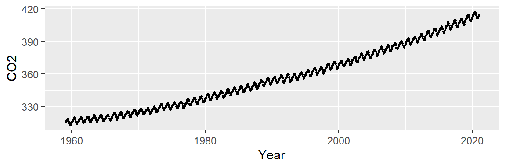
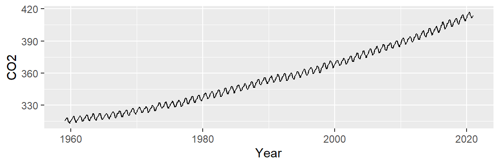
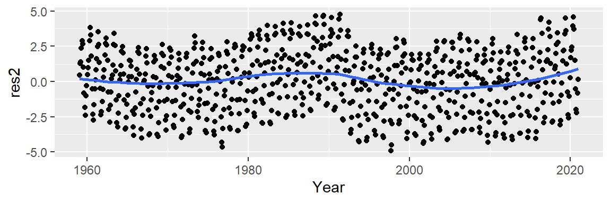
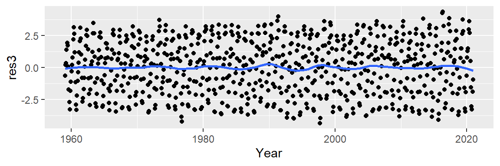
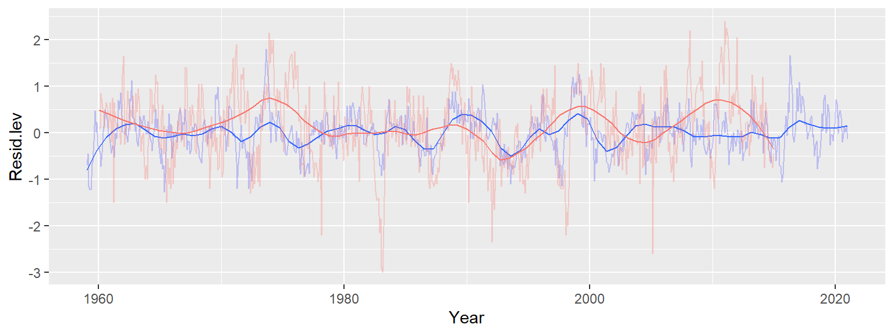

# The third R of EDA: Residuals


::: {.cell}

:::

::: {.cell hash='example_cache/html/unnamed-chunk-2_fd93e819e7915059036d51d67790e90a'}
::: {.cell-output-display}
`````{=html}
<table data-quarto-disable-processing="true" class="table" style="width: auto !important; ">
 <thead>
  <tr>
   <th style="text-align:left;color: rgba(85, 85, 85, 255) !important;background-color: rgba(221, 221, 221, 255) !important;text-align: center;border: 1px solid white !important;
             font-family: 'Source Code Pro', 'Open Sans';
             padding:1px !important;
             padding-left:4px !important;
             padding-right:4px !important;
             font-size: 0.8em;
             border-radius: 5px;"> dplyr </th>
   <th style="text-align:left;color: rgba(85, 85, 85, 255) !important;background-color: rgba(221, 221, 221, 255) !important;text-align: center;border: 1px solid white !important;
             font-family: 'Source Code Pro', 'Open Sans';
             padding:1px !important;
             padding-left:4px !important;
             padding-right:4px !important;
             font-size: 0.8em;
             border-radius: 5px;"> ggplot2 </th>
   <th style="text-align:left;color: rgba(85, 85, 85, 255) !important;background-color: rgba(221, 221, 221, 255) !important;text-align: center;border: 1px solid white !important;
             font-family: 'Source Code Pro', 'Open Sans';
             padding:1px !important;
             padding-left:4px !important;
             padding-right:4px !important;
             font-size: 0.8em;
             border-radius: 5px;"> tidyr </th>
   <th style="text-align:left;color: rgba(85, 85, 85, 255) !important;background-color: rgba(221, 221, 221, 255) !important;text-align: center;border: 1px solid white !important;
             font-family: 'Source Code Pro', 'Open Sans';
             padding:1px !important;
             padding-left:4px !important;
             padding-right:4px !important;
             font-size: 0.8em;
             border-radius: 5px;"> lubridate </th>
  </tr>
 </thead>
<tbody>
  <tr>
   <td style="text-align:left;color: darkred !important;background-color: rgba(250, 232, 232, 255) !important;text-align: center;border: 1px solid white;
             font-family: 'Open Sans', Arial;
             padding:1px !important;
             padding-left:4px !important;
             padding-right:4px !important;
             font-size: 0.8em;
             border-radius: 5px;"> 1.1.4 </td>
   <td style="text-align:left;color: darkred !important;background-color: rgba(250, 232, 232, 255) !important;text-align: center;border: 1px solid white;
             font-family: 'Open Sans', Arial;
             padding:1px !important;
             padding-left:4px !important;
             padding-right:4px !important;
             font-size: 0.8em;
             border-radius: 5px;"> 3.4.4 </td>
   <td style="text-align:left;color: darkred !important;background-color: rgba(250, 232, 232, 255) !important;text-align: center;border: 1px solid white;
             font-family: 'Open Sans', Arial;
             padding:1px !important;
             padding-left:4px !important;
             padding-right:4px !important;
             font-size: 0.8em;
             border-radius: 5px;"> 1.3.1 </td>
   <td style="text-align:left;color: darkred !important;background-color: rgba(250, 232, 232, 255) !important;text-align: center;border: 1px solid white;
             font-family: 'Open Sans', Arial;
             padding:1px !important;
             padding-left:4px !important;
             padding-right:4px !important;
             font-size: 0.8em;
             border-radius: 5px;"> 1.9.3 </td>
  </tr>
</tbody>
</table>

`````
:::
:::


So far, we've used residuals to help diagnose model fits in both univariate and bivariate analyses. We've also learned how to leverage re-expression and robust methods (the two other R's of EDA) in helping improve model fits.

In this chapter, we work through an example that highlights the importance of exploring residuals to reveal additional patterns in the data--patterns that may not necessarily be observed in an initial model fit.

## An EDA example: CO2 analysis

Let's start off by plotting the atmospheric CO2 concentrations (in ppm) over time. The original dataset was pulled from [NOAA's website](http://www.esrl.noaa.gov/gmd/ccgg/trends/).


::: {.cell hash='example_cache/html/unnamed-chunk-3_8ff541de663eb986fb7aa84d57d9e4a8'}

```{.r .cell-code}
library(lubridate)
library(dplyr)
library(ggplot2)

dat <- read.csv("http://mgimond.github.io/ES218/Data/co2_2020.csv")

dat2 <- dat %>%
      mutate( Date = ymd(paste(Year,"/", Month,"/15")),
              Year = decimal_date(Date),
              CO2 = Average)    %>%
     select(Year, Date, CO2)
```
:::


Next, let's look at the data:
      

::: {.cell hash='example_cache/html/unnamed-chunk-4_18cffa525f59a03421c6392b95970664'}

```{.r .cell-code}
ggplot(dat2, aes(x = Year , y = CO2)) + geom_point(size = 0.6)
```

::: {.cell-output-display}
{width=576}
:::
:::


Let's see if plotting the data using lines instead of points helps identify any underlying patterns.
      

::: {.cell hash='example_cache/html/unnamed-chunk-5_55c2b633da90110e2e7c31caf6a481d5'}

```{.r .cell-code}
ggplot(dat2, aes(x = Year , y = CO2)) + geom_line()
```

::: {.cell-output-display}
{width=576}
:::
:::


We note two patterns of interest: an overall upward trend, and a cyclical trend. We will first *smooth* out the overall trend by finding a model that best explains the overall variability, then we'll remove that trend from the data to explore the cyclical component.

## Exploring the overall trend

We can attempt to model the overall trend by fitting a straight line to the data using a 1^st^ order polynomial. The fitted line is displayed in red in the following plot. We will use `ggplot2`'s built-in smoothing function to plot the regression line.


::: {.cell hash='example_cache/html/unnamed-chunk-6_2161d4afd86c476bae6977716b12b4a3'}

```{.r .cell-code}
ggplot(dat2, aes(x = Year, y = CO2)) + geom_line() + 
             stat_smooth(method = "lm", se = FALSE, col = "red") 
```

::: {.cell-output-display}
{width=576}
:::
:::


Next, we subtract the modeled line from the CO2 data and plot the result--this gives us the **residuals** and can be thought of as representing what the linear model does *not* explain about the data. But first, we will need to create a regression model object since it will provide us with the residuals needed to generate the residual plot.


::: {.cell hash='example_cache/html/unnamed-chunk-7_a35d55aa4f50ac91d7535d1ce418686b'}

```{.r .cell-code}
# Generate a model object from the regression fit
M1 <- lm(CO2 ~ Year, dat2) 
dat2$res1 <- M1$residuals

# Plot the residuals from the model object
ggplot(dat2, aes(x = Year, y = res1)) + geom_point()
```

::: {.cell-output-display}
{width=576}
:::
:::


An overall trend is still present, despite having attempted to control for it. This suggests that our simple linear model does not do a good job in *capturing* the shape of the overall trend. 

It appears that the overall trend is slightly convex and has a small peak around the 1990's. This suggests that we should move on to a 2^nd^ order polynomial of the form:

$$
CO2_{trend} = a + b(Year) + c(Year^2) 
$$

The fitted line looks like this: 


::: {.cell hash='example_cache/html/unnamed-chunk-8_3a3326053a34672abde81f4ec6b7a77f'}

```{.r .cell-code}
ggplot(dat2, aes(x = Year, y = CO2)) + geom_line() + 
           stat_smooth(method = "lm", formula = y ~ x + I(x^2), 
                       se = FALSE, col = "red")
```

::: {.cell-output-display}
{width=576}
:::
:::


Now, let's look at the residuals. In helping discern any pattern in our residuals, we add a loess smooth to the plot.


::: {.cell hash='example_cache/html/unnamed-chunk-9_737f2732efa31eb98a846acf9540f805'}

```{.r .cell-code}
M2 <- lm(CO2 ~ Year + I(Year^2), dat2)
dat2$res2 <- M2$residuals

ggplot(dat2 , aes(x = Year, y = res2)) + geom_point() +
           stat_smooth(method = "loess", se = FALSE)
```

::: {.cell-output-display}
{width=576}
:::
:::


This is an improvement over the simple line model (which was a 1^st^ order polynomial fit).  So what we have learned so far is that the overall trend is not perfectly linear but instead follows a parabolic like trajectory with a small hump halfway across the time span. However, we can still make out a "W" shaped trend in the residuals which can hamper our analysis of the oscillatory patterns in the data. We can try a 3^rd^ order polynomial and see if it can capture the 1980 to 1995 hump.


::: {.cell hash='example_cache/html/unnamed-chunk-10_b5a0f63a1435b46624cbc8528f9f1a7e'}

```{.r .cell-code}
ggplot(dat2, aes(x = Year, y = CO2)) + geom_line() + 
           stat_smooth(method = "lm", formula = y ~ x + I(x^2) + I(x^3), 
                       se = FALSE, col = "red")
```

::: {.cell-output-display}
{width=576}
:::
:::


Now, let's look at the residuals. 


::: {.cell hash='example_cache/html/unnamed-chunk-11_b72a0542c1f88351317336ac149a8bfd'}

```{.r .cell-code}
M2 <- lm(CO2 ~ Year + I(Year^2) + I(Year^3), dat2)
dat2$res2 <- M2$residuals

ggplot(dat2 , aes(x = Year, y = res2)) + geom_point() +
           stat_smooth(method = "loess", se = FALSE)
```

::: {.cell-output-display}
{width=576}
:::
:::


This does not seem to be an improvement over the 2^nd^ order polynomial. At this point, we could play with different order polynomials in an attempt to smooth the trend or, we may opt for a non-parametric fit. When the goal is to *peel* off one pattern to explore any underlying pattern we should not limit ourselves to parametric fits (which impose a mathematical model on our data) and instead explore non-parametric smoothing techniques that do not impose any structure on the data whatsoever. We'll make use of the loess fit which is shown in the following figure.


::: {.cell hash='example_cache/html/unnamed-chunk-12_83a89c9aa33856f9a0d1116388596410'}

```{.r .cell-code}
ggplot(dat2, aes(x = Year, y = CO2)) + geom_line() + 
             stat_smooth(method = "loess", span = 1/4, se = FALSE, col = "red")
```

::: {.cell-output-display}
{width=576}
:::
:::


At first glance, this may not look any different from our 2^nd^ or 3^rd^ order polynomial model. But the resulting residuals suggest that the loess smooth did a better job in removing any decadal patterns in our batch of CO2 values.


::: {.cell hash='example_cache/html/unnamed-chunk-13_6b9fcf514f270f4e9f3bef4be83df413'}

```{.r .cell-code}
lo <- loess(CO2 ~ Year, dat2, span=1/4)
dat2$res3 <- lo$residuals

ggplot(dat2,  aes(x = Year, y = res3)) + geom_point() +
           stat_smooth(method = "loess", se = FALSE, span = 0.2)
```

::: {.cell-output-display}
{width=576}
:::
:::


## Exploring the seasonal component

Let's now explore the cyclical pattern in the residuals. Note the residuals' y-axis values: they are three orders of magnitude less than the overall range of CO2 values. This indicates that the oscillating component of the data is relatively small (the CO2 values have a range of [313.33, 417.31] ppm whereas the residuals have a range of [-4.34, 4.34] ppm).

Now, we may be tempted to fit a *smooth* to the residuals but that may not prove to be fruitful. Instead, let's see if the oscillation follows a 12 month cycle. We'll group all the residual values by month of the year. In other words, we will remove the year *tag* associated with each value and explore those values as a function of month alone. Each month's batch of values is distilled into a boxplot.


::: {.cell hash='example_cache/html/unnamed-chunk-14_34a9ab0e1daca67c09ee77a017a7e443'}

```{.r .cell-code}
# Aggregate residuals by year
dat2$Month <- month(dat2$Date, label=TRUE) 

ggplot(dat2, aes(x = Month, y = res3)) + geom_boxplot()         
```

::: {.cell-output-display}
{width=576}
:::
:::


It's clear from the plot that the oscillation follows a yearly cycle: a peak in the spring and a dip in the fall. This cycle is explained in part by the increased land mass in the northern hemisphere relative to the southern hemisphere. Because plants (and by extension photosynthesis) go dormant during the winter months in the northern hemisphere, atmospheric CO2 is no longer being photosynthesized; this despite the southern hemisphere's photosynthesis peak during the October-March period (a result of the southern hemisphere's smaller land mass). Other factors such as increased CO2 emissions during the winter months  may also contribute to the oscillatory nature of atmospheric CO2 concentrations.

Thus far, we have uncovered three patterns of interest: an overall trend, a "hump" around the 1980-1995 time period, and a cyclical component. Note that to effectively explore the cyclical pattern we had to **de-trend** (or **smooth**) the data. Next, we should *smooth* the seasonal component of the data to see if another pattern emerges. We may, for example, smooth the data by subtracting the monthly median from each residual batch leaving us with the next batch of residual values to explore:


::: {.cell hash='example_cache/html/unnamed-chunk-15_eda46418950b965904f820dc8f0de69d'}

```{.r .cell-code}
d3 <- dat2 %>% 
  group_by(month(Date)) %>%
  mutate(Resid.lev = res3 - median(res3)) 

ggplot(d3, aes(x = Month, y = Resid.lev)) + geom_boxplot()     
```

::: {.cell-output-display}
{width=768}
:::
:::


All the boxplots are lined up along their median values. We are now exploring the data after having accounted for both overall trend and seasonality. What can be gleaned from this dataset? We may want to explore the skewed nature of the residuals in March, or the narrower range of CO2 values for the fall months, for example. 

We may also be interested in seeing if any trend in CO2 concentrations exists within each month. Let's explore this by fitting a first order polynomial to the monthly data.


::: {.cell hash='example_cache/html/unnamed-chunk-16_8696b7ec21d0b5f901e1b7fc5a1fa3a0'}

```{.r .cell-code}
ggplot(d3, aes(x = Year, y = Resid.lev)) + geom_point(col = "grey", cex = .6)  + 
     stat_smooth(se = FALSE, method = "lm") + facet_wrap(~ Month, nrow = 1) +
     theme(axis.text.x=element_text(angle=45, hjust = 1.5, vjust = 1.6,  size = 7))
```

::: {.cell-output-display}
{width=768}
:::
:::


Note the overall increase in CO2 for the winter and spring months followed by a similar (but not as persistent) decrease in CO2 loss in the summer and fall months. This suggests either an increase in cyclical amplitude with the deviation from a central value being possibly greater for the winter/spring months. It could also suggest a gradual offset in the periodicity over the 60 year period. More specifically, a leftward shift in periodicity.

Let's fit a loess to see if the trends within each month are monotonic. We'll adopt a robust loess (`family = "symmetric"`) to control for possible outliers in the data.


::: {.cell hash='example_cache/html/unnamed-chunk-17_877c39917518a898b62a09cb5cdb7629'}

```{.r .cell-code}
ggplot(d3, aes(x = Year, y = Resid.lev)) + geom_point(col = "grey", cex = .6)  + 
     stat_smooth(method = "loess", se = FALSE, 
                 method.args = list(family = "symmetric")) + 
     facet_wrap(~ Month, nrow = 1) +
     theme(axis.text.x=element_text(angle=45, hjust = 1.5, vjust = 1.6,  size = 7))
```

::: {.cell-output-display}
{width=768}
:::
:::


The trends are clearly not monotonic suggesting that the processes driving the cyclical concentrations of CO2 are not systematic. However, despite the curved nature of the fits, the overall trends observed with the straight lines still remain.

## Exploring what remains

Now that we've fitted the monthly medians to the seasonal component of the data, let's plot the residuals across the years. We'll make use of the robust version of the loess given that the data may be quite noisy.


::: {.cell hash='example_cache/html/unnamed-chunk-18_4e96c68db86bc64e05e956e9304ef83e'}

```{.r .cell-code}
ggplot(d3, aes(x = Year, y = Resid.lev)) +  geom_line(col = "grey") + 
     stat_smooth(method = "loess", se = FALSE, span = 0.1 ,
                 method.args = list(family = "symmetric", degree = 2))    
```

::: {.cell-output-display}
{width=768}
:::
:::


Recall that at this points, we have accounted for the overall trend (which has by far the greatest effect with a range of over 90 ppm) and the seasonal component (which has a smaller effect with a range of about 6 ppm). The 3^rd^ set of residuals account for about 2 ppm of the total variability in the dataset. Note that we can still make out the seasonal fluctuations if we look closely at the data. But we can also make out broader patterns of interest not consistent with random noise and not explained by seasonal variability. Some of the patterns could be explained by the southern oscillation index (SOI), for example,  which is a measure of the difference in atmospheric pressure across the pacific basin. When the index is positive the resulting winds drive upwelling currents that release additional CO2 into the atmosphere. 

We'll create a simple overlay the SOI data on top of our last plot, but note that a scatter plot of the two variables with a lagging component would be best suited for this analysis.


::: {.cell hash='example_cache/html/unnamed-chunk-19_af66d480a9a97d8f1f14f998181dd648'}

```{.r .cell-code}
library(tidyr)

soi <- read.csv("http://mgimond.github.io/ES218/Data/Southern_oscillation.csv")

soi <- gather(soi, key = Month, value = Index, -1)
Date <- ymd(paste(soi$YEAR, soi$Month, 15) )
soi$Yr <- decimal_date(Date)

ggplot(d3, aes(x = Year, y = Resid.lev)) +  
             geom_line(col = "blue", alpha = 0.2) + 
             stat_smooth(method = "loess", se = FALSE, span = 0.1, lwd = 0.5,
                         method.args = list(family = "symmetric", degree = 2)) +
             geom_line(dat = soi, aes(Yr, Index/2, colour = "red"), alpha = 0.3) +
             stat_smooth(dat = soi, aes(Yr, Index/2, colour = "red"), lwd = 0.5,
                         method = "loess", se = FALSE, span = 0.2,
                         method.args = list(family = "symmetric", degree = 2)) +
             guides(color = FALSE)
```

::: {.cell-output-display}
{width=768}
:::
:::


The blue lines represent the residuals (with the bold blue line showing the loess fit) and the red lines represent the SOI trend (with the bold line showing its loess fit). Note that we halved the SOI values to match the range along the y-scale; the intent is to facilitate the comparison of SOI trend to CO2 trend. There appears to be matching maxima (notably around 1975 and 1988) but we also note some opposing trends such as in the period after 2010. When the index drops below 0, "El Nino" events become more prominent and upwelling flows are suppressed. Though this may prevent CO2 trapped in the deeper Pacific oceans from reaching the surface, "El Nino" events can also have a measurable impact on land climate thus influencing the rate of vegetation growth and, by extension, CO2 uptake. El nino is also believed to increase the rate of forest and brush fires around the world which may also contribute to atmospheric CO2 concentrations.  

It's important to realize that this is one of many ways in which we could have proceeded with the analysis. For example, we could have started off the analysis by removing the seasonal component from the data, then analyzed the long term trend. 

