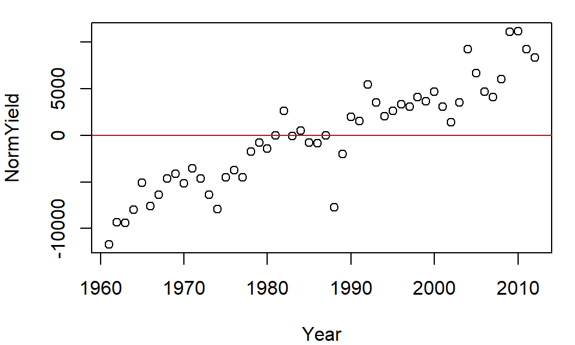

# Grouping and summarizing


::: {.cell}

:::

::: {.cell hash='group_by_cache/html/unnamed-chunk-2_cd2338c52672295a1db060b6e3202081'}
::: {.cell-output-display}
`````{=html}
<table data-quarto-disable-processing="true" class="table" style="width: auto !important; ">
 <thead>
  <tr>
   <th style="text-align:left;color: rgba(85, 85, 85, 255) !important;background-color: rgba(221, 221, 221, 255) !important;text-align: center;border: 1px solid white !important;
             font-family: 'Source Code Pro', 'Open Sans';
             padding:1px !important;
             padding-left:4px !important;
             padding-right:4px !important;
             font-size: 0.8em;
             border-radius: 5px;"> dplyr </th>
  </tr>
 </thead>
<tbody>
  <tr>
   <td style="text-align:left;color: darkred !important;background-color: rgba(250, 232, 232, 255) !important;text-align: center;border: 1px solid white;
             font-family: 'Open Sans', Arial;
             padding:1px !important;
             padding-left:4px !important;
             padding-right:4px !important;
             font-size: 0.8em;
             border-radius: 5px;"> 1.1.4 </td>
  </tr>
</tbody>
</table>

`````
:::
:::


## Summarizing data by group


Let's first create a dataframe listing the average delay time in minutes, by day of the week and by quarter, for Logan airport's 2014 outbound flights.


::: {.cell hash='group_by_cache/html/unnamed-chunk-3_c23ea5474f2535a9e7c1b5b9a35d4729'}

```{.r .cell-code}
df <- data.frame(
  Weekday = factor(rep(c("Mon", "Tues", "Wed", "Thurs", "Fri"), each = 4), 
                   levels = c("Mon", "Tues", "Wed", "Thurs", "Fri")),
  Quarter = paste0("Q", rep(1:4, each = 5)), 
  Delay = c(9.9, 5.4, 8.8, 6.9, 4.9, 9.7, 7.9, 5, 8.8, 11.1, 10.2, 9.3, 12.2,
            10.2, 9.2, 9.7, 12.2, 8.1, 7.9, 5.6))
```
:::


The goal will be to summarize the table by `Weekday` as shown in the following graphic. 


The data table has three variables: `Weekday`, `Quarter` and `Delay`. `Delay` is the value we will summarize which leaves us with one variable to *collapse*: `Quarter`. In doing so, we will compute the `Delay` statistics for all quarters associated with a unique `Weekday` value.

This workflow requires two operations: a grouping operation using the `group_by` function and a summary operation using the `summarise`/`summarize` function. Here, we'll compute two summary statistics: minimum delay time and maximum delay time.


::: {.cell hash='group_by_cache/html/unnamed-chunk-4_db15eeb225ba52d8d0d6c4ebaf271c32'}

```{.r .cell-code}
library(dplyr)

df %>% 
  group_by(Weekday) %>% 
  summarise(min_delay = min(Delay), max_delay = max(Delay))
```

::: {.cell-output .cell-output-stdout}
```
# A tibble: 5 × 3
  Weekday min_delay max_delay
  <fct>       <dbl>     <dbl>
1 Mon           5.4       9.9
2 Tues          4.9       9.7
3 Wed           8.8      11.1
4 Thurs         9.2      12.2
5 Fri           5.6      12.2
```
:::
:::


Note that the weekday follows the chronological order as defined in the `Weekday` factor.

You'll also note that the output is a `tibble`. This data class is discussed at the end of this page.

### Grouping by multiple variables

You can group by more than one variable. For example, let's build another dataframe listing the average delay time in minutes, by quarter, by weekend/weekday and by inbound/outbound status for Logan airport's 2014 outbound flights.


::: {.cell hash='group_by_cache/html/unnamed-chunk-5_3598f76e4c52b97ff4a19d6e6ed79737'}

```{.r .cell-code}
df2 <- data.frame(
  Quarter = paste0("Q", rep(1:4, each = 4)), 
  Week = rep(c("Weekday", "Weekend"), each=2, times=4),
  Direction = rep(c("Inbound", "Outbound"), times=8),
  Delay = c(10.8, 9.7, 15.5, 10.4, 11.8, 8.9, 5.5, 
            3.3, 10.6, 8.8, 6.6, 5.2, 9.1, 7.3, 5.3, 4.4))
```
:::


The goal will be to summarize the delay time by `Quarter` and by `Week` type as shown in the following graphic. 


This time, the data table has four variables. We are wanting to summarize by `Quater` and `Week` which leaves one variable, `Direction`, that needs to be collapsed. 


::: {.cell hash='group_by_cache/html/unnamed-chunk-6_6de698b8961425ae8b983a1493c2e376'}

```{.r .cell-code}
df2 %>% 
  group_by(Quarter, Week) %>% 
  summarise(min_delay = min(Delay), max_delay = max(Delay))
```

::: {.cell-output .cell-output-stdout}
```
# A tibble: 8 × 4
# Groups:   Quarter [4]
  Quarter Week    min_delay max_delay
  <chr>   <chr>       <dbl>     <dbl>
1 Q1      Weekday       9.7      10.8
2 Q1      Weekend      10.4      15.5
3 Q2      Weekday       8.9      11.8
4 Q2      Weekend       3.3       5.5
5 Q3      Weekday       8.8      10.6
6 Q3      Weekend       5.2       6.6
7 Q4      Weekday       7.3       9.1
8 Q4      Weekend       4.4       5.3
```
:::
:::


The following section demonstrates other  grouping/summarizing operations on a larger dataset.

## A working example

The data file  *FAO_grains_NA.csv* will be used in this exercise. This dataset consists of grain yield and harvest year by North American country. The dataset was downloaded from http://faostat3.fao.org/ in June of 2014. 

Run the following line to load the FAO data file into your current R session.


::: {.cell hash='group_by_cache/html/unnamed-chunk-7_33781461449abdfa636326ba4d55c565'}

```{.r .cell-code}
dat <- read.csv("http://mgimond.github.io/ES218/Data/FAO_grains_NA.csv", header=TRUE)
```
:::


Make sure to load the `dplyr` package before proceeding with the following examples. 


::: {.cell hash='group_by_cache/html/unnamed-chunk-8_5ba369358d60f8b751c1205276370d0f'}

```{.r .cell-code}
library(dplyr)
```
:::


### Summarizing by crop type

The `group_by` function will split any operations applied to the dataframe into groups defined by one or more columns. For example, if we wanted to get the minimum and maximum years from the `Year` column for which crop data are available *by crop type*, we would type the following:


::: {.cell hash='group_by_cache/html/unnamed-chunk-9_2ef8188c2dfc6593b2066ea1a46143ef'}

```{.r .cell-code}
dat %>% 
  group_by(Crop) %>% 
  summarise(yr_min = min(Year), yr_max=max(Year))
```

::: {.cell-output .cell-output-stdout}
```
# A tibble: 11 × 3
   Crop         yr_min yr_max
   <chr>         <int>  <int>
 1 Barley         1961   2012
 2 Buckwheat      1961   2012
 3 Canary seed    1980   2012
 4 Grain, mixed   1961   2012
 5 Maize          1961   2012
 6 Millet         1961   2012
 7 Oats           1961   2012
 8 Popcorn        1961   1982
 9 Rye            1961   2012
10 Sorghum        1961   2012
11 Triticale      1989   2012
```
:::
:::


### Count the number of records in each group

In this example, we are identifying the number of records by `Crop` type. There are two ways this can be accomplished:


::: {.cell hash='group_by_cache/html/unnamed-chunk-10_21ec9655cf61d764cf16fa963430f4ef'}

```{.r .cell-code}
dat %>%
  filter(Information == "Yield (Hg/Ha)", 
         Year >= 2005 & Year <=2010, 
         Country=="United States of America") %>%
  group_by(Crop) %>%
  count()
```
:::


Or,


::: {.cell hash='group_by_cache/html/unnamed-chunk-11_218c1062b7dadd9a452facacb91d966f'}

```{.r .cell-code}
dat %>%
  filter(Information == "Yield (Hg/Ha)", 
         Year >= 2005 & Year <=2010, 
         Country=="United States of America") %>%
  group_by(Crop) %>%
  summarise(Count = n())
```

::: {.cell-output .cell-output-stdout}
```
# A tibble: 7 × 2
  Crop      Count
  <chr>     <int>
1 Barley        6
2 Buckwheat     6
3 Maize         6
4 Millet        6
5 Oats          6
6 Rye           6
7 Sorghum       6
```
:::
:::


The former uses the `count()` function and the latter uses the `summarise()` and `n()` functions.

### Summarize by mean yield and year range

Here's another example where *two* variables are summarized in a single pipe.


::: {.cell hash='group_by_cache/html/unnamed-chunk-12_3375144b2b9adcf66de96cf9903fc028'}

```{.r .cell-code}
dat.grp <- dat %>%
  filter(Information == "Yield (Hg/Ha)", 
         Year >= 2005 & Year <=2010, 
         Country=="United States of America") %>%
  group_by(Crop) %>%
  summarise( Yield = mean(Value), `Number of Years` = max(Year) - min(Year)) 

dat.grp
```

::: {.cell-output .cell-output-stdout}
```
# A tibble: 7 × 3
  Crop       Yield `Number of Years`
  <chr>      <dbl>             <int>
1 Barley    35471.                 5
2 Buckwheat 10418.                 5
3 Maize     96151.                 5
4 Millet    16548.                 5
5 Oats      22619.                 5
6 Rye       17132.                 5
7 Sorghum   42258.                 5
```
:::
:::


### Normalizing each value in a group by the group median

In this example, we are subtracting each value in a group by that group's median. This can be useful in identifying which year yields are higher than or lower than the median yield value within each crop group. We will concern ourselves with US yields only and sort the output by crop type. We'll save the output dataframe as `dat2`.


::: {.cell hash='group_by_cache/html/unnamed-chunk-13_6bdc88a6859380a9a82c440219a1fa21'}

```{.r .cell-code}
dat2 <- dat %>% 
  filter(Information == "Yield (Hg/Ha)",
         Country == "United States of America") %>%
  select(Crop, Year, Value)                     %>%
  group_by(Crop)                                %>%
  mutate(NormYield = Value - median(Value))     %>%
  arrange(Crop)
```
:::


Let's plot the normalized yields by year for `Barley` and add a `0` line representing the (normalized) central value.


::: {.cell small.mar='true' hash='group_by_cache/html/unnamed-chunk-14_b24ee004d649585506009e21b89e5883'}

```{.r .cell-code}
plot( NormYield ~ Year, dat2[dat2$Crop == "Barley",] )
abline(h = 0, col="red")
```

::: {.cell-output-display}
{width=480}
:::
:::


The relative distribution of points does not change, but the values do (they are re-scaled) allowing us to compare values based on some localized (group) context. This technique will prove very useful later on in the course when EDA topics are explored.

### `dplyr`'s output data structure

Some of `dplyr`'s functions such as `group_by`/`summarise` generate a **tibble** data table. For example, the `dat.grp` object created in the last chunk of code is associated with a `tb_df` (a tibble).


::: {.cell hash='group_by_cache/html/unnamed-chunk-15_fa85a0762e31df99d268e6b9402bf9a0'}

```{.r .cell-code}
class(dat.grp)
```

::: {.cell-output .cell-output-stdout}
```
[1] "tbl_df"     "tbl"        "data.frame"
```
:::
:::


A *tibble* table will behave a little differently than a *data frame* table when printing to a screen or subsetting its elements. In most cases, a tibble rendering of the table will not pose a problem in a workflow, however, this format may prove problematic with some older functions. To remedy this, you can force the `dat.grp` object to a standalone `dataframe` as follows:


::: {.cell hash='group_by_cache/html/unnamed-chunk-16_f73696d6ccd26410ec596a623e0d4a72'}

```{.r .cell-code}
dat.df <- as.data.frame(dat.grp)
class(dat.df)
```

::: {.cell-output .cell-output-stdout}
```
[1] "data.frame"
```
:::
:::

