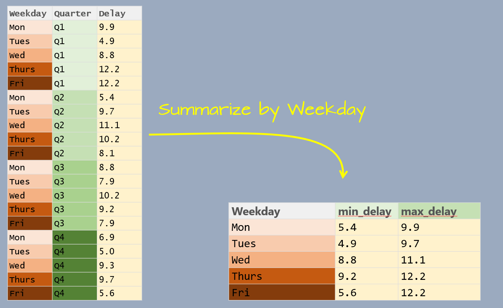
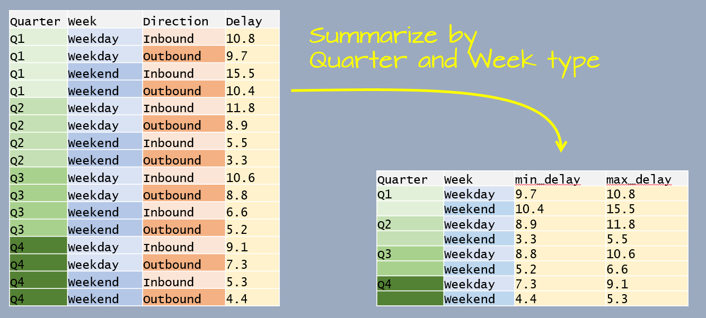
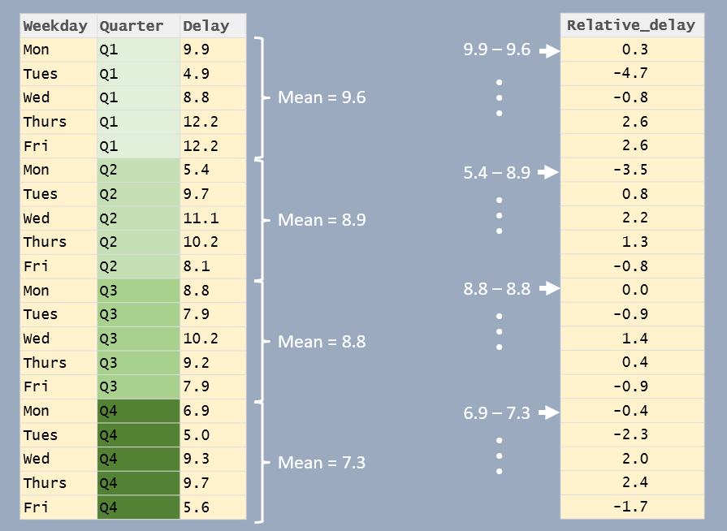

# Grouping and summarizing

```{r echo=FALSE}
source("libs/Common.R")
```


```{r echo = FALSE, eval=knitr::is_html_output()}
pkg_ver(c("dplyr"))
```

----

In Chapter 9, you were introduced to the `summarise()` function, which aggregates an entire column using functions like `mean()` or `sum()`. This summarization can also be performed within groups allowing calculations to be done separately for each category of a grouping variable.

## Summarizing data by group

Let's first create a dataframe listing the average delay time in minutes, by day of the week and by quarter, for Logan airport's 2014 outbound flights.

```{r}
df <- data.frame(
  Weekday = factor(rep(c("Mon", "Tues", "Wed", "Thurs", "Fri"), times = 4), 
                   levels = c("Mon", "Tues", "Wed", "Thurs", "Fri")),
  Quarter = paste0("Q", rep(1:4, each = 5)), 
  Delay = c(9.9, 4.9, 8.8, 12.2, 12.2, 5.4, 9.7, 11.1, 10.2, 8.1, 8.8, 7.9, 10.2,
            9.2, 7.9, 6.9, 5.0, 9.3, 9.7, 5.6))
```

The goal will be to summarize the table by `Weekday` as shown in the following graphic. 



The data table has three variables: `Weekday`, `Quarter` and `Delay`. `Delay` is the value we will summarize which leaves us with one variable to *collapse*: `Quarter`. In doing so, we will compute the `Delay` statistics for all quarters associated with a unique `Weekday` value.

This workflow requires two operations: a grouping operation using the `group_by` function and a summary operation using the `summarise`/`summarize` function. Here, we'll compute two summary statistics: minimum delay time and maximum delay time.

```{r}
library(dplyr)

df %>% 
  group_by(Weekday) %>% 
  summarise(min_delay = min(Delay), max_delay = max(Delay))
```

Note that the weekday follows the chronological order as defined in the `Weekday` factor.

You'll also note that the output is a `tibble`. This data class is discussed at the end of this page.

### Grouping by multiple variables

You can group by more than one variable. For example, let's build another dataframe listing the average delay time in minutes, by quarter, by weekend/weekday and by inbound/outbound status for Logan airport's 2014 outbound flights.

```{r}
df2 <- data.frame(
  Quarter = paste0("Q", rep(1:4, each = 4)), 
  Week = rep(c("Weekday", "Weekend"), each=2, times=4),
  Direction = rep(c("Inbound", "Outbound"), times=8),
  Delay = c(10.8, 9.7, 15.5, 10.4, 11.8, 8.9, 5.5, 
            3.3, 10.6, 8.8, 6.6, 5.2, 9.1, 7.3, 5.3, 4.4))
```

The goal will be to summarize the delay time by `Quarter` and by `Week` type as shown in the following graphic. 



This time, the data table has four variables. We are wanting to summarize by `Quater` and `Week` which leaves one variable, `Direction`, that needs to be collapsed. 

```{r}
df2 %>% 
  group_by(Quarter, Week) %>% 
  summarise(min_delay = min(Delay), max_delay = max(Delay))
```

The following section demonstrates other  grouping/summarizing operations on a larger dataset.

### Functions used in `summarise()`

The `summarise()` function typically uses functions that **aggregate** or **extract** meaningful summaries from grouped data.

#### **Numeric Aggregation Functions**

- `sum(x)`: Computes the sum of values in `x`.
- `mean(x)`: Computes the mean (average) of `x`.
- `median(x)`: Computes the median of `x`.
- `min(x)`: Finds the minimum value in `x`.
- `max(x)`: Finds the maximum value in `x`.
- `sd(x)`: Computes the standard deviation of `x`.
- `var(x)`: Computes the variance of `x`.
- `n()`: Counts the number of rows in each group.
- `n_distinct(x)`: Counts the number of unique values in `x`.

Note that some of these aggregation functions will return `NA` if at least one element in the input vector is `NA`. To have the function ignore the `NA` values, add the `na.rm = TRUE` argument. For example:

```{r}
z <- c(3, NA, 10, 4, 0)
mean(z) # returns NA
mean(z , na.rm = TRUE) # ignores NA
```

#### **Extracting Single Values from Groups**
- `first(x)`: Retrieves the first value in `x`.
- `last(x)`: Retrieves the last value in `x`.
- `unique(x)`: Returns unique values (useful if all values in a group are identical).

#### **Boolean and Logical Summaries**
- `any(x)`: Returns `TRUE` if any value in `x` is `TRUE`.
- `all(x)`: Returns `TRUE` if all values in `x` are `TRUE`.


### Example

```{r}
dat <- data.frame(group = c("A", "A", "B", "B", "B"),
                 x      = c(10, 20, 30, 40, 50),
                 total  = c(30, 30, 120, 120, 120),
                 stat   = c(FALSE, FALSE, FALSE, TRUE, FALSE))

# Summarizing data
dat %>%
  group_by(group) %>%
  summarise(sum_x = sum(x),
            total = unique(total),  # Could have also used first() or last()
            frac  = sum_x / total,  # Check that sum(x) == total
            stat  = any(stat))
```
NOTE: In this example, `total` represents the sum of values within each group, so it should not be summed again. Since the rows are being collapsed, we need to explicitly tell `summarise()` how to retain a single value for the total column. Using `unique(total)` ensures we keep the intended group total, assuming it remains consistent within each group. Alternatively, `first(total)` or `last(total)` could also be used if the values are identical across rows.

## Other ways to use `group_by`

The grouping operation does not always need to be followed by a summarization function. The `group_by()` function can also be used in conjunction with `mutate()` to perform calculations within each group while preserving the original number of rows.

For example, you might use `mutate()` after `group_by()` to create group-relative values, like percentages or rankings within each category, or apply conditional transformations where the operation depends on the group a row belongs to.

In the following example, the delay times are reported as the difference between delay time and the associate quarter's mean delay time.



```{r}
df %>% 
  group_by(Quarter) %>% 
  mutate(Relative_delay = Delay - mean(Delay))
```

## Ungrouping a dataframe in `dplyr`

When using `group_by()` in dplyr, the behavior of `summarise()` depends on the number of grouping variables.

### Grouping by a Single Variable

If you group by one variable, `summarise()` automatically removes the grouping after aggregation. For example:

```{r}
mtcars %>% group_by(gear) %>% summarise(mpg = mean(mpg))
```

In this case, the resulting data frame is ungrouped as `summarise()` drops the only grouping variable (gear). This is confirmed by the absence of any group in the table header.

### Grouping by Multiple Variables

If you group by more than one variable, `summarise()` only removes the last grouping variable. For example

```{r}
mtcars %>% group_by(am, gear) %>% summarise(mpg = mean(mpg))
```

Here, the result remains grouped by `am` as only `gear` was removed from the grouping structure. You can confirm this by checking the table header or by using `group_vars()` on the dataframe.

### Grouping and `mutate()`

Note that this behavior does not apply to `mutate()`. When using `mutate()` on a grouped data frame, all grouping variables persist in the output. 

```{r}
mtcars %>% group_by(am, gear) %>% mutate(mpg_scaled = mpg / mean(mpg)) %>% head()
```

In the output, the first few rows are displayed along with the header information, which confirms that the grouping variables (`am` and `gear`) remain intact.

### Removing al grouping

To ensure that the table is completely free of any grouping elements, use `ungroup`:

```{r}
mtcars %>% group_by(am, gear) %>% summarise(mpg = mean(mpg)) %>% ungroup()
```

Now, the resulting data frame has no remaining grouping structure.

## A working example

The data file  *FAO_grains_NA.csv* will be used in this exercise. This dataset consists of grain yield and harvest year by North American country. The dataset was downloaded from http://faostat3.fao.org/ in June of 2014. 

Run the following line to load the FAO data file into your current R session.

```{r}
dat <- read.csv("http://mgimond.github.io/ES218/Data/FAO_grains_NA.csv", header=TRUE)
```

Make sure to load the `dplyr` package before proceeding with the following examples. 

```{r, message=FALSE}
library(dplyr)
```

### Summarizing by crop type

The `group_by` function will split any operations applied to the dataframe into groups defined by one or more columns. For example, if we wanted to get the minimum and maximum years from the `Year` column for which crop data are available *by crop type*, we would type the following:

```{r}
dat %>% 
  group_by(Crop) %>% 
  summarise(yr_min = min(Year), yr_max=max(Year))
```

### Count the number of records in each group

In this example, we are identifying the number of records by `Crop` type. There are two ways this can be accomplished:

```{r eval = FALSE}
dat %>%
  filter(Information == "Yield (Hg/Ha)", 
         Year >= 2005 & Year <=2010, 
         Country=="United States of America") %>%
  group_by(Crop) %>%
  count()
```

Or,

```{r}
dat %>%
  filter(Information == "Yield (Hg/Ha)", 
         Year >= 2005 & Year <=2010, 
         Country=="United States of America") %>%
  group_by(Crop) %>%
  summarise(Count = n())
```

The former uses the `count()` function and the latter uses the `summarise()` and `n()` functions.

### Summarize by mean yield and year range

Here's another example where *two* variables are summarized in a single pipe.

```{r}
dat.grp <- dat %>%
  filter(Information == "Yield (Hg/Ha)", 
         Year >= 2005 & Year <=2010, 
         Country=="United States of America") %>%
  group_by(Crop) %>%
  summarise( Yield = mean(Value), `Number of Years` = max(Year) - min(Year)) 

dat.grp
```

### Normalizing each value in a group by the group median

In this example, we are subtracting each value in a group by that group's median. This can be useful in identifying which year yields are higher than or lower than the median yield value within each crop group. We will concern ourselves with US yields only and sort the output by crop type. We'll save the output dataframe as `dat2`.

```{r}
dat2 <- dat %>% 
  filter(Information == "Yield (Hg/Ha)",
         Country == "United States of America") %>%
  select(Crop, Year, Value)                     %>%
  group_by(Crop)                                %>%
  mutate(NormYield = Value - median(Value))     %>%
  arrange(Crop)
```

Let's plot the normalized yields by year for `Barley` and add a `0` line representing the (normalized) central value.

```{r fig.width=5, fig.height=3,small.mar=TRUE}
plot( NormYield ~ Year, dat2[dat2$Crop == "Barley",] )
abline(h = 0, col="red")
```

The relative distribution of points does not change, but the values do (they are re-scaled) allowing us to compare values based on some localized (group) context. This technique will prove very useful later in the course when EDA topics are explored.

### `dplyr`'s output data structure

Some of `dplyr`'s functions such as `group_by`/`summarise` generate a **tibble** data table. For example, the `dat.grp` object created in the last chunk of code is associated with a `tb_df` (a tibble).

```{r}
class(dat.grp)
```

A *tibble* table will behave a little differently than a *data frame* table when printing to a screen or subsetting its elements. In most cases, a tibble rendering of the table will not pose a problem in a workflow, however, this format may prove problematic with some older functions. To remedy this, you can force the `dat.grp` object to a standalone `dataframe` as follows:

```{r}
dat.df <- as.data.frame(dat.grp)
class(dat.df)
```
