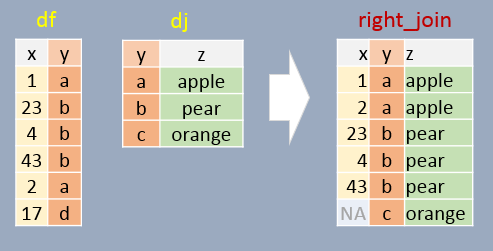
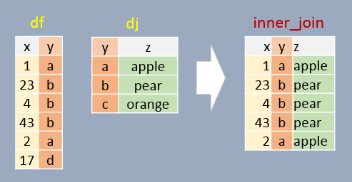
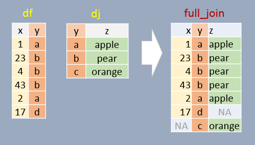

# Joining Data Tables

```{r echo=FALSE}
source("libs/Common.R")
```
 
```{r echo = FALSE}
pkg_ver(c("dplyr"))
```
 
----

`dplyr` provides functions for joining data from one table to another allowing you to combine information based on shared keys. Four joining functions, each with distinct behavior, are: `left_join`, `right_join`, `inner_join`, and `full join`.

To demonstrate these functions, we'll be joining two dataframes: `df` and `dj`. 

```{r, message=FALSE}
df <- data.frame( x = c(1, 23, 4, 43, 2, 17),
                  y = c("a", "b", "b", "b", "a", "d"),
                  stringsAsFactors = FALSE)
df
```


```{r, message=FALSE}
dj <- data.frame( z = c("apple", "pear", "orange"),
                  y = c("a", "b", "c"),
                  stringsAsFactors = FALSE)
dj
```

In the examples that follow, we will join both tables by the shared key `y`. A shared key is a column (or set of columns) that appears in both tables and is used to match rows when joining them. It acts like a common identifier that links related data together. Note that the column names do not need to match (see [note](#note1) at the bottom of this page).

## Left join

In this example, if a join element in `df` does not exist in `dj`, `NA` will be assigned to column `z`. In other words, all elements in `df` will exist in the output regardless if a matching element is found in `dj`. Note that the output is sorted in the same order as `df` (the *left* table).

```{r, warning=FALSE}
library(dplyr)

left_join(df, dj, by="y")
```


## Right join

If a join element in `df` does not exist in `dj`, that element is removed from the output. A few additional important notes follow:

+ All elements in `dj` appear at least once in the output (even if they don't have a match in `df` in which case an `NA` value is added);
+ The output table is sorted in the order in which the `y` elements appear in `dj`;
+ Element `y` will appear as many times as there are matching `y`'s in `df`.

```{r, warning=FALSE}
right_join(df, dj, by="y")
```




## Inner join

In this example, **only** matching elements in both  `df` and `dj` are saved in the output. This is basically an "intersection" of both tables.

```{r, warning=FALSE}
inner_join(df, dj, by="y")
```




## Full join

In this example, **all** elements in both `df` and `dj` are present in the output. For non-matching pairs, `NA` values are supplied. This is basically a "union" of both tables.

```{r warning=FALSE}
full_join(df, dj, by="y")
```




## Joins in a piping operation

The aforementioned joining functions can be used with pipes. For example:

```{r}
df %>% 
  left_join(dj, by = "y")
```

## A note about shared key names {#note1}

If the shared keys have different names in each table, you need to specify the `by =` argument as `by = c("left_col" = "right_col")`. For example,

```{r, message=FALSE}
library(dplyr)

df <- data.frame( x = c(1, 23, 4, 43, 2, 17),
                  y1 = c("a", "b", "b", "b", "a", "d"),
                  stringsAsFactors = FALSE)

dj <- data.frame( z = c("apple", "pear", "orange"),
                  y2 = c("a", "b", "c"),
                  stringsAsFactors = FALSE)

left_join(df, dj, by = c("y1" = "y2"))
```