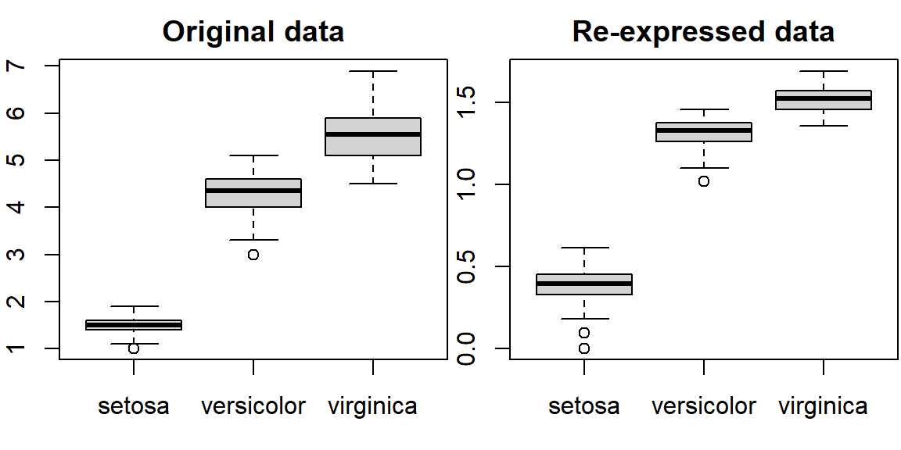
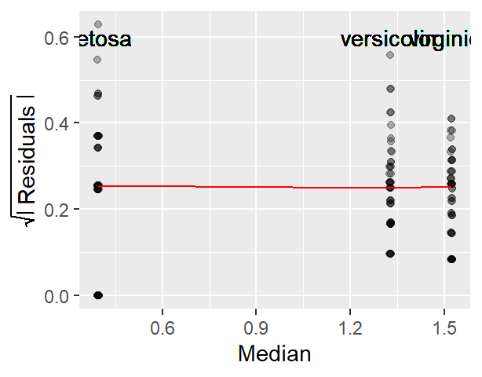
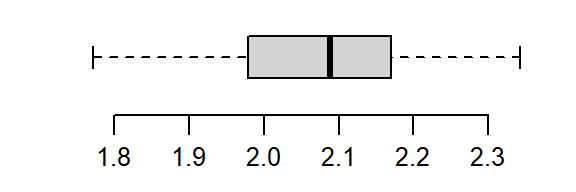

# Re-expressing values


::: {.cell}

:::

::: {.cell hash='re_express_cache/html/unnamed-chunk-2_5b18032b799cde8cf3b7cc47164c1ce7'}
::: {.cell-output-display}
`````{=html}
<table class="table" style="width: auto !important; ">
 <thead>
  <tr>
   <th style="text-align:left;color: #555555 !important;background-color: #dddddd !important;text-align: center;border: 1px solid white !important;
             font-family: 'Source Code Pro', 'Open Sans';
             padding:1px !important;
             padding-left:4px !important;
             padding-right:4px !important;
             font-size: 0.8em;
             border-radius: 5px;"> dplyr </th>
   <th style="text-align:left;color: #555555 !important;background-color: #dddddd !important;text-align: center;border: 1px solid white !important;
             font-family: 'Source Code Pro', 'Open Sans';
             padding:1px !important;
             padding-left:4px !important;
             padding-right:4px !important;
             font-size: 0.8em;
             border-radius: 5px;"> ggplot2 </th>
  </tr>
 </thead>
<tbody>
  <tr>
   <td style="text-align:left;color: darkred !important;background-color: #FAE8E8 !important;text-align: center;border: 1px solid white;
             font-family: 'Open Sans', Arial;
             padding:1px !important;
             padding-left:4px !important;
             padding-right:4px !important;
             font-size: 0.8em;
             border-radius: 5px;"> 1.0.10 </td>
   <td style="text-align:left;color: darkred !important;background-color: #FAE8E8 !important;text-align: center;border: 1px solid white;
             font-family: 'Open Sans', Arial;
             padding:1px !important;
             padding-left:4px !important;
             padding-right:4px !important;
             font-size: 0.8em;
             border-radius: 5px;"> 3.4.0 </td>
  </tr>
</tbody>
</table>

`````
:::
:::


## Introduction

Datasets do not always follow a nice symmetrical distribution nor do their spreads behave systematically across different levels (e.g. medians). Such distributions do not lend themselves well to visual exploration since they can mask simple patterns. They can also be a problem when testing hypotheses using traditional statistical procedures. A solution to this problem is non-linear **re-expression** (aka transformation) of the values. In univariate analysis, we often seek to **symmetrize** the distribution and/or **equalize** the spread. In multivariate analysis, the objective is to usually **linearize** the relationship between variables and/or to **normalize** the residual in a regression model.


</p>

One popular form of re-expression is the **log** (natural or base 10). The other is the family of power transformations (of which the *log* is a special case) implemented using either the **Tukey** transformation or the **Box-Cox** transformation.

## The log transformation

One of the most popular transformations used in data analysis is the logarithm. The log, $y$, of a value $x$ is the power to which the base must be raised to produce $x$. This requires that the log function be defined by a **base**, $b$, such as `10`, `2` or `exp(1)` (the latter defining the natural log).

$$
y = log_b(x) \Leftrightarrow  x=b^y 
$$

In R, the base is defined by passing the parameter `base=` to the `log()` function as in `log(x , base=10)`.

Re-expressing with the log is particularly useful when the change in one value as a function of another is multiplicative and not additive. An example of such a dataset is the compounding interest. Let's assume that we start off with $1000 in an investment account that yields 10% interest each year. We can calculate the size of our investment for the next 50 years as follows:


::: {.cell hash='re_express_cache/html/unnamed-chunk-3_5dd70aeca9988f05766e1dcd04d75c2f'}

```{.r .cell-code}
rate <- 0.1                 # Rate is stored as a fraction
y    <- vector(length = 50) # Create an empty vector that can hold 50 values
y[1] <- 1000                # Start 1st year with $1000

# Next, compute the investment ammount for years 2, 3, ..., 50.
# Each iteration of the loop computes the new amount for year i based 
# on the previous year's amount (i-1).
for(i in 2:length(y)){
  y[i] <- y[i-1] + (y[i-1] * rate)  # Or y[i-1] * (1 + rate)
}
```
:::


The vector `y` gives us the amount of our investment for each year over the course of 50 years.


::: {.cell hash='re_express_cache/html/unnamed-chunk-4_db4d2822a0702823dcdc5bbb4558425f'}
::: {.cell-output .cell-output-stdout}
```
 [1]   1000.000   1100.000   1210.000   1331.000   1464.100   1610.510   1771.561   1948.717
 [9]   2143.589   2357.948   2593.742   2853.117   3138.428   3452.271   3797.498   4177.248
[17]   4594.973   5054.470   5559.917   6115.909   6727.500   7400.250   8140.275   8954.302
[25]   9849.733  10834.706  11918.177  13109.994  14420.994  15863.093  17449.402  19194.342
[33]  21113.777  23225.154  25547.670  28102.437  30912.681  34003.949  37404.343  41144.778
[41]  45259.256  49785.181  54763.699  60240.069  66264.076  72890.484  80179.532  88197.485
[49]  97017.234 106718.957
```
:::
:::


We can plot the values as follows:


::: {.cell hash='re_express_cache/html/unnamed-chunk-5_dd1f2716534cb949490c653418480d03'}

```{.r .cell-code}
plot(y, pch = 20)
```

::: {.cell-output-display}
{width=384}
:::
:::


The change in difference between values from year to year is **not additive**, in other words, the difference between years 48 and 49 is different than that for years 3 and 4.

--------------------------------------------
Years              Difference
----------------  ---------------------------
`y[49] - y[48]`    8819.75

`y[4] - y[3]`      121
--------------------------------------------


However, the ratios between the pairs of years are identical:

-------------------------------------
Years              Ratio
----------------  -------------------
`y[49] / y[48]`    1.1

`y[4] / y[3]`      1.1
-------------------------------------


We say that the change in value is *multiplicative* across the years. In other words, the value amount 6 years out is $value(6) = (yearly\_increase)^{6} \times 1000$ or `1.1^6 * 1000` = 1771.561 which matches value `y[7]`. 

When we expect a variable to change multiplicatively as a function of another variable, it is usually best to transform the variable using the logarithm. To see why, plot the log of `y`.


::: {.cell hash='re_express_cache/html/unnamed-chunk-6_19277b14a59f5f97f43c9d49b5c86ee0'}

```{.r .cell-code}
plot(log(y), pch=20)
```

::: {.cell-output-display}
{width=384}
:::
:::


Note the change from a curved line to a perfectly straight line. The logarithm will produce a straight line if the rate of change for `y` is constant over the range of `x`. This is a nifty property since it makes it so much easier to see if and where the rate of change differs. For example, let's look at the population growth rate of the US from 1850 to 2013.


::: {.cell hash='re_express_cache/html/unnamed-chunk-7_714d98058628cd5c5e54490f5e1c1a38'}

```{.r .cell-code}
dat <- read.csv("https://mgimond.github.io/ES218/Data/Population.csv", header=TRUE)
plot(US ~ Year, dat, type="l") 
```

::: {.cell-output-display}
{width=384}
:::
:::


The population count for the US follows a slightly curved (convex) pattern. It's difficult to see from this plot if the rate of growth is consistent across the years (though there is an obvious jump in population count around the 1950's). Let's log the population count.


::: {.cell hash='re_express_cache/html/unnamed-chunk-8_0edbd3c245999cae6e854cf557aa9e0f'}

```{.r .cell-code}
plot(log(US) ~ Year, dat, type="l")  
```

::: {.cell-output-display}
{width=384}
:::
:::


It's clear from the log plot that the rate of growth for the US has not been consistent over the years (had it been consistent, the line would have been straight). In fact, there seems to be a gradual decrease in growth rate over the 150 year period (though a more thorough analysis would be needed to see where and when the growth rates changed).

A logarithm is defined by a base. Some of the most common bases are `10`, `2` and `exp(1)` with the latter being the natural log. The bases can be defined in the call to `log()` by adding a second parameter to that function. For example, to apply the log base 2 to the 5^th^ value of the vector `y`, type `log( y[5], 2)`. To apply the natural log to that same value, simply type `log( y[5], exp(1))`. If you don't specify a base, `R` will default to the natural log.

The choice of a log base will not impact the shape of the logged values in the plot, only in its absolute value. So unless interpretation of the logged value is of concern, any base will do. Generally, you want to avoid difficult to interpret logged values. For example, if you apply log base 10 to the investment dataset, you will end up with a smaller range of values thus more decimal places to work with  whereas a base 2 logarithm will generate a wider range of values and thus fewer decimal places to work with.


::: {.cell hash='re_express_cache/html/unnamed-chunk-9_1a3eaf1760dc652cf8ecf4b7fba51efe'}
::: {.cell-output-display}
{width=576}
:::
:::


A rule of thumb is to use log base 10 when the range of values to be logged covers 3 or more powers of ten, $\geq 10^3$ (for example, a range of 5 to 50,000); if the range of values covers 2 or fewer powers of ten, $\leq 10^2$(for example, a range of 5 to 500) then a natural log or a log base 2 log is best.

## The Tukey transformation

The Tukey family of transformations offers a broader range of re-expression options (which includes the log). The values are re-expressed using the algorithm:

$$
\begin{equation} T_{Tukey} = 
\begin{cases} x^p , & p \neq  0 \\
              log(x), & p = 0  
\end{cases}
\end{equation}
$$
The objective is to find a value for $p$ from a "ladder" of powers (e.g. -2, -1, -1/2, 0, 1/2, 1, 2) that does a good job in re-expressing the batch of values. Technically, $p$ can take on any value. But in practice, we normally pick a value for $p$ that may be "interpretable" in the context of our analysis. For example, a log transformation (`p=0`) may make sense if the process we are studying has a steady growth rate. A cube root transformation (p = 1/3) may make sense if the entity being measured is a volume (e.g. rain fall measurements). But sometimes, the choice of $p$ may not be directly interpretable or may not be of concern to the analyst.

A nifty solution to finding an appropriate $p$ is to create a function whose input is the vector (that we want to re-express) and a $p$ parameter we want to explore.


::: {.cell hash='re_express_cache/html/unnamed-chunk-10_1d023692841d35aa4cc7de10888eeb44'}

```{.r .cell-code}
RE <- function(x, p = 0) {
  if(p != 0) {
    z <- x^p
  } else{
    z <- log(x)
  }
  return(z)
}
```
:::


To use the custom function `RE` simply pass two vectors: the batch of numbers being re-expressed and the $p$ parameter.


::: {.cell hash='re_express_cache/html/unnamed-chunk-11_f0d3ba08547df0e6ceaf43c00375d5d0'}

```{.r .cell-code}
# Create a skewed distribution of 50 random values
set.seed(9)
a <- rgamma(50, shape = 1)

# Let's look at the skewed distribution
boxplot(a, horizontal = TRUE)
```

::: {.cell-output-display}
{width=288}
:::
:::


The batch is strongly skewed to the right. Let's first try a square-root transformation (`p=1/2`)


::: {.cell hash='re_express_cache/html/unnamed-chunk-12_68d38364dcccd974cd6f601bde6aad50'}

```{.r .cell-code}
a.re <- RE(a, p = 1/2)   
boxplot(a.re, horizontal = TRUE)
```

::: {.cell-output-display}
{width=288}
:::
:::


That certainly helps minimize the skew, but the distribution still lacks symmetry. Let's try a log transformation (`p=0`):


::: {.cell hash='re_express_cache/html/unnamed-chunk-13_fef3a4993f85684901ec0d0463446fa1'}

```{.r .cell-code}
a.re <- RE(a, p = 0)   
boxplot(a.re, horizontal = TRUE)
```

::: {.cell-output-display}
{width=288}
:::
:::


That's a little too much over-correction; we don't want to substitute a right skew for a left skew. Let's try a power in between (i.e.  `p=1/4`):


::: {.cell hash='re_express_cache/html/unnamed-chunk-14_60f510177b70010ca36c073d85f8cd55'}

```{.r .cell-code}
a.re <- RE(a, p = 1/4)   
boxplot(a.re, horizontal = TRUE)
```

::: {.cell-output-display}
{width=288}
:::
:::


That's much better. The distribution is now nicely balanced about its median.


## The Box-Cox transformation

Another family of transformations is the Box-Cox transformation. The values are re-expressed using a modified version of the Tukey transformation:

$$
\begin{equation} T_{Box-Cox} = 
\begin{cases} \frac{x^p - 1}{p}, & p \neq  0 \\
              log(x), & p = 0 
\end{cases}
\end{equation}
$$
Just as we can create a custom Tukey transformation function, we can create a Box-Cox transformation function too:


::: {.cell hash='re_express_cache/html/unnamed-chunk-15_b926ff76f3c6930e802dfe29738beb72'}

```{.r .cell-code}
BC <- function(x, p = 0) {
  if(p == 0) {
    z <- log(x)
  } else {
    z <- (x^p - 1)/p
  }
  return(z)
}
```
:::


While both the Box-Cox and Tukey transformations method will generate similar distributions when the power `p` is `0` or greater, they will differ in distributions when the power is negative. For example, when re-expressing  `mtcars$mpg` using an inverse power (p = -1), Tukey’s re-expression will change the data order but the Box-Cox transformation will not as shown in the following plots:. 


::: {.cell hash='re_express_cache/html/unnamed-chunk-16_05ffc6c0498a6695ab5de821bd422ef3'}

```{.r .cell-code}
plot(mpg ~ disp, mtcars, main = "Original data")
plot(RE(mtcars$mpg, p = -1) ~ mtcars$disp, main = "Tukey")
plot(BC(mtcars$mpg, p = -1) ~ mtcars$disp, main = "Box-Cox")
```

::: {.cell-output-display}
{width=576}
:::
:::


The original data shows a negative relationship between `mpg` and `disp`; the Tukey re-expression takes the inverse of `mpg` which changes the nature of the relationship between the y and x variables where whe have a positive relationship between the re-expressed `mpg` variable and `disp` variable (note that by simply changing the sign of the re-expressed value, `-x^(-1)` maintains the nature of the original relationship); the Box-Cox transformation, on the other hand, maintains this negative relationship.

The choice of re-rexpression will depend on the analysis context. For example, if you want an easily interpretable transformation then opt for the Tukey re-expression. If you want to compare the shape of transformed variables, the Box-Cox approach will be better suited.

## Re-expressing to stabilize spread

We learned in the last chapter that one rendering of the spread-level plot can suggest the power transformation to use. We'll recreate the plots (however this time, we'll make use if the base plotting functions).


::: {.cell hash='re_express_cache/html/unnamed-chunk-17_899fa765bc5273b770b83e1be716f9c7'}

```{.r .cell-code}
library(dplyr)
df <- read.csv("http://mgimond.github.io/ES218/Data/Food_web.csv")

# Create s-l table 
df.sl <- df %>%
  group_by(dimension) %>%
  summarise(med  = log(median(mean.length)),
            IQR  = IQR(mean.length),  
            sprd = log(IQR))

# Plot spread vs median
plot(sprd ~ med, df.sl, pch = 16)
```

::: {.cell-output-display}
{width=211.2}
:::
:::


The plot suggests a monotonic relationship between spread and median. Next, we'll  fit a line to this scatter plot and compute its slope. We'll use the `MASS::rlm()` function, but note that any other line fitting strategies could be used as well.


::: {.cell hash='re_express_cache/html/unnamed-chunk-18_83e821dc9a5a3750b4e478e82d840756'}

```{.r .cell-code}
plot(sprd ~ med, df.sl, pch = 16)

# Run regression model
M <- MASS::rlm(sprd ~ med, df.sl)
abline(M, col = "red")
```

::: {.cell-output-display}
{width=211.2}
:::
:::


The slope can be used to come up with the best power transformation to minimize the systematic increase in spread:  $p = 1 - slope$. 

The slope can be extracted from the model `M` using the `coef` function:


::: {.cell hash='re_express_cache/html/unnamed-chunk-19_609cbfe3d96ca457775f9bea9552bd37'}

```{.r .cell-code}
coef(M)
```

::: {.cell-output .cell-output-stdout}
```
(Intercept)         med 
  -3.003785    2.969673 
```
:::
:::


The second value in the output is the slope. So the power to use is `1 - 2.97` or `-1.97`. We will use the  power transformation function `BC`  to re-express the `mean.length` values. We'll add the re-expressed values as a new  column to `df`:


::: {.cell hash='re_express_cache/html/unnamed-chunk-20_8eddf61163d52a09a1271749dce1278b'}

```{.r .cell-code}
df$re.mean.length <- BC(df$mean.length, -1.97)
```
:::


Let's compare boxplots between the original values with the re-expressed values.


::: {.cell hash='re_express_cache/html/unnamed-chunk-21_be04b660ed02ca46f5673427bf18b7c0'}

```{.r .cell-code}
boxplot(mean.length ~ reorder(dimension, mean.length, median), df, 
        main = "Original data")
boxplot(re.mean.length ~ reorder(dimension, mean.length, median), df, 
        main = "Re-expressed data")
```

::: {.cell-output-display}
{width=576}
:::
:::


Recall that our goal here was to minimize any systematic relationship between spread and median. The re-expression seems to have eliminated the monotonic increase in spread, but did the re-expression go too far? Could we be seeing a slight decrease in spread with increasing medians? 

We'll check for a homogeneous spread across fitted medians using one of the spread-level plots covered in the last chapter.


::: {.cell hash='re_express_cache/html/unnamed-chunk-22_44a871ab0516751099387ca8b37c64cc'}

```{.r .cell-code}
library(ggplot2)
df1 <- df %>%
  group_by(dimension)  %>%
  mutate( Median = median(re.mean.length),
          Residuals = sqrt( abs( re.mean.length - Median)))   

# Generate the s-l plot
ggplot(df1, aes(x = Median, y = Residuals)) + 
  geom_jitter(alpha = 0.3, width = 0.003, height = 0) +
  stat_summary(fun.y = median, geom = "line", col = "red") +
  ylab(expression(sqrt( abs( " Residuals ")))) +
  geom_text(aes(x = Median, y = 0.6, label = dimension) )
```

::: {.cell-output-display}
{width=307.2}
:::
:::


The plot suggests a slightly decreasing spread with increasing fitted values. We may want to scale back on the power to see if we can eliminate one monotonic spread (increasing) without creating another one (decreasing).

An examination of other powers leads us to a power of `-1.5` which seems to remove any increasing spreads without creating a decreasing spread.


::: {.cell hash='re_express_cache/html/unnamed-chunk-23_d99eacc9097419f655a6d03c1abf2904'}

```{.r .cell-code}
df$re.mean.length <- BC(df$mean.length, -1.5)
```
:::

::: {.cell hash='re_express_cache/html/unnamed-chunk-24_7d4d103f45a562c487f4fac99f9130c6'}

```{.r .cell-code}
df1 <- df %>%
  group_by(dimension)  %>%
  mutate( Median = median(re.mean.length),
          Residuals = sqrt( abs( re.mean.length - Median)))   

# Generate the s-l plot
ggplot(df1, aes(x = Median, y = Residuals)) + 
  geom_jitter(alpha = 0.3, width = 0.003, height = 0) +
  stat_summary(fun.y = median, geom = "line", col = "red") +
  ylab(expression(sqrt( abs( " Residuals ")))) +
  geom_text(aes(x = Median, y = 0.6, label = dimension) )
```

::: {.cell-output-display}
{width=307.2}
:::
:::

