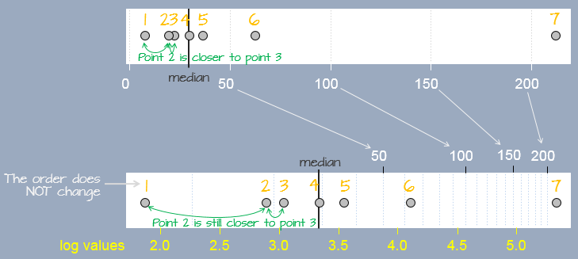

# Re-expressing values


```{r setup, include=FALSE}
#knitr::opts_chunk$set(message=FALSE, warning=FALSE, results='hold')
```

```{r echo=FALSE}
source("libs/Common.R")
options(width = 100)
```


```{r echo = FALSE}
pkg_ver(c("tukeyedar"))
```

--------

Real-world data often deviates from the textbook assumptions of symmetry, Normality, or consistent spread across groups. Such deviations can pose challenges when testing hypotheses using traditional statistical procedures. For example, a skewed distribution may disproportionately weight extreme values, distorting model fitting and subsequent analyses.

One effective strategy to address these issues is non-linear **re-expression** also known as transformation. In univariate analysis, re-expression is typically used to achieve one or more of the following objectives:

+ **Symmetrizing** the distribution to mitigate skewness.
+ **Equalizing** the spread to stabilize variability across groups.
+ **Normalizing** the distribution to allow for a mathematical characterization of the spread.

In multivariate analysis, we can add the goals of:

+ **Linearizing** relationships between variables to simplify interpretation and improve model performance.
+ **Normalizing** residuals in regression models to satisfy assumptions of common statistical techniques.

Re-expressing variables involves changing the scale of measurement, typically from a linear scale to a non-linear one. It's important to note that re-expressing batches of values does not create false patterns from noise: **Re-expression changes perspective, not reality**.

Among the various transformation techniques available, one of the most commonly used is the **logarithmic** transformation, which will be discussed next.

</p>

## The log transformation

A popular form of transformation used is the logarithm. The log, $y$, of a value $x$ is the power to which the base must be raised to produce $x$. This requires that the log function be defined by a **base**, $b$, such as `10`, `2` or `exp(1)` (the latter defining the natural log).

$$
y = log_b(x) \Leftrightarrow  x=b^y 
$$

A log transformation preserves the order of the observations as measured on a linear scale but modifies the "distance" between them in a systematic way. In the following figure, seven observations measured on a linear scale (top scale) are re-expressed on a *natural* log scale (bottom scale). Notice how the separation between observations change. This results in a different set of values for the seven observations. The yellow text under the log scale shows *natural* log scale values.

{width="65%"}

In R, the base is defined by passing the parameter `base=` to the `log()` function as in `log(x , base=10)`.

Re-expressing with the log is particularly useful when the change in one value as a function of another is multiplicative and not additive. An example of such a dataset is the compounding interest. Let's assume that we start off with $1000 in an investment account that yields 10% interest each year. We can calculate the size of our investment for the next 50 years as follows:

```{r tidy=FALSE}
rate <- 0.1                 # Rate is stored as a fraction
y    <- vector(length = 50) # Create an empty vector that can hold 50 values
y[1] <- 1000                # Start 1st year with $1000

# Next, compute the investment amount for years 2, 3, ..., 50.
# Each iteration of the loop computes the new amount for year i based 
# on the previous year's amount (i-1).
for(i in 2:length(y)){
  y[i] <- y[i-1] + (y[i-1] * rate)  # Or y[i-1] * (1 + rate)
}
```

The vector `y` gives us the amount of our investment for each year over the course of 50 years.

```{r, echo=FALSE}
y
```

We can plot the values as follows:

```{r, fig.width=4,fig.height=4}
plot(y, pch = 20)
```

The change in difference between values from year to year is **not additive**, in other words, the difference between years 48 and 49 is different than that for years 3 and 4.

--------------------------------------------
Years              Difference
----------------  ---------------------------
`y[49] - y[48]`    `r round(y[49] - y[48],2)`

`y[4] - y[3]`      `r round(y[4] - y[3],2)`
--------------------------------------------


However, the ratios between the pairs of years are identical:

-------------------------------------
Years              Ratio
----------------  -------------------
`y[49] / y[48]`    `r y[49] / y[48]`

`y[4] / y[3]`      `r y[4] / y[3]`
-------------------------------------


We say that the change in value is *multiplicative* across the years. In other words, the value amount 6 years out is $value(6) = (yearly\_increase)^{6} \times 1000$ or `1.1^6 * 1000` = `r 1.1^6 * 1000` which matches value `y[7]`. 

When we expect a variable to change multiplicatively as a function of another variable, it is usually best to transform the variable using the logarithm. To see why, plot the log of `y`.

```{r, fig.width=4,fig.height=4}
plot(log(y), pch=20)
```

Note the change from a curved line to a perfectly straight line. The logarithm will produce a straight line if the rate of change for `y` is constant over the range of `x`. This is a nifty property since it makes it easier to see if and where the rate of change differs. For example, let's look at the population growth rate of the US from 1850 to 2013.

```{r fig.width=4,fig.height=4}
dat <- read.csv("https://mgimond.github.io/ES218/Data/Population.csv", header=TRUE)
plot(US ~ Year, dat, type="l") 
```

The population count for the US follows a slightly curved (convex) pattern. It's difficult to see from this plot if the rate of growth is consistent across the years (though there is an obvious jump in population count around the 1950's). Let's log the population count.

```{r fig.width=4,fig.height=4}
plot(log(US) ~ Year, dat, type="l")  
```

Here, the log plot shows that the rate of growth for the US has not been consistent over the years (had it been consistent, the line would have been straight). In fact, there seems to be a gradual decrease in growth rate over the 150 year period.

A logarithm is defined by a base. Some of the most common bases are `10`, `2` and `exp(1)` with the latter being the natural log. The bases can be defined in the call to `log()` by adding a second parameter to that function. For example, to apply the log base 2 to a vector `y`, type `log(y, 2)`. To apply the natural log to that same value, simply type `log(y, exp(1))`--this is `R`'s default log.

The choice of a log base will not impact the fundamental shape of the logged values in the plot, it only changes its scale. So unless interpretation of the logged value is of concern, any base will do. Generally, you want to avoid difficult to interpret logged values. For example, if you apply log base 10 to the investment dataset, you will end up with a small range of values--thus more decimal places to work with--whereas a base 2 logarithm will generate a wider range of values and thus fewer decimal places to work with.

```{r fig.width=6, fig.height=4, echo=FALSE}
ly1 <- log(y, 2)
ly2 <- log(y, 10)
brk <- round(seq(min(ly1), max(ly1), by=2))
                
OP <- par(mar=c(3,7,2,5))
plot(log(y,2), type="p", pch=20, axes=FALSE, ylab=NA)
axis(2, at=brk, label=round(log(2^brk,10),2), line=3.5, las=2, 
     col="blue",col.ticks = "blue", col.axis = "blue")
axis(2, at=brk, labels=brk, hadj=1, las=2)
axis(4, at=brk, labels = 2^brk, las=2)
axis(1, outer=FALSE)
mtext("Base 2", 2, las=2, adj=1.2, padj=-12)
mtext("Base 10", 2, las=2, padj=-12, adj=2.3,col="blue")
mtext("Amount ($)", 4, las=2, padj=-13)
box()
grid()
par(OP)

```

A rule of thumb is to use log base 10 when the range of values to be logged covers 3 or more powers of ten, $\geq 10^3$ (for example, a range of 5 to 50,000); if the range of values covers 2 or fewer powers of ten, $\leq 10^2$ (for example, a range of 5 to 500) then a natural log or a log base 2 is best.

The log is not the only transformation that can be applied to a dataset. A family of power transformations (of which the *log* is a special case) can be implemented using either the **Tukey** transformation or the **Box-Cox** transformation. We'll explore the Tukey transformation next.

## The Tukey transformation

The Tukey family of transformations offers a broad range of re-expression options (which includes the log). The values are re-expressed using the algorithm:

$$
\begin{equation} T_{Tukey} = 
\begin{cases} x^p , & p \neq  0 \\
              log(x), & p = 0  
\end{cases}
\end{equation}
$$
The objective is to find a value for $p$ from a "ladder" of powers (e.g. -2, -1, -1/2, 0, 1/2, 1, 2) that does a good job in re-expressing the batch of values. Technically, $p$ can take on any value. But in practice, we normally pick a value for $p$ that may be "interpretable" in the context of our analysis. For example, a log transformation (`p=0`) may make sense if the process we are studying has a steady growth rate. A cube root transformation (p = 1/3) may make sense if the entity being measured is a volume (e.g. rain fall measurements). But sometimes, the choice of $p$ may not be directly interpretable or may not be of concern to the analyst.

Finding a power transformation that achieves a desired shape can be an iterative process. In the following example, a skewed distribution is generated using the `rgamma` function. The goal will be to symmetrize the disitrbution.

```{r fig.width=3, fig.height=1, echo=2:7}
OP <- par(mar=c(2,2,0,1), bty='n', cex.axis=0.8, mgp=c(1.5,0.5,0))
# Create a skewed distribution of 50 random values
set.seed(9)
a <- rgamma(50, shape = 1)

# Let's look at the skewed distribution
boxplot(a, horizontal = TRUE)
par(OP)
```

The batch is strongly skewed to the right. In an attempt to symmetrize the distribution, we'll first try a square-root transformation (a power of 1/2)

```{r fig.width=3, fig.height=1, echo=2}
OP <- par(mar=c(2,2,0,1), bty='n', cex.axis=0.8, mgp=c(1.5,0.5,0))
boxplot(a^(1/2), horizontal = TRUE)
par(OP)
```

The skew is reduced, but the distribution still lacks symmetry. We'll reduce the power to `0`--a log transformation:

```{r fig.width=3, fig.height=1, echo=2}
OP <- par(mar=c(2,2,0,1), bty='n', cex.axis=0.8, mgp=c(1.5,0.5,0))
boxplot(log(a), horizontal = TRUE)
par(OP)
```

That's a little too much over-correction; we don't want to substitute a right skew for a left skew. A power between 0 and 1/2 (i.e. 1/4) is explored next.

```{r fig.width=3, fig.height=1, echo=2}
OP <- par(mar=c(3.8,3.8,0,1), bty='n', cex.axis=0.8, mgp=c(1.5,0.5,0))
boxplot(a^(1/4), horizontal = TRUE)
par(OP)
```

The power of 1/4 does a good job rendering a symmetrical distribution about `a`'s central value.

Note that power transformations are not a panacea to all distributional problems. If a power transformation cannot generate the desired outcome, then other analytical strategies that do not rely on a desired distributional shape needs to be sought.

## The Box-Cox transformation

Another family of transformations is the Box-Cox transformation. The values are re-expressed using a modified version of the Tukey transformation:

$$
\begin{equation} T_{Box-Cox} = 
\begin{cases} \frac{x^p - 1}{p}, & p \neq  0 \\
              log(x), & p = 0 
\end{cases}
\end{equation}
$$
Both the Box-Cox and Tukey transformations method will generate similar distributions when the power `p` is `0` or greater, they will differ in distributions when the power is negative. For example, when re-expressing  `mtcars$mpg` using an inverse power (p = -1), Tukey’s re-expression will change the data order but the Box-Cox transformation will not as shown in the following plots:. 

```{r fig.width=6, fig.height=2, echo=FALSE}
library(tukeyedar)
OP <- par(mar=c(2,2,1.1,1), mfrow=c(1,3), cex.axis=0.8)
plot(mpg ~ disp, mtcars, main = "Original data")
plot(mtcars$mpg^-1 ~ mtcars$disp, main = "Tukey")
plot(eda_re(mtcars$mpg, p = -1) ~ mtcars$disp, main = "Box-Cox")
par(OP)
```

The original data shows a negative relationship between `mpg` and `disp`; the Tukey re-expression takes the inverse of `mpg` which changes the nature of the relationship between the y and x variables where we now have a positive relationship between the re-expressed `mpg` variable and `disp` variable (note that by simply changing the sign of the re-expressed value, `-x^(-1)` maintains the nature of the original relationship); the Box-Cox transformation, on the other hand, maintains this negative relationship.

The choice of re-expression will depend on the analysis context. For example, if you want an easily interpretable transformation then opt for the Tukey re-expression. If you want to compare the shape of transformed variables, the Box-Cox approach will be better suited.

## The `eda_re` function

The `tukeyedar` package offers a re-expression function that implements both the Tukey and Box-Cox transformations. To apply the Tukey transformation set `tukey = TRUE` (the default setting). For the Box-Cox transformation, set `tukey = FALSE`. The power parameter is defined by the `p` argument.

For a Tukey transformation:

```{r  class.source="eda", fig.width=3, fig.height=1, echo=2:4}
OP <- par(mar=c(2,2,0,1), bty='n', cex.axis=0.8, mgp=c(1.5,0.5,0))
library(tukeyedar)
mpg_re <- eda_re(mtcars$mpg, p=-0.25)
boxplot(mpg_re, horizontal = TRUE)
par(OP)
```

For a Box-Cox transformation:

```{r  class.source="eda", fig.width=3, fig.height=1, echo=2:3}
OP <- par(mar=c(2,2,0,1), bty='n', cex.axis=0.8, mgp=c(1.5,0.5,0))
mpg_re <- eda_re(mtcars$mpg, p=-0.25, tukey = FALSE)
boxplot(mpg_re, horizontal = TRUE)
par(OP)
```

## Built-in re-expressions for many `tukeyedar` functions

Many `tukeyedar` functions have a built-in argument `p` that will take as argument a power transformation that will be applied to the data. For example, the following  Normal QQ plot function applies a quartic root transformation (`p = 1/4`) to `a`.

```{r  class.source="eda", fig.width=2.5, fig.height=3}
eda_theo(a, p = 1/4)
```

## The `eda_unipow` function

The `eda_unipow` function will generate a matrix of distribution plots for a given vector of values using different power of transformations. By default, these powers are ` c(2, 1, 1/2, 1/3, 0, -1/3, -1/2, -1, -2)`--this generates a 3-by-3 plot matrix.

```{r class.source="eda", fig.width = 6, fig.height = 6}
eda_unipow(a)
```

What we are seeking is a symmetrical distribution. The power of `1/3` comes close. We can tweak the input power parameters to cove a smaller range of values.

```{r class.source="eda", fig.width = 3.8, fig.height = 3.8}
eda_unipow(a, p = c(1/3, 1/4, 1/5, 1/6))
```

The above plot suggests that we could go with a power transformation of `0.25` or `0.2`. The choice may come down to convenience and "interpretability".


