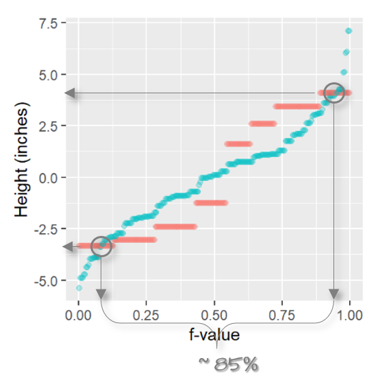

# Fits and residuals

```{r echo=FALSE}
source("libs/Common.R")
```

```{r echo = FALSE}
pkg_ver(c("dplyr", "tidyr", "ggplot2","lattice"))
```

In the previous chapters, we determined that the `voice.part` singer groups differed only by location (central value) and not so much by spread. In this section, we will expand this analysis by **fitting** a model (the mean) to the data, then we'll explore the residuals (i.e. the part of the data not explained by the fitted model). This exercise will tackle two objectives:

-   To seek a simple *mathematical* model to characterize both the mean and residual of the data.
-   To compare the influence of the voice part to that of the residual in characterizing the variation in height values (this to help address the question *"can the voice parts explain much of the variability in the data?"*).

## Fitting the data

Univariate data can be characterized by their location and by their spread. The different groups of singers differ by their central values, we will therefore **fit** the group means to each group batch and compare the **residuals** between groups. This implies that we characterize the data using the following mathematical function:

$$
Singer\ height = \mu_{voice\ part} + \epsilon
$$

$\mu_{voice\ part}$ is a measure of location, such as the mean, for each singer voice part group and $\epsilon$ is the residual that remains after the fitting of $\mu$.

First, we'll load the libraries that will be used in this chapter, then we'll load the `singer` data into the `df` object.

```{r}
library(dplyr)
library(tidyr)
library(ggplot2)
library(lattice)

df <- singer
```

Next, we'll plot the singer values using jittered points. We'll also add an orange point to each batch which will represent each group's mean.

```{r fig.width = 6, fig.height=3}
ggplot(df, aes(y = height, x = voice.part)) + 
  geom_jitter(width = 0.1, height = 0, alpha = 0.1) +
  stat_summary(fun = "mean", geom = "point", cex = 3, pch = 21, col = "red", bg = "orange") 
```

We've **fitted** each group with the **mean**--a mathematical description of the batches. Note that we could have used other measures of location such as the median, but since the data seem to follow a symmetrical distribution, the mean remains an adequate choice.

## Computing the residuals

To facilitate our comparison of the residuals, we will "re-level" the batches of values by subtracting the group means from their respective group values: this will allow us to plot **residuals** for each batch.

```{r}
df2 <- df %>% 
  group_by(voice.part) %>%
  mutate(Height.res = height - mean(height))
```

Next, we will generate a plot of the (jittered) residuals.

```{r fig.width = 6, fig.height=3}
ggplot(df2) + aes(y=Height.res, x=voice.part)             + 
  geom_jitter(width = 0.1, height=0, alpha=0.1) +
  stat_summary(fun = "mean", geom = "point", cex = 3, pch = 21, col = "red", bg="orange") 
```

We've *normalized* the batches to a common location. Note that the values along the y-axis have changed: all values are now spread around `0`. Next, we'll check that the batches of residuals have similar spread.

## Comparing the residuals

The feature that interests us in the residuals is the **spread**. We've learned that a good way to compare spreads is to plot the quantiles of each batch against one another.

### Residual q-q plots

If we want to compare *all* batches of residuals, we can create a matrix of pairwise **residual q-q plots**. We'll adopt the same code chunk used to generate the pairwise empirical q-q plots in chapter 17.

```{r fig.width = 6, fig.height= 6}
min_size     <- min(tapply(df2$Height.res, df$voice.part, length)) 
singer_split <- split(df2$Height.res, df$voice.part)
rng          <- range(df2$Height.res) 
 
qq_df <- as.data.frame(lapply(singer_split, 
                              function(x) quantile(x, type = 5,
                                                   p = (1:min_size -0.5)/min_size) ))

plotfun = function(x,y, ...){
points(x,y,pch=18)
  abline(c(0,1),col="blue")
}

pairs(qq_df, upper.panel=NULL, panel = plotfun, xlim = rng, ylim=rng) 
```

Since we removed the means from each batch of values, each pair of values should no longer display any significant offsets. This facilitates our comparison of the spreads and allows us to focus just on the multiplicative offsets.

The residual q-q plots suggest that the spreads are very similar across singer heights given that the points fall almost perfectly along the one-to-one line.

Next, we'll explore another method for comparing residuals that will not require as many plots.

### Comparing batches to pooled residuals using a q-q plot

If we assume that the spreads are homogeneous across the batches, we may choose to combine (pool) the residuals and compare the residuals of each batch to the **pooled** residuals. The advantage with this approach is that we are increasing the *size* of the reference residual distribution thus reducing noise that results from a relatively small sample size. It also reduces the number of q-q plots to analyze--going from 28 plots to just eight!

```{r fig.width=8, fig.height=2.3 }

df3 <- df2 %>%
  group_by(voice.part)  %>%
  arrange(Height.res)  %>% 
  mutate(f.val    = (row_number() - 0.5) / n())  %>%
  ungroup()  %>%
  mutate(Pooled.res = quantile(Height.res, probs = f.val))  %>%
  select(voice.part, Height.res, Pooled.res)

ggplot(df3, aes(y = Height.res, x = Pooled.res)) + geom_point(alpha = 0.5) + 
              geom_abline(intercept = 0, slope = 1) +
              facet_wrap(~ voice.part, nrow = 1) 
```

All eight batches seem to have similar spreads. This makes it possible to assess the influence the fitted means have in explaining the spreads since we can now treat the residuals, $\epsilon$, as a constant.

$$
Singer\ height = \mu_{voice\ part} + \epsilon_{contant}
$$

Had the residuals varied across all singer height values, we would be in a difficult position of assessing how much of the variability can be explained by just the fitted means.

#### What to expect if one or more of the batches have different spreads

The residual vs. pooled residual plots can be effective at identifying batches with different spreads. In the following example, we combine four simulated batches generated from an identical distribution (`V1`, `V2`, `V3` and `V4`) with two simulated batches generated from a different distribution (`V5` and `V6`). Their boxplots are shown next.

```{r, echo = FALSE}
set.seed(26)
ex1 <- replicate(4, rnorm(100, 10, 1), simplify = TRUE) %>% 
  cbind(replicate(2,sqrt(rnorm(100, 100,1)), simplify = TRUE)) %>%  
  as.data.frame() %>% 
  pivot_longer(names_to = "batch", values_to = "value", cols = everything()) %>% 
  group_by(batch)  %>%
  arrange(value)  %>% 
  mutate(value.res = value - mean(value),
          f.val    = (row_number() - 0.5) / n())  %>%
  ungroup()  %>%
  mutate(Pooled.res = quantile(value.res, probs = f.val) ) 
```

```{r fig.width=5, fig.height=2, echo = FALSE}
ggplot(ex1, aes(batch, value)) + geom_boxplot() +  xlab("")
```

Now let's take a look at the residual vs. pooled residual plots.

```{r fig.width=8, fig.height=2.2 , echo = FALSE}

ggplot(ex1, aes(y = value.res, x = Pooled.res)) + geom_point(alpha = 0.5) + 
  geom_abline(intercept = 0, slope = 1) +
  facet_wrap(~ batch, nrow = 1) 
```

Batches `V5` and `V6` clearly stand out as having different distributions from the rest of the batches. But it's also important to note that `V5` and `V6` *contaminate* the pooled residuals. This has the effect of nudging the other four batches away from the one-to-one line. Note what happens when batches `V5` and `V6` are removed from the pooled residuals.

```{r echo = FALSE, fig.width=5.5, fig.height=2.2 }
set.seed(26)
ex2 <- replicate(4, rnorm(100, 10, 1), simplify = TRUE) %>% 
  as.data.frame() %>% 
  pivot_longer(names_to = "batch", values_to = "value", cols = everything()) %>% 
  group_by(batch)  %>%
  arrange(value)  %>% 
  mutate(value.res = value - mean(value),
          f.val    = (row_number() - 0.5) / n())  %>%
  ungroup()  %>%
  mutate(Pooled.res = quantile(value.res, probs = f.val) ) 

ggplot(ex2, aes(y = value.res, x = Pooled.res)) + geom_point(alpha = 0.5) + 
  geom_abline(intercept = 0, slope = 1) +
  facet_wrap(~ batch, nrow = 1) 
```

The *tightness* of points around the one-to-one line suggests nearly identical distributions between `V1`, `V2`, `V3` and `V4` as would be expected given that they were generated from the same underlying distribution.

Performing simulations like this can help understand how a pooled residual q-q plot may behave under different sets of distributions.

## Residual-fit spread plot

So far, we've learned that the spreads of singer heights are the same across all batches. This makes it feasible to assess how the differences in mean heights between voice parts compare in magnitude to the spread of the pooled residuals.

### Creating the residual-fit spread plot

To generate the **residual-fit spread** plot (or **r-f spread** plot for short), we first need to normalize the data to the global mean. We then split the *normalized* singer height data into two parts: the modeled means and the residuals. For example, the smallest value in the `Bass 2` group is `66`. When normalized to the global mean, that value is `-1.29`. The normalized value is then split between the group's (normalized) mean of `4.1` and its residual of `-5.39` (i.e. the difference between its value and the `Bass 2` group mean). These two values are then each added to two separate quantile plots: the *fitted values* plot and the *residuals* plot. This process is repeated for each observation in the dataset to generate the final r-f spread plot.


To generate the R-F plot using `ggplot2`, we must first split the data into its fitted and residual components. We'll make use of piping operations to complete this task.

```{r}
rf <- df %>%
  mutate(norm = height - mean(height)) %>%   # Normalize values to global mean
  group_by(voice.part) %>% 
  mutate( Residuals  = norm - mean(norm),    # Extract group residuals
          `Fitted values` = mean(norm))%>%   # Extract group means
  ungroup() %>% 
  select(Residuals, `Fitted values`) %>% 
  pivot_longer(names_to = "type",  values_to = "value", cols=everything()) %>% 
  group_by(type) %>% 
  arrange(value) %>% 
  mutate(fval = (row_number() - 0.5) / n()) 
```

Next, we'll plot the data.

```{r fig.height=3, fig.width=5.5}
ggplot(rf, aes(x = fval, y = value)) + 
  geom_point(alpha = 0.3, cex = 1.5) +
  facet_wrap(~ type) +
  xlab("f-value") +
  ylab("Height (inches)") 
```

An alternative to the side-by-side r-f plot is one where both fits and residuals are overlapping.

```{r fig.height=3, fig.width=4.5}
ggplot(rf, aes(x = fval, y = value, col = type)) + 
  geom_point(alpha = 0.3, cex = 1.5) +
  xlab("f-value") +
  ylab("Height (inches)") 
```

<p>

</p>

The spread of the fitted heights (across each voice part) is not insignificant compared to the spread of the combined residuals. **The spread in the fitted means encompasses about 85% of the spread in the residuals**. You can eyeball the upper and lower bound of the fractions by matching the intersections of the upper and lower mean values with the residuals' quantiles along the x-axis as shown in the following figure.

{width="350"}

The r-f spread plot suggests that the voice-parts *can* explain a good part of the variation in the data!

### Other examples of r-f spread plots

First, let's compare the following two plots. Both plots show two batches side-by-side. The difference in location is nearly the same in both plots (group `a` and `b` have a mean of 10 and 11 respectively), but the difference in spreads are not.

```{r fig.height=2.5, fig.width=5, echo=FALSE}
OP <- par( mfrow=c(1,2), mar=c(3,3,1,1))
set.seed(33)
ff <- data.frame( y = c(10 + rnorm(20, 0,1.4), 11 + rnorm(20,0,1.4)), cat = rep(c("a","b"),each=20))
ff2 <- data.frame( y = c(10 + rnorm(20, 0,0.3), 11 + rnorm(20,0,0.3)), cat = rep(c("a","b"),each=20))

lim <- range(ff$y,ff2$y)
stripchart(y ~ cat, ff2, pch=20, vertical=TRUE, method="jitter",
           col=c("blue","red"), ylim=lim )
title("Plot 1")
stripchart(y ~ cat, ff, pch=20, vertical=TRUE, method="jitter",
           col=c("blue","red"), ylim=lim )
title("Plot 2")
par(OP)
```

`Plot 2` does not allow us to say, with confidence, that the batch means differ by much compared to their spreads. `Plot 1` on the other hand, shows a significant difference in batch means when compared to their spreads.

The r-f spread plot for `Plot 1` follows:

```{r fig.height=2.5, fig.width=4, echo=FALSE}
# rfs(oneway(y~cat, data = ff2, spread = 1), 
#     aspect=1, 
#     ylab = "Height (inches)")

ff2 %>%
  mutate(norm = y - mean(y)) %>%   # Normalize values to global mean
  group_by(cat) %>% 
  mutate( Residuals  = norm - mean(norm),    # Extract group residuals
          `Fitted values` = mean(norm))%>%   # Extract group means
  ungroup() %>% 
  select(Residuals, `Fitted values`) %>% 
  pivot_longer(names_to = "type",  values_to = "value", cols=everything()) %>% 
  group_by(type) %>% 
  arrange(value) %>% 
  mutate(fval = (row_number() - 0.5) / n()) %>% 
  ggplot() + aes(x = fval, y = value) + 
  geom_point(alpha = 0.3, cex = 1.5) +
  facet_wrap(~ type) +
  xlab("f-value") +
  ylab("Height (inches)") 

```

It's clear from this r-f spread plot that the spread of the mean values (between batches `a` and `b`) is important compared to that of its residuals. The means span one unit (about -0.5 to +0.5 on the y-axis) while the residuals span about the same amount. This suggests that the groups `a` and `b` explain much of the variability in the data.

For `Plot 2`, the difference in mean values is also one unit, but the spread of residuals spans almost 5 units. An r-f spread plot makes this difference quite clear.

```{r fig.height=2.5, fig.width=4, echo=FALSE}
# rfs(oneway(y~cat, data = ff, spread = 1), 
#     aspect=1, 
#     ylab = "Height (inches)")

ff %>%
  mutate(norm = y - mean(y)) %>%   # Normalize values to global mean
  group_by(cat) %>% 
  mutate( Residuals  = norm - mean(norm),    # Extract group residuals
          `Fitted values` = mean(norm))%>%   # Extract group means
  ungroup() %>% 
  select(Residuals, `Fitted values`) %>% 
  pivot_longer(names_to = "type",  values_to = "value", cols=everything()) %>% 
  group_by(type) %>% 
  arrange(value) %>% 
  mutate(fval = (row_number() - 0.5) / n()) %>% 
  ggplot() + aes(x = fval, y = value) + 
  geom_point(alpha = 0.3, cex = 1.5) +
  facet_wrap(~ type) +
  xlab("f-value") +
  ylab("Height (inches)") 
```

The spread between each batch's fitted mean is small compared to that of the combined residuals suggesting that much of the variability in the data is not explained by the differences between groups `a` and `b` for `Plot 2`.
