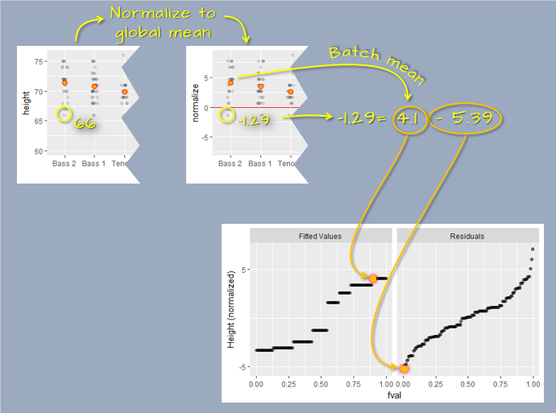

# Fits and residuals

```{r echo=FALSE}
source("libs/Common.R")
```

```{r echo = FALSE}
pkg_ver(c("dplyr", "tidyr", "ggplot2", "lattice", "tukeyedar"))
```

----------------------

In the last chapter, we learned of the many benefits that homogeneity in the residuals can offer. Homogeneity in the residuals can also facilitate our assessment in the importance a grouping variable may contribute to an estimation of a variable in a dataset. For example, can educational attainment help determine a person's income level, or can the implementation of a specific soil treatment improve yield of crops. 

This chapter has for objective to evaluate whether *conditioning* the mean on a grouping variable explains a substantial portion of the *variability* by comparing its influence to that of the residuals using a *residual-fit spread* plot.

## Introduction

```{r echo = FALSE}
set.seed(9591)
df <- data.frame(y = rnorm(60, mean = c(10,11, 12), sd = 0.5), 
                 groups = rep(c("a","b","c"), times = 20),
                 groups2 = sample(c("c","b","a"), 60, replace = TRUE))
```

An overarching goal in data analysis is to summarize data with mathematical expressions that effectively characterize its values. A basic example of such a summary is the overall mean. For instance, consider a dataset of 60 values (visualized in the following jitter plot).  These values can be characterized by a mean, $\mu$ of `r round(mean(df$y),1)` units (depicted as a bisque color point in the plot)  and the residuals, $\epsilon$.

$$
y = \mu + \epsilon
$$

```{r fig.height=3, fig.width=2.4, echo = FALSE}
library(tukeyedar)
eda_jitter(df, y, show.par = FALSE)
```

While the overall mean serves as an initial estimate for $y$, it is accompanied by some degree of uncertainty. In this case, the variability spans approximately four units. 

To refine our estimate of $y$, we can incorporate additional information, such as the group to which each measurement belongs. This allows us to account for group-level differences and reduce the uncertainty in our estimate of $y$. 


$$
y = \mu_{group} + \epsilon
$$
For example, dividing the measurements into three groups provides separate estimates of, $\mu_{group}$ for each group.

```{r fig.height=3, fig.width=2.8, echo = FALSE}
eda_jitter(df, y, groups, show.par = FALSE)
```

In this example, knowing the group membership of an observation produces three distinct estimates of $y$ that range from about 10 to 12 units. This approach not only helps us hone in on a more precise measure of location, but it also reduces the uncertainty in our estimate of $y$ by about two units--an improvement over the earlier model which relied on a single estimate for all observations. 

A grouping variable’s usefulness in improving our estimate of $y$ depends not only on its ability to provide distinct group-level estimates of the population mean but also on its potential to reduce the uncertainty surrounding those estimates. In the following jitter plot, we see an example where splitting the data into groups yields little improvement in the precision of our estimates compared to the simpler overall mean model:


```{r fig.height=3, fig.width=2.8, echo = FALSE}
set.seed(1775)
df2 <- data.frame(y = rnorm(60,11,0.93), groups = rep(c("a","b","c"), times = 20) )
eda_jitter(df2, y, groups, show.par = FALSE, xlab = "unhelpful groups", reorder = FALSE)
```

Here, the improvement in $y$ estimates is modest because the uncertainty within each group ($\epsilon$) remains substantial. Each group exhibits a range of approximately four units, comparable to the range of uncertainty in the overall mean model.

## The residual-fit spread plot

The **residual-fit spread** (**rfs**) plot, introduced by William Cleveland, is a visualization tool designed to compare the variability explained by a fitted model (e.g., group means in univariate analysis) to the variability in the residuals. The plot is constructed as follows:

+  Fit a model, such as the mean, to the data.
+  Compute residuals by subtracting the fitted values from the original values.
+  Center the fitted values (e.g., subtract the overall mean) to align both datasets around zero.
+  Generate side-by-side quantile plots for the centered fitted values and residuals.

An important assumption in creating an rfs plot is that the residual distribution has a consistent shape across groups, ensuring valid comparisons.

Using the dataset introduced earlier in this chapter, we first calculate the group means of 10, 11 and 12. The data are then split into two parts: the modeled means and the residuals. For instance, an observation $y = 11.07$ (highlighted in green in the figure below) can be decomposed as follows:

$$
11.07 = 12 - 0.93
$$

Here, 12 is the group mean, and -0.93 is the residual value.

The decomposed values are plotted as side-by-side quantile plots: the fitted means on the left and the residuals on the right. To facilitate a direct comparison of spreads, the fitted values are re-centered around zero by subtracting the overall mean ($\mu_{overall} = 11$) from each values. For the highlighted observation, this yields: 

$$
Fit\ minus\ mean: 12 - 11 = 1
$$

 

In the rfs plot, both spreads are shown on a shared y-axis, centered at zero. This alignment enables a straightforward comparison of variability between the fitted values and the residuals. In this example, the spreads are approximately equal, suggesting that the grouping variable (voice part) accounts for some of the variability in the data.

## Exloring extreme scenarios with an rfs plot

To build intuition for interpreting the residual-fit spread (rfs) plot, let’s consider two extreme cases.

### Scenario 1: Maximizing group separation

In this scenario, the $y$ values are assigned to groups to maximize separation between them:

```{r fig.height=3.2, fig.width=2.4, echo = FALSE}
df2 <- eda_trim_df(df, y, prop = 0) # Sort the data
df2$groups <- rep(c("a","b","c"), each = nrow(df2) / 3 )

eda_jitter(df2, y, groups, show.par = FALSE)
```

The variability within each group is reduced to around 1.25 units--significantly less than the overall variability of 4 units. This dataset generates the following rfs plot:

```{r fig.height=3.5, fig.width=4.8, echo = FALSE, results='hide'}
eda_rfs(df2, y, groups, show.par = FALSE)
```

Here, the group means explain a substantial portion of the variability in $y$. The spread in fitted group means covers 2 units, while approximately 95% of the residuals fall within a range of 1 unit--a much smaller spread. This indicates that the grouping variable can play a key role in explaining $y$.

### Scenario 2: Minimizing group separation

Now consider the opposite extreme, where the grouping variable is minimally effective at explaining $y$. The original $y$ values remain unchanged, but the grouping assignments are restructured to minimize differences between group means:

```{r fig.height=3.2, fig.width=2.4, echo = FALSE}
set.seed(423)
df2$y <- sample(df$y, replace = FALSE)
eda_jitter(df2, y, groups, show.par = FALSE, reorder = FALSE)
```

Here the group means differ by less than 0.3 units whereas the residuals span three to four units. The resulting rfs is as follows:

```{r fig.height=3.5, fig.width=4.8, results='hide', echo=FALSE}
eda_rfs(df2, y, groups, show.par = FALSE)
```

In this scenario, the residuals dominate, and the grouping variable contributes little to improving our estimates of $y$. The small spread in fitted values compared to the residuals indicates that the grouping variable has minimal impact. If we were to abandon the grouping variable and rely solely on the overall mean, the residual spread would remain nearly unchanged.


## Generating an rfs plot with `eda_rfs`

The rfs plot can be generated with the `eda_rfs` function from the `tukeyedar` package. But first, we'll generate the singer height data used in the previous chapters.

```{r}
df <- lattice::singer
```

The rfs plot for the singer height data follows:

```{r class.source="eda", fig.height=3.5, fig.width=4.8, results='hide'}
eda_rfs(df, height, voice.part)
```

In addition to generating a plot, the function will output information about the spreads in the console. It extracts the range of values associated with the mid 90% of the residuals.

```{r class.source="eda", fig.height=3.5, fig.width=4.8, fig.keep = "none", echo = FALSE}
eda_rfs(df, height, voice.part)
```

The reason the mid 90% of values is chosen is to prevent outliers, or extreme values, in the residuals from disproportionately exaggerating the spread in residuals. For example, you’ll note several extreme residual values above 5 inches.

To help visualize the inner 90% of values, you can add the `q=TRUE` argument to the function:

```{r class.source="eda", fig.height=3.5, fig.width=4.8, results='hide'}
eda_rfs(df, height, voice.part, q = TRUE)
```

The spread of the fitted heights (across each voice part) is not insignificant compared to the spread of the combined residuals. The spread in the fitted means spans the same range of the bulk of residual values. 


## Generating an rfs plot with `ggplot`

To generate the R-F plot using `ggplot2`, we must first split the data into its fitted and residual components. We'll make use of `dplyr` and `tidyr` functions to tackle this task.

```{r}
library(dplyr)
library(tidyr)

rf <- df %>%
  mutate(norm = height - mean(height)) %>%   # Normalize values to global mean
  group_by(voice.part) %>% 
  mutate( Residuals  = norm - mean(norm),    # Extract group residuals
          `Fit minus mean` = mean(norm))%>%   # Extract group means
  ungroup() %>% 
  select(Residuals, `Fit minus mean`) %>% 
  pivot_longer(names_to = "type",  values_to = "value", cols=everything()) %>% 
  group_by(type) %>% 
  arrange(value) %>% 
  mutate(fval = (row_number() - 0.5) / n()) 
```

Next, we'll plot the data.

```{r fig.height=3, fig.width=5.5}
library(ggplot2)
ggplot(rf, aes(x = fval, y = value)) + 
  geom_point(alpha = 0.3, cex = 1.5) +
  facet_wrap(~ type) +
  xlab("f-value") +
  ylab("Height (inches)") 
```

