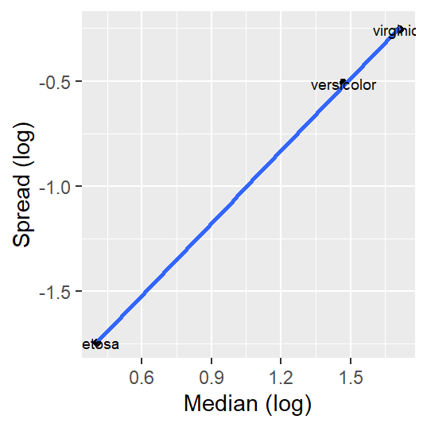
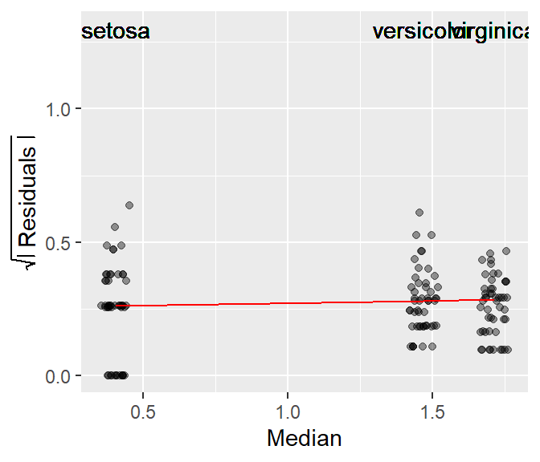

# Spread-level plots


::: {.cell}

:::

::: {.cell hash='sl_plot_cache/html/unnamed-chunk-2_a9e0c5c25fa201d342586fad77e0b216'}
::: {.cell-output-display}
`````{=html}
<table data-quarto-disable-processing="true" class="table" style="width: auto !important; ">
 <thead>
  <tr>
   <th style="text-align:left;color: rgba(85, 85, 85, 255) !important;background-color: rgba(221, 221, 221, 255) !important;text-align: center;border: 1px solid white !important;
             font-family: 'Source Code Pro', 'Open Sans';
             padding:1px !important;
             padding-left:4px !important;
             padding-right:4px !important;
             font-size: 0.8em;
             border-radius: 5px;"> dplyr </th>
   <th style="text-align:left;color: rgba(85, 85, 85, 255) !important;background-color: rgba(221, 221, 221, 255) !important;text-align: center;border: 1px solid white !important;
             font-family: 'Source Code Pro', 'Open Sans';
             padding:1px !important;
             padding-left:4px !important;
             padding-right:4px !important;
             font-size: 0.8em;
             border-radius: 5px;"> ggplot2 </th>
  </tr>
 </thead>
<tbody>
  <tr>
   <td style="text-align:left;color: darkred !important;background-color: rgba(250, 232, 232, 255) !important;text-align: center;border: 1px solid white;
             font-family: 'Open Sans', Arial;
             padding:1px !important;
             padding-left:4px !important;
             padding-right:4px !important;
             font-size: 0.8em;
             border-radius: 5px;"> 1.1.4 </td>
   <td style="text-align:left;color: darkred !important;background-color: rgba(250, 232, 232, 255) !important;text-align: center;border: 1px solid white;
             font-family: 'Open Sans', Arial;
             padding:1px !important;
             padding-left:4px !important;
             padding-right:4px !important;
             font-size: 0.8em;
             border-radius: 5px;"> 3.4.4 </td>
  </tr>
</tbody>
</table>

`````
:::
:::


## Introduction

Some batches of data may show a systematic change in spread vs. location. In other words, the variability in each batch may be dependent on that batches median value. Such dependency is often undesirable (e.g. in an ANOVA for instance) and preferably removed in an analysis. A plot well suited for visualizing this dependency is the **spread-level** plot, **s-l** (or **spread-location** plot as Cleveland calls it).

## Constructing the s-l plot

The s-l plot compares a measure of the spread's residual to the location (usually the median) for each batch of data. The spread is usually distilled down to its residual (what remains after subtracting each batch value by the batch median) then it's transformed by taking the square root of its absolute value. The following block walks you through the steps needed to create an s-l plot.


::: {.cell hash='sl_plot_cache/html/unnamed-chunk-3_9187cec471b10956d63ffc9a30e6f07a'}

```{.r .cell-code}
library(dplyr)
library(ggplot2)

singer <- lattice::singer
res.sq <-  singer %>% group_by(voice.part) %>% 
                      mutate(Median   = median(height),
                             Residual = sqrt(abs(height - Median)))

ggplot(res.sq, aes(x=Median, y=Residual)) + 
  geom_jitter(alpha=0.4,width=0.2) +
  stat_summary(fun = median, geom = "line", col = "red") +
  ylab(expression(sqrt(abs(" Residuals ")))) +
  geom_text(aes(x = Median, y = 3.3, label = voice.part))
```

::: {.cell-output-display}
{width=480}
:::
:::


The red line in the plot helps identify the type of relationship between spread and location. If the line increases monotonically upward, there is an increasing spread as a function of increasing location; if the line decreases monotonically downward, there is a decreasing spread as a function of increasing location; and if line is neither increasing nor decreasing monotonically, there is no change in spread as a function of location.

> Note that if you are to rescale the y-axis when using the `stat_summary()` function, you should use the `coord_cartesian(ylim = c( .. , .. ))` function instead of the `ylim()` function. The latter will mask the values above its maximum range from the `stat_summary()` function, the former will not.

The singer dataset does not seem to exhibit any dependence between a voice part's spread and its median value.

Next, we'll look at an example of a dataset that *does* exhibit a dependence between spread and fitted values.

## Example: the `iris` dataset

R has a built-in dataset called `iris` that provide measurements of sepal and petal dimensions for three different species of the iris family. In this next example, we will plot the spreads of the `Petal.Length` residuals (after removing their group median values) to their group medians.


::: {.cell hash='sl_plot_cache/html/unnamed-chunk-4_c31935faa3125f3844ba51b516baafae'}

```{.r .cell-code}
# Create two new columns: group median and group residuals
 df1 <- iris %>%
   group_by(Species)  %>%
   mutate( Median = median(Petal.Length),
           Residuals = sqrt(abs( Petal.Length - Median)))  

# Generate the s-l plot 
 ggplot(df1, aes(x = Median, y = Residuals)) + 
   geom_jitter(alpha = 0.4, width = 0.05, height = 0) +
   stat_summary(fun = median, geom = "line", col = "red") +
   ylab(expression(sqrt( abs(" Residuals ")))) +
   geom_text(aes(x = Median, y = 1.3, label = Species))
```

::: {.cell-output-display}
{width=336}
:::
:::


A monotonic spread is apparent in this dataset too, i.e. as the median length of the Petal increases, so does the spread.

## How can we stabilize spreads in a dataset?

A technique used to help reduce or eliminate monotonic variations in the spreads as a function of fitted values is to **re-express** the original values. Re-expression, which involves transforming values via a pwoer transformation, will be covered in the next chapter. However, in the next section, we learn of a variation of the s-l plot that can identify a power transformation that can help stabilize spread. 


### Variations of the S-L plot

Another version of the S-L plot (and one that seems to be more mainstream) pits the log of the inter-quartile spread vs the log of the median. This approach only works for positive values (this may require that values be adjusted so that the minimum value be no less than or equal to 0).  

This approach is appealing in that the slope of the best fit line can be used to come up with a power transformation (a topic covered in next week's lecture) via **power = 1 - slope**.

This variant of the s-l plot can be computed in R as follows (we will use the food web data as an example).


::: {.cell hash='sl_plot_cache/html/unnamed-chunk-5_e930bbfdb7e1af934707bcd46bff54b4'}

```{.r .cell-code}
sl <- iris %>%
  group_by(Species)  %>%
  summarise (level  = log(median(Petal.Length)),
                IQR = IQR(Petal.Length),  # Computes the interquartile range
             spread = log(IQR))

ggplot(sl, aes(x = level, y = spread)) + geom_point() + 
  stat_smooth(method = MASS::rlm, se = FALSE) +
  xlab("Median (log)") + ylab("Spread (log)") +
  geom_text(aes(x = level, y = spread, label = Species), cex=2.5)
```

::: {.cell-output-display}
{width=268.8}
:::
:::


Note how this plot differs from our earlier s-l plot in that we are only displaying each batch's median spread value and we are *fitting* a straight line to the medians instead of *connecting* them.

The slope suggests a monotonic increase in spread vs location. We can extract the slope value from a regression model. Here, we'll adopt a robust bivariate model (bivariate analysis is covered later in this course).


::: {.cell hash='sl_plot_cache/html/unnamed-chunk-6_6d3fd12613d9bfbd45d59b658e228128'}

```{.r .cell-code}
coefficients(MASS::rlm(spread ~ level, sl))
```

::: {.cell-output .cell-output-stdout}
```
(Intercept)       level 
  -2.204242    1.143365 
```
:::
:::


The slope is the second coefficient in the above output. The computed slope value is `1.14`. This suggests a power transformation of `1 - 1.14` (or about `-0.14`). You will learn in the next chapter that as a power transformation value approaches `0`, when can opt to use the `log` transformation instead. We'll try this next.


::: {.cell hash='sl_plot_cache/html/unnamed-chunk-7_2eb9368a33f85e5ca3bb37b49231d052'}

```{.r .cell-code}
# Create two new columns: group median and group residuals
 df1 <- iris %>%
   group_by(Species)  %>%
   mutate( log.length = log(Petal.Length),
           Median = median(log.length),
           Residuals = sqrt(abs( log.length - Median)))  

# Generate the s-l plot 
 ggplot(df1, aes(x = Median, y = Residuals)) + 
   geom_jitter(alpha = 0.4, width = 0.05, height = 0) +
   stat_summary(fun = median, geom = "line", col = "red") +
   ylab(expression(sqrt( abs(" Residuals ")))) +
   geom_text(aes(x = Median, y = 1.3, label = Species))
```

::: {.cell-output-display}
{width=336}
:::
:::


Applying a log transformation to the petal length values seems to have helped stabilize the spread given that the connected lines are close to flat. However, there is a very slight upward slope--though probably insignificant. Would applying a power transformation of `-0.14` have helped? We will revisit this dataset in the next chapter.


