# The theoretical QQ plot


::: {.cell}

:::

::: {.cell}
::: {.cell-output-display}
`````{=html}
<table data-quarto-disable-processing="true" class="table" style="width: auto !important; ">
 <thead>
  <tr>
   <th style="text-align:left;color: rgba(85, 85, 85, 255) !important;background-color: rgba(221, 221, 221, 255) !important;text-align: center;border: 1px solid white !important;
             font-family: 'Source Code Pro', 'Open Sans';
             padding:1px !important;
             padding-left:4px !important;
             padding-right:4px !important;
             font-size: 0.8em;
             border-radius: 5px;"> dplyr </th>
   <th style="text-align:left;color: rgba(85, 85, 85, 255) !important;background-color: rgba(221, 221, 221, 255) !important;text-align: center;border: 1px solid white !important;
             font-family: 'Source Code Pro', 'Open Sans';
             padding:1px !important;
             padding-left:4px !important;
             padding-right:4px !important;
             font-size: 0.8em;
             border-radius: 5px;"> ggplot2 </th>
   <th style="text-align:left;color: rgba(85, 85, 85, 255) !important;background-color: rgba(221, 221, 221, 255) !important;text-align: center;border: 1px solid white !important;
             font-family: 'Source Code Pro', 'Open Sans';
             padding:1px !important;
             padding-left:4px !important;
             padding-right:4px !important;
             font-size: 0.8em;
             border-radius: 5px;"> lattice </th>
   <th style="text-align:left;color: rgba(85, 85, 85, 255) !important;background-color: rgba(221, 221, 221, 255) !important;text-align: center;border: 1px solid white !important;
             font-family: 'Source Code Pro', 'Open Sans';
             padding:1px !important;
             padding-left:4px !important;
             padding-right:4px !important;
             font-size: 0.8em;
             border-radius: 5px;"> tukeyedar </th>
  </tr>
 </thead>
<tbody>
  <tr>
   <td style="text-align:left;color: darkred !important;background-color: rgba(250, 232, 232, 255) !important;text-align: center;border: 1px solid white;
             font-family: 'Open Sans', Arial;
             padding:1px !important;
             padding-left:4px !important;
             padding-right:4px !important;
             font-size: 0.8em;
             border-radius: 5px;"> 1.1.4 </td>
   <td style="text-align:left;color: darkred !important;background-color: rgba(250, 232, 232, 255) !important;text-align: center;border: 1px solid white;
             font-family: 'Open Sans', Arial;
             padding:1px !important;
             padding-left:4px !important;
             padding-right:4px !important;
             font-size: 0.8em;
             border-radius: 5px;"> 3.5.1 </td>
   <td style="text-align:left;color: darkred !important;background-color: rgba(250, 232, 232, 255) !important;text-align: center;border: 1px solid white;
             font-family: 'Open Sans', Arial;
             padding:1px !important;
             padding-left:4px !important;
             padding-right:4px !important;
             font-size: 0.8em;
             border-radius: 5px;"> 0.22.6 </td>
   <td style="text-align:left;color: darkred !important;background-color: rgba(250, 232, 232, 255) !important;text-align: center;border: 1px solid white;
             font-family: 'Open Sans', Arial;
             padding:1px !important;
             padding-left:4px !important;
             padding-right:4px !important;
             font-size: 0.8em;
             border-radius: 5px;"> 0.4.0 </td>
  </tr>
</tbody>
</table>

`````
:::
:::


-----

Thus far, we have used the quantile-quantile plots to compare the distributions between two empirical (i.e. observational) datasets. The QQ plot can also be used to compare an empirical distribution to a theoretical distribution (i.e. one defined mathematically). Such a plot is usually referred to as a **theoretical QQ plot**. Examples of popular theoretical distributions include the *Normal* distribution (aka the Gaussian distribution), the *chi-square* distribution, and the *exponential* distribution.


::: {.cell}
::: {.cell-output-display}
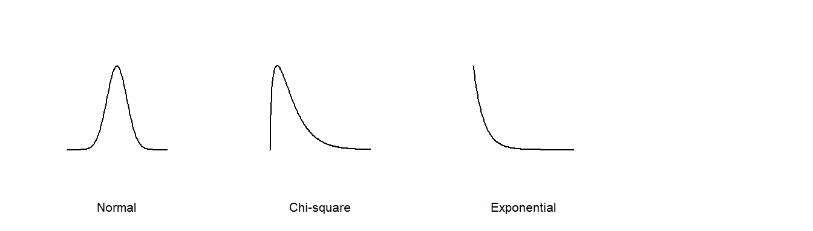{width=672}
:::
:::


There are many reasons we might want to compare empirical data to theoretical distributions:

 * A theoretical distribution is easy to parameterize. For example, if the shape of the distribution of a batch of numbers can be approximated by a Normal distribution we can reduce the complexity of our data to just two parameters: the mean and the standard deviation.
 
 * If data can be approximated by certain theoretical distributions, then many parametric statistical procedures can be applied to the data.
 
 * In inferential statistics, knowing that a sample was derived from a population whose distribution follows a theoretical distribution allows us to derive certain properties of the population from the sample. For example, if we know that a sample comes from a normally distributed population, we can define confidence intervals for the sample mean using a t-distribution.
 
 * Modeling the distribution of the observed data can provide insights into the underlying process that generated the data.
 
But very few empirical datasets follow any theoretical distribution exactly. So the question usually ends up being "how well does theoretical distribution *X* fit my data?"

The **theoretical quantile-quantile** plot is a tool designed to explore how a batch of numbers deviates from a theoretical distribution. In the following examples, we will compare empirical data to the *Normal* distribution using the **Normal quantile-quantile** plot or **Normal QQ** plot for short.

## The Normal QQ plot

If we wish to assess whether a batch of values follows the shape of a Normal distribution, we can compare it to its matching *Normal* quantile function,$q_{\mu,\sigma}(f)$. For example, given a batch of values $x$, we can generate the matching Normal quantiles using $x$'s mean, $\mu$, and standard deviation, $\sigma$. The following figure shows the Normal QQ plot (left plot) and matching density plots for reference (right plot).


::: {.cell}
::: {.cell-output-display}
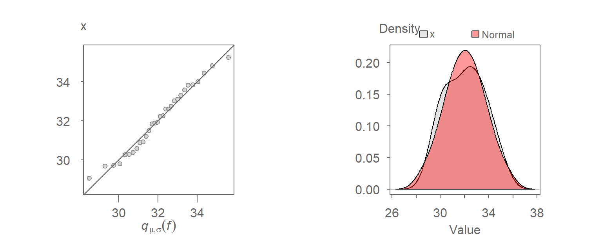{width=768}
:::
:::


The traditional "bell" shape of the Normal distribution (red density plot) is apparent in the right plot. You will seldom expect any set of observational data to follow a Normal distribution exactly. Our interest is in knowing how *close* a batch of values comes to a Normal distribution.

Constructing the above QQ plot requires that we extract the mean and standard deviation from $x$. This can be avoided by noting that the Normal quantile, $q_{\mu,\sigma}(f)$, can be decomposed into its mean and standard deviation components $\mu + \sigma q_{0,1}(f)$ where $q_{0,1}(f)$ is the **unit Normal quantile** (i.e. a Normal quantile whose mean is $0$ and standard deviation is $1$ unit). So, if we compare $x$ to a unit Normal quantile we get the following QQ plot:


::: {.cell}
::: {.cell-output-display}
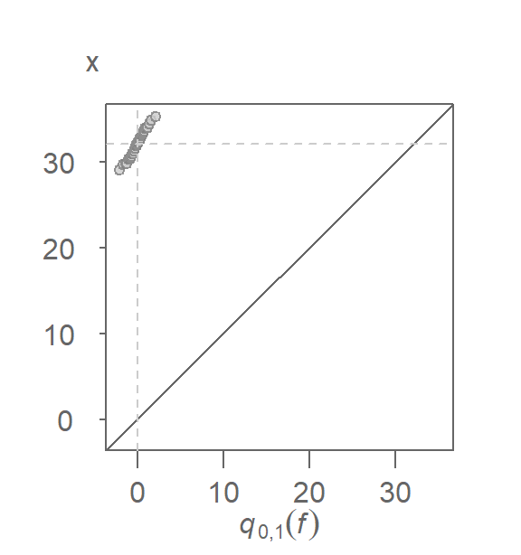{width=288}
:::
:::


You'll note both the additive and multiplicative offsets described in the previous chapter. The additive offset is nothing more than the sample mean, $\mu$, and the multiplicative offset is nothing more than the sample standard deviation, $\sigma$. 

We know that if two batches differ only by their offsets (additive and/or multiplicative), and not their general shape, then we expect the points to follow a straight line. Knowing this, we can modify the QQ plot by plotting $x$ against the unit Normal quantile, $q_{0,1}(f)$. The $x=y$ slope used in the empirical QQ plot no longer applies here given that the $x$ and $q_{0,1}(f)$ scales will not necessarily match in magnitude; $q_{0,1}(f)$ will usually range from -2 to 2 regardless of the range of values in x. Instead, we fit a line to the points to help gauge the pattern's *straightness*. This gives us the **unit Normal QQ plot**. Note that the word "unit" is often dropped from the plot name and is therefore often labeled as the **Normal QQ plot**.


::: {.cell}
::: {.cell-output-display}
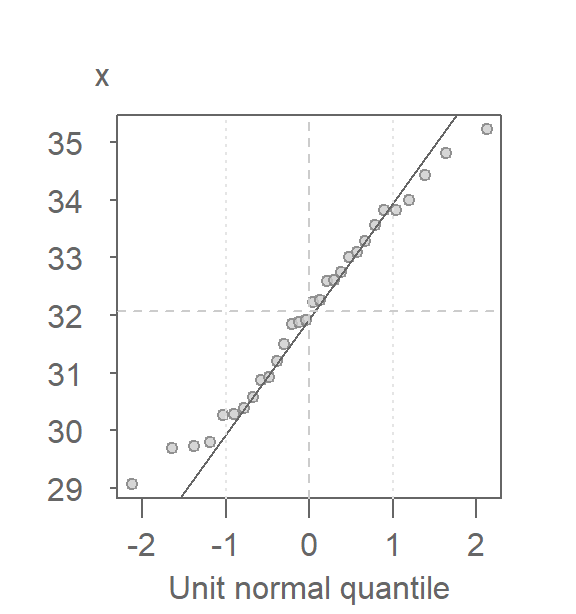{width=288}
:::
:::


There are many ways one can fit a line to the data, Here, we opt to fit a line to the first and third quartiles (IQR) of the QQ plot. Its purpose is to help gauge the "straightness" of the points.

The x-axis can help identify the tails of the distribution by noting that roughly 68% of the values fall between `-1` and `1` standard deviations and that roughly 95% of the values fall between `-2` and `2` standard deviations.

If a variable $X$ is determined to follow a *Normal* distribution, it can be mathematically characterized as:

$$
X \sim   N(\mu_{X}, \sigma_{X})
$$

which explicitly states that $X$ follows a *Normal* distribution with mean $\mu_{X}$ and a standard deviation $\sigma_{X}$.

## Generating a Normal QQ plot with `eda_theo`

In the examples that follow, we'll compare the `Alto 1` singer group to a Normal distribution. 


::: {.cell}

```{.r .cell-code}
library(dplyr)

df <- lattice::singer

alto  <- df %>% 
  filter(voice.part == "Alto 1") %>% 
  pull(height)
```
:::


The `tukeyedar` package has a built-in function, `eda_theo`, that will compare a batch of values to one of six theoretical distributions. The distributions include the Normal, exponential, uniform, gamma, chi-square and Weibull distributions. By default, the function compares the batch to a Normal distribution.


::: {.cell}

```{.r .eda .cell-code}
library(tukeyedar)
eda_theo(alto) 
```

::: {.cell-output-display}
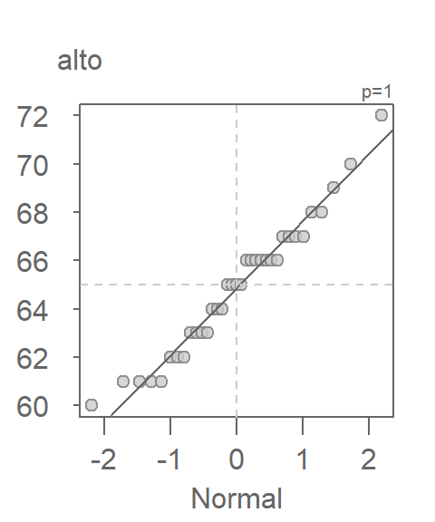{width=240}
:::
:::


The horizontal and vertical dashed lines highlight the *median* value of each batch. The power transformation applied to the variable is shown in the upper right-hand corner of the plot. By default, no power transformation is applied (i.e p = 1).

The Normal QQ plot can be split across a grouping variable using the `eda_theopan` function. The input object must be a dataframe with a continuous variable column and a grouping variable column. For example, to generate a Normal QQ plot of singer heights conditioned on voice part, type.


::: {.cell}

```{.r .eda .cell-code}
eda_theopan(df, height, voice.part) 
```

::: {.cell-output-display}
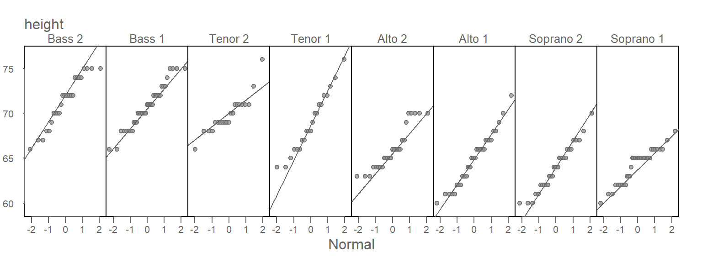{width=768}
:::
:::


## Generating a Normal QQ plot with `qqnorm`

To generate a Normal QQ plot in base R, we will need two functions: `qqnorm` and `qqline`. 


::: {.cell}

```{.r .cell-code}
qqnorm(alto)
qqline(alto)
```

::: {.cell-output-display}
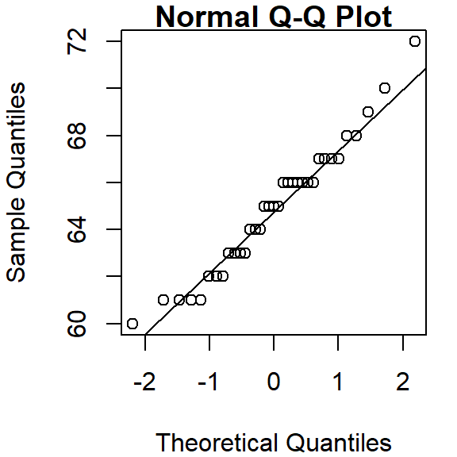{width=288}
:::
:::


## Generating a Normal QQ plot with `ggplot`

To generate the Normal QQ plot in `ggplot`, we first use the `stat_qq` function to generate the point plot, then we call the `stat_qq_line` function to generate the IQR fit. Here, we are passing a single vector object instead of a dataframe to `ggplot()`.


::: {.cell}

```{.r .cell-code}
library(ggplot2)

ggplot() + aes(sample = alto) + stat_qq(distribution = qnorm) +
  stat_qq_line(col = "blue") +
  xlab("Unit normal quantile") + ylab("Height")
```

::: {.cell-output-display}
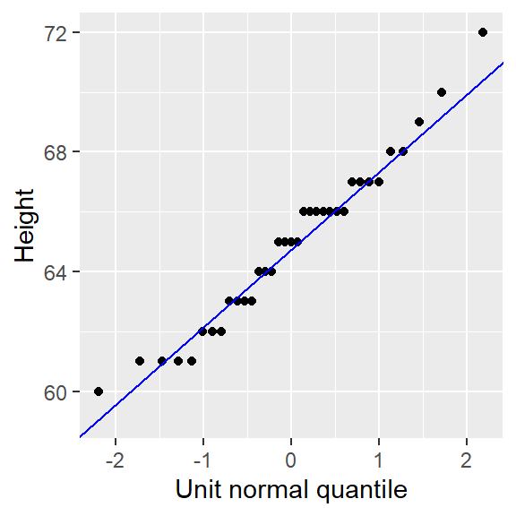{width=288}
:::
:::


Note the slight difference in syntax used with `ggplot` when passing a vector instead of a dataframe to the function. Here, we take the `aes()` function outside of the `ggplot()` function. This is done to render a cleaner syntax. The alternative, `ggplot( , aes(sample = alto))`, would make it difficult to notice the comma just before `aes()`, thus increasing the chance for a typo.

The `stat_qq_line` function uses the built-in `quantile` function and, as such, will adopt the default quantile type `7` (i.e. it computes the f-value as $(i - 1)/(n - 1))$). The `eda_theo` function adopts quantile type `5`. This setting cannot be changed in the`stat_qq_line` function. 

Note that `geom_qq` and  `geom_qq_line` functions are identical to `stat_qq`and `stat_qq_line`.

`ggplot`'s faceting function can be leveraged to generate a panel of QQ plots similar to that generated with the `eda_theopan` function.


::: {.cell}

```{.r .cell-code}
ggplot(df, aes(sample=height)) + stat_qq(distribution=qnorm) +
  stat_qq_line( col = "blue") +
  xlab("Unit normal quantile") + ylab("Height") +
  facet_wrap(~voice.part, nrow = 1)
```

::: {.cell-output-display}
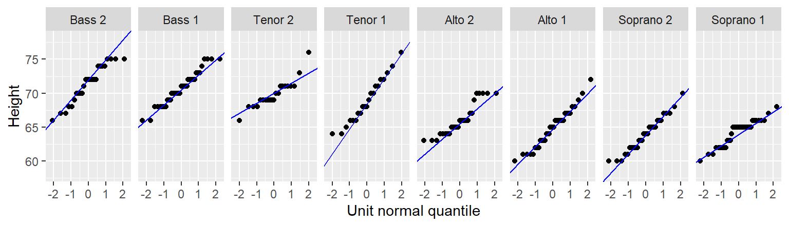{width=768}
:::
:::


## How Normal is my dataset?

The `alto` batch of values seem to do a good job in following a Normal distribution given how well they follow a straight line in the Normal QQ plot. The stair-step pattern in the points is simply a byproduct of the rounding of height values to the nearest inch. A few observations at the tail ends of the distribution deviate from Normal, but this is to be expected given that tail ends of distributions tend to be noisy.

So, how do the other singer groups compare to a Normal distribution? Let's recreate the Normal QQ plots panel using the `eda_theopan` function.


::: {.cell}

```{.r .eda .cell-code}
eda_theopan(df, height, voice.part) 
```

::: {.cell-output-display}
{width=768}
:::
:::


When comparing a batch of values to a Normal distribution, we are looking for a point pattern that follows the fitted line at the *core* of the dataset. If a systematic deviation from the straight line is observed (such as a curved pattern, for example), then this may be evidence against an assumption of normality. For the most part, all eight batches in our example appear to follow a Normal distribution with the exception of `Alto 2` that exhibits a slight concave shape in its Normal QQ plot.

## What should a dataset pulled from a Normal distribution look like?

Simulations are a great way to develop an intuitive feel for what a dataset pulled from a Normal distribution might look like in a Normal QQ plot. You will seldom come across perfectly Normal data in the real world. Noise is an inherent part of any underlying process. As such, random noise can influence the shape of a QQ plot despite the data coming from a Normal distribution. This is especially true with small datasets as demonstrated in the following example where we simulate five small batches of values pulled from a Normal distribution. The `rnorm` function is used in this example to randomly generate numbers from a Normal distribution whose mean and standard deviation are pulled from the `Alto 1` batch. We also round the values to mimic the rounding of height values observed in the `singer` dataset.


::: {.cell}

```{.r .eda .cell-code}
set.seed(321)  # Sets random generator seed for consistent output

# Simulate values from a normal distribution
sim <- data.frame(sample = paste0("Sample",1:5),
                  value  = round(rnorm(length(alto)*5, 
                                 mean = mean(alto), sd = sd(alto))))

# Generate QQ plots of the simulated values
eda_theopan(sim, value, sample)
```

::: {.cell-output-display}
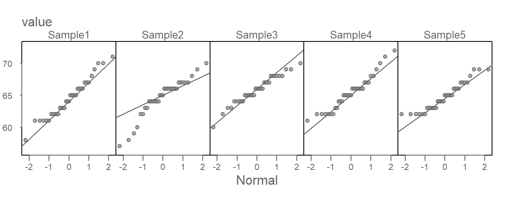{width=624}
:::
:::


Of the five simulated batches, `Sample3` generates a *textbook*  Normal QQ plot. `Sample5` looks very much like the `Alto 2` singer plot and `Sample2` *could* lead one to question its Normal distribution provenance, even though we know that it, and all other four plots, were generated from a Normal distribution! 

The singer height Normal QQ plots, including `Alto 2`,  do not look different from some of these simulated plots. In fact, they probably look more *Normal* then the simulated set of values! This lends confidence in our verdict that the `singer` height distributions can be characterized by a Normal distribution, regardless of the voice part the heights are pulled from.

## How Normal QQ plots behave in the face of skewed data

It can be helpful to simulate distributions of difference skewness to see how a Normal quantile plot may behave. In the following figure, the top row shows different density distribution plots, The bottom row shows the **Normal QQ plots** for each distribution.


::: {.cell}
::: {.cell-output-display}
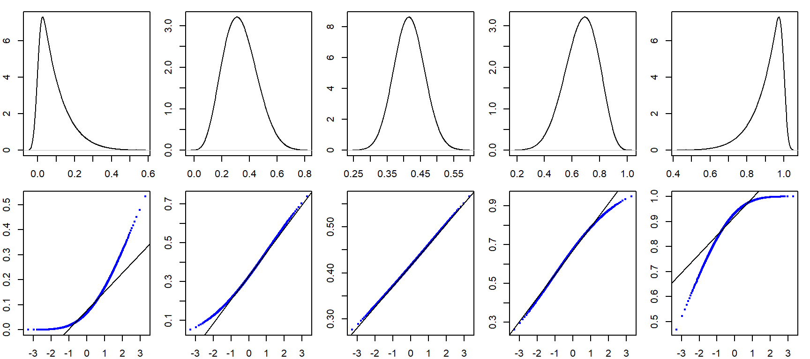{width=864}
:::
:::

