# Analyzing Two-Way Tables: The Median Polish

```{r echo=FALSE}
source("libs/Common.R")
```


```{r echo = FALSE, eval=knitr::is_html_output()}
pkg_ver(c("dplyr", "tidyr", "tukeyedar"))
```

-------

In previous chapters, we explored univariate and bivariate datasets--structures where each observation typically corresponds to a single value or a pair of values. In this chapter, we shift focus to a different data structure: the **two-way table**, where each cell contains a single value representing the intersection of two categorical factors. Unlike the datasets covered earlier, which often consist of many observations per group or variable, two-way tables typically summarize data with **one value per cell**, such as a mean, count, or rate. This structure requires a different analytical approach.

The **median polish** is an exploratory data analysis technique designed to extract the effects of row and column factors from such tables. It serves as a robust alternative to two-way ANOVA, with the goal of characterizing the contribution of each factor to the expected values in the table. Unlike traditional methods that rely on means, the median polish uses medians to iteratively adjust for row and column effects. This reliance on medians makes the technique less sensitive to outliers, providing a more robust summary of the data's structure. Median polish is particularly useful in situations where data contains extreme values.

-----

## Introduction to Two-Way Tables

Before tackling two-way tables, let's explore a simpler one-way table. The following dataset shows mean annual income by occupation for the year 2014 (*src: [Bureau of Labor Statistics](http://www.bls.gov/oes/#tables)*)

```{r echo=FALSE, results='asis'}

library(xtable)
df <- data.frame( row.names =c("Architecture and Engineering", 
"Arts, Design, Entertainment, Sports, and Media", "Building and Grounds Cleaning and Maintenance", 
"Business and Financial Operations", "Community and Social Service", 
"Computer and Mathematical", "Construction and Extraction", "Education, Training, and Library", 
"Farming, Fishing, and Forestry", "Food Preparation and Serving Related", 
"Healthcare Practitioners and Technical", "Healthcare Support", 
"Installation, Maintenance, and Repair", "Legal", "Life, Physical, and Social Science", 
"Management", "Office and Administrative Support", "Personal Care and Service", 
"Production", "Protective Service", "Sales and Related", "Transportation and Material Moving"),
Income = c(112490, 72410, 83970, 81520, 70070, 45310, 101110, 52210, 
55790, 76010, 28820, 43980, 21980, 26370, 24980, 38660, 
35530, 25160, 46600, 45220, 35490, 34460)
)

print(xtable(df, digits=0),include.rownames=TRUE, type="html",
      size="size:7")


```

What insights can we derive from this dataset beyond the raw income values for each occupation type? To begin, we might consider summarizing the income data with a central measure, such as the median. For instance, in our working example, the median income is `r sprintf("%i",median(df$Income))`. This single value provides a summary measure that represents the overall income distribution.

However, not all income values in the dataset are equal to `r sprintf("%i",median(df$Income))`—they vary above or below the median. To capture this variability, we can compute deviations by subtracting the median income from each occupation's income value. While this information can be tabulated, a dotplot provides a more visual and intuitive means of comparing these deviations.

```{r small.mar=TRUE, fig.width=6,fig.height=4, echo=FALSE}
options(scipen=3)
dotchart( as.matrix(df)- median(df$Income), pch=16,cex=0.6)
abline(v = 0, col="red")
```

We have separated the income values into two parts: an **overall** and its **residuals**. This can be written in the following algebraic form:

$$
Income_{occupation} = Median_{income} + \varepsilon_{occupation}
$$

For example, 'Healthcare Support' average income of  `r sprintf("%i",df$Income[12])` can be separated into the median, `r sprintf("%i",median(df$Income))`, and its residual, `r sprintf("%i",df$Income[12]-median(df$Income))`. 

The income value can be thought of as the **response** to the occupation type (also known as a **factor**). In other words, the factor determines the value in our table.

Next, we will see how the idea of separating the values into components can be expanded to **two-way** (aka **two-factor**) tables.

## Anatomy of a two-way table

Let's decompose the following table which represents infant mortality rates (per 1000 live births) by region and by a father's educational attainment for the years 1964 through 1966 (Hoaglin *et al.*).

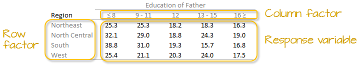

A two-way table is composed of three variables: 

  * a **row factor** which has **four levels** in our working example: Northeast, North Central, South and West,
  * a **column factor** which has **five levels** in our working example: under 8, 9-11, 12, 13-15 and 16 and greater years of education,
  * **response variables** of which we have 4 (rows) x 5 (columns) = 20 all together.

Each cell in the table contains a single summary value-such as a rate, mean, or count-rather than a collection of individual observations.

We can model the response variable, $y_{ij}$, as the sum of a common value, a row effect, a column effect, and a residual:


$$
y_{ij} = \mu + \alpha_i + \beta_j + \epsilon_{ij}
$$

where $y_{ij}$  is the **response variable** for row $i$ and column $j$, $\mu$ is the overall typical value (hereafter referred to as the *common value*), $\alpha_i$ is the **row effect**, $\beta_j$ is the **column effect** and  $\epsilon_{ij}$ is the **residual** or value left over after *all* effects are taken into account. This additive model forms the foundation of the median polish technique.

The goal of this analysis is to decompose the response variable into its respective effects--*education* and *region*--by iteratively removing row and column medians until the remaining residuals are minimized.  

## Analysis workflow

Let's first create the dataframe.

```{r}
df <- data.frame(row.names = c("NE","NC","S","W"),
                 ed8       = c(25.3,32.1,38.8,25.4), 
                 ed9to11   = c(25.3,29,31,21.1),
                 ed12      = c(18.2,18.8,19.3,20.3),
                 ed13to15  = c(18.3,24.3,15.7,24),
                 ed16      = c(16.3,19,16.8,17.5)
                 )
```

### Visualizing patterns in two-way tables

It's often easier to look at a graphical representation of the data than a tabular one. Even a table as small as this can benefit from a plot. 

We will adopt Bill Cleveland's dotplot for this purpose. R has a built-in dotplot function called `dotchart`. It requires that the table be stored as a matrix instead of a dataframe; we will therefore convert `df` to a matrix by wrapping it with the `as.matrix()` function.

```{r small.mar=TRUE, fig.width=3, fig.height=3.8}
dotchart( as.matrix(df), cex=0.7)
```

The plot helps visualize any differences in mortality rates across different father educational attainment levels. There seems to be a gradual decrease in child mortality with increasing father educational attainment. 

However, the plot does not help spot differences across regions (except for the `ed12` group). We can generate another plot where region becomes the main grouping factor.  We transpose the matrix so that regions become the primary grouping variable on the y-axis, allowing us to compare mortality rates across regions for each education level..

```{r small.mar=TRUE, fig.width=3, fig.height=3.8}
dotchart( t(as.matrix(df)), cex=0.7)
```

At first glance, there seems to be higher death rates for the `NC` and `S` regions and relatively lower rates for the `W` and `NE` regions. But our eyes may be fooled by outliers in the data.

Next, we'll generate side-by-side boxplots to compare the effects between both categories. Note that we'll need to create a *long* version of the table using the `tidyr` package.

```{r small.mar=TRUE, fig.width=6, fig.height=3, fig.show='hold'}
library(tidyr)
library(dplyr)

df.l <- df %>%
  mutate(Region = as.factor(row.names(.)) )  %>%
  pivot_longer(names_to = "Edu", values_to = "Deaths", -Region) %>% 
  mutate(Edu = factor(Edu, levels=names(df)))

# side-by-side plot
OP <- par(mfrow=c(1,2))
plot(Deaths ~ Region + Edu, df.l)
par(OP)
```

Together, these plots suggest that both education and region may influence infant mortality, with education appearing to have a stronger effect.

Next we will attempt to quantify these effects using Tukey's **median polish**.

### Median polish

A median polish is an iterative process whereby we seek to extract the effects from the data into their row and column components. The steps involved in each iteration are described next.

#### Step 1: Compute overall median and residual table

First, we will compute the median value for *all* values in the dataset; this will be our first estimate of the **common** value. The resulting median value is placed in the upper left-hand margin of the table. A **residual table** is created by taking the difference between the original value and the overall median.

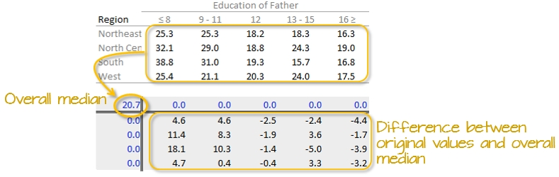

You'll also note that the row and column effect values are initially populated with 0 values.


#### Step 2: Compute the row  medians

Next, row medians are computed  (shown in red in the following figure) from the residual table. 

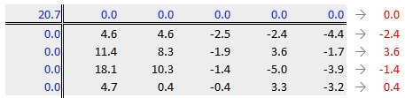

Note that in addition to computing the row median values for the response variable, we are also computing the median value for the *column effects* in the upper margin (which happens to be zero since we have no column effect values yet).

#### Step 3: Create a new residual table from the row medians

The row medians are added to the left hand margin of the new residual table (shown in green). These values represent the *row effects* in this first iteration. A new set of residual values is created from the row medians where each cell takes on the value of the subtraction of the row median from each response variable in that row.

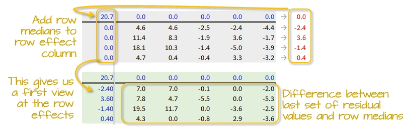

The subtraction is also done for the *column effect* values (even though all values remain zero) **and** the global median (common effect value).

#### Step 4: Compute the column medians

Next, column medians are computed  (shown in red in the following figure) from the residual table. Note that you are NOT computing the column medians from the original response variables.  Note too that we are also computing the median value for the row effect values (left margin).

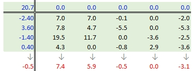


#### Step 5: Create a new residual table from the column medians

A new residual table is created from the column medians where each new cell takes on the value of the subtraction of the column median from each initial residual value in that column.  For example, the first upper-left cell's residual is $7.0 - 7.4 = -0.4$.

The column medians are also added to the column effect margin. Note that we are also adding the row effect median value, `-0.5`, to the *common effect* cell in the upper left-hand corner.

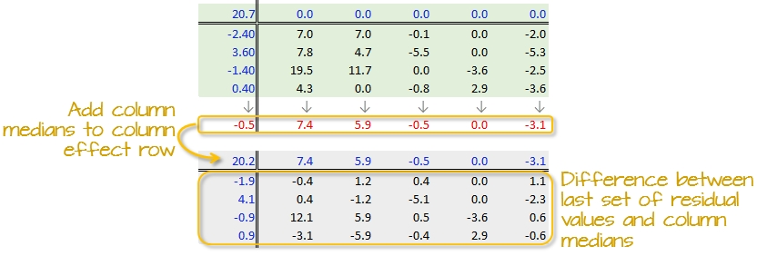

We have now completed our first row and column smoothing iteration. However, there may be more row and column effects that can be pulled from the residuals. We therefore move on to a second iteration.

#### Step 6: Second iteration -- row effects

Next, we compute the row medians from the residuals, then add the *column effect* median to the top margin (and the common value) and subtract the row medians from the residuals. as in step 3.

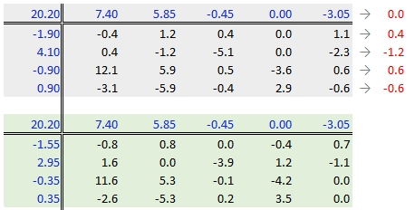

#### Step 7: Second iteration -- column effects

To wrap-up the second iteration, we compute the column median values from the residuals then subtract the medians from those residuals. We also add the medians to the row effect values and the common value.

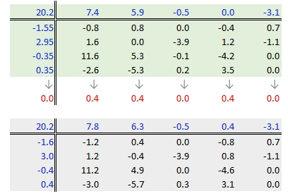

#### When do we stop iterating?

The goal is to iterate through the row and column smoothing operations until the row and column effect medians are close to 0. However, Hoaglin *et al.* (1983) warn against *“using unrestrained iteration”* and suggest that a few steps should be more than adequate in most instances. 

In our working example, a third iteration may be warranted. The complete workflow for this third iteration follows. 

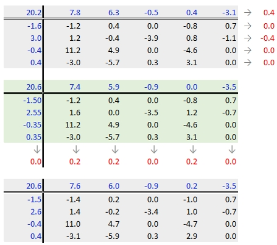

The final version of the table (along with the column and row values) is shown below:

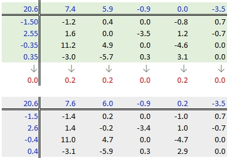

A progression of each iteration is shown side-by-side in the next figure. The left-most table is the original data showing death rates. The second table shows the outcome of the first round of polishing (including the initial overall median value of 20.2). The third and forth table show the second and third iterations of the smoothing operations.

```{r echo = FALSE, fig.width = 11, fig.height=2.5}
library(tukeyedar)
grd <- c("ed8", "ed9-11", "ed12", "ed13-15", "ed16")
reg <- c("NE", "NC", "S", "W")
dfl <- data.frame(region =  factor(rep( c("NE", "NC", "S", "W"), each = 5),
                                   levels = reg),
                 edu = factor(rep( grd , 4), levels = grd),
                 perc = c(25.3, 25.3, 18.2, 18.3, 16.3, 32.1, 29, 18.8,
                          24.3, 19, 38.8, 31, 19.3, 15.7, 16.8, 25.4, 
                          21.1, 20.3, 24, 17.5))

out0 <- eda_pol(dfl, row = region, col = edu, val = perc, plot = FALSE, maxiter = 0)
out1 <- eda_pol(dfl, row = region, col = edu, val = perc, plot = FALSE, maxiter = 1)
out2 <- eda_pol(dfl, row = region, col = edu, val = perc, plot = FALSE, maxiter = 2)
out3 <- eda_pol(dfl, row = region, col = edu, val = perc, plot = FALSE, maxiter = 3)

OP <- par(mfrow = c(1,4))
 plot(out0, row.size = 0.7, col.size = 0.7, res.size =1.2)
 plot(out1, row.size = 0.7, col.size = 0.7, res.size =1.2)
 plot(out2, row.size = 0.7, col.size = 0.7, res.size =1.2)
 plot(out3, row.size = 0.7, col.size = 0.7, res.size =1.2)
par(OP)
```

A few takeway observations from the analysis follow:

 * The *common effect* of 20.6 contributes the largest portion of the overall variation in the table. 
 * Between `Region` and `Education` effects, `Education` explains a greater share of the variability in infant mortality rates. Specifically, the range of the `Education` effect is 7.58 - (-3.45) = 11.03 deaths per 1000 births compared to 2.55 - (-1.5) = 4.05 deaths per 1000 births for the `Region` effect.
 * One notably high residual--**10.97 deaths above the overall median deaths**--is observed in the **Southern region** and for fathers with only an **8^th^ grade education**, indicating a potential outlier or area for further investigation.

### Interpreting the median polish

As noted earlier, a two-way table represents the relationship between the response variable, $y$, and the two categories as:

$$
y_{ij} = \mu + \alpha_i + \beta_j + \epsilon_{ij}
$$

In our working example, $\mu$ = 20.6; $\alpha_i$ = -1.5, 2.6, -0.4, and 0.4 for $i$ = `NE`, `NC`, `S` and `W` respectively; $\beta_j$ = 7.6, 6.0, -0.9, 0.2 and -3.5 for $j$ = `ed8`, `ed9to11`, `ed12`, `ed13to15` and `ed16` respectively.

The residuals represent the portion of the mortality rates that can't be explained by either factors. 

So the mortality rate in the upper left-hand cell from the original table can be deconstructed as:

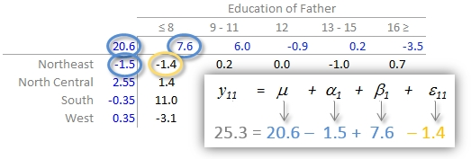

An examination of the table suggests that the infant mortality rate is greatest for fathers who did not attain more than 8 years of school (i.e. who has not completed high school) as noted by the high column effect value of 7.6. This is the rate of infant mortality **relative to the overall median** (i.e. on average, 20.6 infants per thousand die every year and the rate goes up to 7.6 + 20.6 = 28.2 for infants whose father has not passed the 8^th^ grade).  Infants whose father has completed more than 16 years of school (i.e. who has completed college) have a lower rate of mortality as indicated by the low effect value of -3.5 (i.e. 3.5 fewer depths than average). The effects from regions also show higher infant mortality rates for North Central and Western regions (with effect values of 2.6 and 0.4 respectively) and lower rates for the northeastern and southern regions; however the regional effect does not  appear to be as dominant as that of the father’s educational attainment. 

It’s also important to look at the distribution of the residuals across the two-way table. One should identify unusually high or low residuals in the table. Such residuals may warrant further investigation (e.g. the high southern region residual value of 10.97 may need further exploration).

### Test for non-additivity (interactive terms)

Thus far, we have assumed an additive relationship between the effects (factors). But this additive model may not be the best fit for our data. A good way to test this is by generating a **Tukey Additivity Plot** where we plot residuals vs. the **comparison value**, $cv_{ij}$, defined as $\alpha_i \beta_j / \mu$. If the plot is devoid of any obvious trend or pattern we can conclude that our dataset is consistent with an additive model. Such seems to be the case with our working example as shown in the following plot.

```{r fig.width=3, fig.height=3, echo=FALSE, small.mar=TRUE, message=FALSE, results='hide'}
# plot( medpolish(df,maxiter=3), pch=20)
plot(eda_pol(df.l, Region, Edu, Deaths, plot = FALSE), plot = "diagnostic", row.size=0.7, col.size = 0.7, res.size =0.8)
```

If the diagnostic plot revealed a trend, its shape--or more specifically, its slope--could be used in helping define an appropriate transformation for the data.  A rule of thumb is to apply a $(1 – slope)$ power transformation to the original data. 

If a power transformation is not appropriate for the dataset, then a non-additive (i.e. interactive) term can be added to the model. This term is often of the form $k \cdot \alpha_i \beta_j / \mu)$ where $\alpha_i \beta_j / \mu$ is the comparison values. The constant $k$ is the slope estimated from the linear pattern in the diagnostic plot (i.e. the *Tukey Additivity* plot). The extended model thus takes the form:

$$
y_{ij} = \mu + \alpha_i + \beta_j + k(\alpha_i \beta_j / \mu)  + \epsilon_{ij}
$$
The term $\alpha_i \beta_j$ introduces a **multiplicative** interaction between the row effect $\alpha_i$  and the column effect $\beta_j$. While $\alpha_i$ and $\beta_j$ are constant effects for their respective row and column, the presence of the  interactive term means their contributions to the cell value $y_{ij}$ are not purely independent. With some algebraic manipulation, the contribution of the row effect $\alpha_i$ can be seen as modified by the column effect $\beta_j$:


$$
y_{ij} = \mu + \alpha_i(i + k\beta_j/\mu) + \beta_j  + \epsilon_{ij}
$$

or vice versa:

$$
y_{ij} = \mu + \alpha_i + \beta_j(1 + k\alpha_j/\mu) + \epsilon_{ij}
$$
These rearrangements demonstrate how the effect associated with one factor depends on the level of the other factor, which is the hallmark of interaction.

## Implementing the median polish in R

### Using base R's `medpolish`

The steps outlined in the previous section can be easily implemented using pen and paper or a spreadsheet environment for larger datasets. R has a built-in function called `medpolish()` which does this for us. We can define the maximum number of iterations by setting  the `maxiter=` parameter but note that `medpolish` will, by default, automatically estimate the best number of iterations for us. 

```{r}

df.med <- medpolish( df)
```

The median polish ran through 4 iterations--one more than was run in our step-by-step example.

The four values printed to the console gives us the sum of absolute residuals at each iteration. The output from the model is stored in the `df.med` object. To see its contents , simply type it at the command line.

```{r}
df.med
```

All three effects are displayed as well as the residuals (note that the precision returned is greater than that used in our earlier analysis).

To generate the Tukey additivity plot, simply wrap the median polish object with the `plot` command as in:

```{r fig.width=3, fig.height=3, small.mar=TRUE}
plot( df.med )
```


### Using `eda_pol`

The `tukeyedar` package has a custom function called `eda_pol` that will output the polished table as a graphic element. 

Unlike the base `medpolish` function, `eda_pol` requires that the data be in long form. In creating the long form version of the data, we'll explicitly set the levels for educational attainment and region.

```{r}
grd <- c("ed8", "ed9-11", "ed12", "ed13-15", "ed16")
reg <- c("NE", "NC", "S", "W")
dfl <- data.frame(Region =  factor(rep( c("NE", "NC", "S", "W"), each = 5),
                                   levels = reg),
                 Education = factor(rep( grd , 4), levels = grd),
                 Deaths = c(25.3, 25.3, 18.2, 18.3, 16.3, 32.1, 29, 18.8,
                          24.3, 19, 38.8, 31, 19.3, 15.7, 16.8, 25.4, 
                          21.1, 20.3, 24, 17.5))
```

The `eda_pol` requires that you specify which variables will be mapped to the row and column effects.

```{r class.source="eda", eval = FALSE}
library(tukeyedar)

df.pol <- eda_pol(dfl, row = Region, col = Education , val = Deaths )
```
```{r class.source="eda", fig.width = 4.3, fig.height=2.5, echo = FALSE}
library(tukeyedar)

df.pol <- eda_pol(dfl, row = Region, col = Education , val = Deaths,
                   res.size = 0.8, row.size = 0.8, col.size = 0.8)
```

Here, the `eda_pol` function required five iterations which explains the slight difference in output from that generated with the `medpolish` function. You can control the maximum number of iterations in `eda_pol` with the `maxiter` argument.

By default, the column and row values are listed in the same order as they are presented in the input data frame (either defined alphabetically or defined by their levels). You can have the function sort the values by their effect size using the `sort` argument.

```{r class.source="eda", fig.width = 4.6, fig.height=2.8, eval = FALSE}
df.pol <- eda_pol(dfl, row = Region, col = Education, val = Deaths, sort = TRUE )
```
```{r class.source="eda", fig.width = 4.3, fig.height=2.5, echo = FALSE}
df.pol <- eda_pol(dfl, row = Region, col = Education , val = Deaths,
                   res.size = 0.8, row.size = 0.8, col.size = 0.8,  sort = TRUE )
```


The `df.pol` object is a list that stores output values such as the common, row and column effects.

```{r}
df.pol$global
df.pol$row
df.pol$col
```

The `eda_pol` will also output a diagnostic plot.

```{r class.source="eda", fig.width = 3, fig.height=3, eval = FALSE}
plot(df.pol, plot = "diagnostic")
```

```{r class.source="eda", fig.width = 3.8, fig.height=3.1, echo = FALSE}
plot(df.pol, plot = "diagnostic", res.size = 0.8, row.size = 0.8, col.size = 0.8)
```

In addition to generating the plot, the function returns the slope of the fitted line in the console.

For a comprehensive review of the median polish and the `eda_pol` function, see the `eda_pol` [vignette](https://mgimond.github.io/tukeyedar/articles/polish.html).

## What if we use the mean instead of the median?

The procedure is similar with some notable differences. First, we compute the global mean instead of the medians (the common effect) then subtract it from all values in the table. Next, we compute the row means (the row effect) then subtract each mean from all values in its associated row. We finally compute the column means (from the residuals) to give us the column effect. That's it, unlike the median polish, we do not iterate the smoothing sequences. An example of a "mean" polish applied to our data follows:

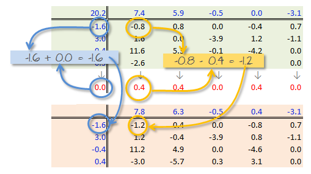

The results differ slightly from those produced using the median polish. Recall that the mean is sensitive to outliers and medians are not. 

So what can we gain from the "mean" polish? Well, as it turns out, it serves as the basis of the **two-way ANOVA**. 

### Two-way ANOVA

A two-way ANOVA assesses whether the factors (categories) have a significant effect on the outcome. Its implementation can be conceptualized as a regression analysis where each row and column level is treated as a dummy variable. The computed regression coefficients are the same as the levels computed using the "mean" polish outlined in the previous step except for one notable difference: the ANOVA adds one of the column level values and one of the row level values to the grand mean. It then subtracts those values from their respective row/column effects.

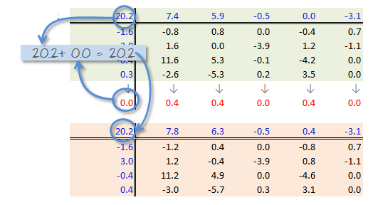

The resulting row/column levels are the regression coefficients:

```{r}
M <- lm(Deaths ~ Education + Region, dfl)
coef(M)
```

The regression formula takes on the form:

$$
\begin{split}
Deaths = 32.21 - 3.8(ed9to11) -11.25(ed12) -9.83(ed13to15) -13(ed16) \\
         -3.96(RegionNE) -0.320(RegionS)  -2.980(RegionW) + \epsilon_{ij}
\end{split}
$$

For example, to compute the first value in the raw table (death rate = 25.3) using the formula, substitute the variables as follows:

$$
\begin{split}
Deaths &= 32.21 - 3.8(0) -11.25(0) -9.83(0) -13(0)&& \\
         &-3.96(1) -0.320(0)  -2.980(0) - 3.0& \\
       &= 32.21 -3.96 -3.0&& \\
       &= 25.3&&
\end{split}
$$

To assess if any of the factors have a significant effect on the `Death` variables, simply wrap the regression with an `anova()` function.


```{r}
anova(M)
```

The results suggest that the father's educational attainment has a significant effect on infant mortality (p = 0.0025) whereas the region does not (p = 0.338).

### Visualizing a two-way ANOVA as a table

You can view the output of a two-way ANOVA as a "mean polish" table using the `eda_pol` function. Simply set the `stat` argument to `mean`. 

```{r class.source="eda", fig.width = 4.6, fig.height=2.8, eval = FALSE}
df.ano <- eda_pol(dfl, row = Region, col = Education, val = Deaths, stat = mean)
```
```{r class.source="eda", fig.width = 4.3, fig.height=2.5, echo = FALSE}
df.ano <- eda_pol(dfl, row = Region, col = Education , val = Deaths, stat = mean,
                   res.size = 0.8, row.size = 0.8, col.size = 0.8 )
```

## Summary

The median polish is a powerful exploratory tool for analyzing two-way tables, data structures where each cell represents a single value at the intersection of two categorical factors. Unlike traditional methods such as two-way ANOVA, which rely on means and are sensitive to outliers, the median polish uses medians to iteratively extract row and column effects offering a robust decomposition of the data.

In this chapter, we:

+ Introduced the structure of two-way tables and how they differ from univariate and bivariate datasets.
+ Demonstrated how to separate a one-way table into a central value and residuals.
+ Extended this idea to two-way tables using the median polish algorithm.
+ Visualized the iterative process of smoothing row and column effects.
+ Interpreted the resulting decomposition in terms of common, row, column, and residual effects.
+ Compared the median polish to its mean-based counterpart and linked it to two-way ANOVA.
+ Explored diagnostic tools for assessing additivity and identifying potential interactions.


## References

*Understanding Robust and Exploratory Data Analysis*, D.C. Hoaglin, F. Mosteller and J.W. Tukey, 1983.


