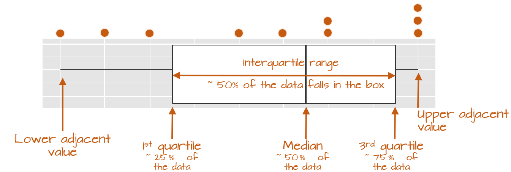
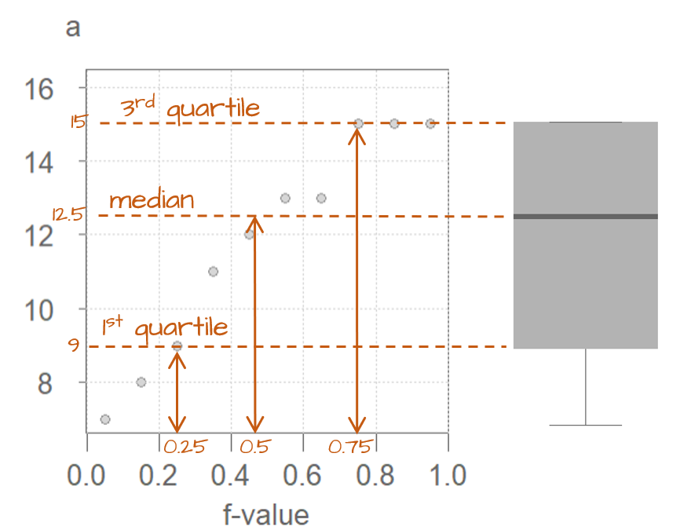

# Visualizing univariate distributions


```{r echo=FALSE, message=FALSE}
source("libs/Common.R")
```


```{r echo = FALSE}
pkg_ver(c("dplyr", "ggplot2","tidyr"))
```


## Introduction

**Univariate** data consist of measurements or observations of a single characteristic or attribute of a subject or phenomenon. Structurally, we can think of univariate as consisting of a single variable in a dataset. In this course, we will limit the variable to a *continuous* one.  Examples include a vehicle's miles-per-gallon performance, PFAS concentrations in municipal water, or the average distance between trees in a plot. 

Analyzing data benefits from characterizing its statistical properties, such as measures of central tendency and dispersion. Measures of central tendency, often reduced to single values, provide a concise summary of a dataset's typical value. While summary statistics like standard deviation and interquartile range offer insights into a batch's dispersion, they cannot fully capture the intricacies of its distribution. Visualization techniques are better suited to reveal these nuances. This chapter will introduce you to graphs designed to explore a batch's distribution. The choice of graphing technique will depend on the specific aspects of the distribution you wish to emphasize.

Going forward, we will use the terms **location**, **spread**, and **shape** to describe a batch of values. Location refers to a measure of central tendency, spread to a measure of variability, and shape to the overall form of the distribution.

```{r echo = FALSE, results = 'asis', fig.width = 4, fig.height=1}
# Uses table to generate a tabulated figure of a set of values.

#set.seed(23)
#a   <- round(runif(6, 5, 15))
#b   <- round(runif(10, 10, 20))
# a.df <- gridExtra::tableGrob(t(a), rows=NULL)
# b.df <- gridExtra::tableGrob(t(b), rows=NULL)
# gridExtra::grid.arrange(a.df, b.df, nrow = 2, ncol = 1 ,newpage = FALSE)
```


## Histograms

A histogram is one of the more ubiquitous tools for visualizing a batch's distribution. It divides the range of values into intervals, or bins, and then counts the number of observations that fall within each bin. By plotting the frequency of observations in each bin, histograms reveal the a distribution's *shape.*" For example, to create a histogram of batch `b` where each bin size covers **one** unit along the x-axis, we type:

```{r fig.height=2, fig.width=4.5}
# Generate two random variables
set.seed(23)
a   <- round(runif(50, 10, 20))
b   <- round(runif(100, 10, 20))
df  <- data.frame(Group = c(rep("a", 50), rep("b",100)), Value = c(a,b))

# Generate the histogram for batch b (note the use of b as a vector)
library(ggplot2)
ggplot(NULL , aes(x = b)) + geom_histogram(breaks = seq(9.5,20.5, by = 1), color = "white")
```

(Note that `b` does not need to be passed as a dataframe, however, a `NULL` needs to be added prior to the comma as a placeholder for *no dataframe*).

In the above example, we are explicitly defining the bin width as 1 unit, and the range as 9.5 to 20.5 via the parameter `breaks = seq(9.5,20.5, by = 1)`. The `color` argument specifies the *outline* color. To change the fill color use the `fill` argument. 

In our example, we have three values that fall in the first bin (bin ranging from 9.5 to 10.5), fourteen values that fall in the second bin (bin value ranging from 10.5 to 11.5) and so on up to the last bin which has four values falling in it (bin covering the range 19.5 to 20.5). 

We can modify the width of each bin. For example, to have each bin cover two units instead of one, type:

```{r fig.height=2, fig.width=4.5}
ggplot(as.data.frame(b), aes(x = b)) + geom_histogram(breaks = seq(9.5,20.5,by = 2), 
                                                      colour = "white") 
```

You'll note that changing bin widths can alter the *look* of the histogram, this is particularly true when plotting large batches of values.

You can also opt to have the function determine the bin width by simply specifying the *number* of bins using the `bins =` parameter. For example, to display 12 bins, type:

```{r fig.height=2, fig.width=4.5}
ggplot(as.data.frame(b), aes(x = b)) + geom_histogram(bins = 12, colour = "white")
```

Note that if a bin has no values falling in it, an empty space in the plot is used as an *empty bin" placeholder.

So far, we had the histogram display the total number of observations falling in each bin on the y-axis. This may be easy to interpret, but it may make it difficult to compare batches of values having different total number of observations. To demonstrate this, let's plot both batches `a` (which has 50 observations) and `b` (which has 100 observations) side-by-side.

```{r fig.width = 6, fig.height=3}
ggplot(df, aes(x = Value)) + geom_histogram(bins = 10) + facet_wrap(~ Group)
```

The differences in batch sizes results in differing bar heights. This has for effect of *squeezing* the bars downward in the plot for batch `a` because of it smaller batch size. This can make it difficult to compare distributions between batches. To resolve this issue, we can convert counts to density whereby the areas covered by each bin sum to `1`. Each bin's density value is computed from:

$$
density = \frac{count}{bin\ width * total\ observations}
$$

In `ggplot2` we will map the `after_stat(density)` aesthetic to the y-axis to have ggplot compute density values.

```{r fig.width = 6, fig.height=3}
ggplot(df, aes(x = Value, y=after_stat(density))) + geom_histogram(bins = 10) + 
  facet_wrap(~ Group)
```

This makes for a more appropriate comparison between batches.

## Density plots

One limitation with a histogram is its sensitivity to the number of bins chosen (as demonstrated in the above examples). It also suffers from discontinuities in its bins. Let's start with a small set of values `a`.

```{r echo = FALSE, results = 'asis', fig.width = 4, fig.height=0.5}
set.seed(23)
a  <- sort(round(runif(10, 5, 15)))
 a.df <- gridExtra::tableGrob(t(a), rows=NULL)
# b.df <- gridExtra::tableGrob(t(b), rows=NULL)
 gridExtra::grid.arrange(a.df,nrow = 1, ncol = 1 ,newpage = FALSE)
```

In the following example, two histograms are generated using the same bin sizes and counts but with different starting x values. The red marks along the x-axis show the location of each `a` observation. Note that some observations overlap. 

```{r fig.height=2, fig.width=8, echo=FALSE}
p1 <- ggplot(NULL, aes(x = a)) + geom_histogram(breaks = seq(6.5,16.5,by = 2), colour = "white") + geom_rug(col = "red", cex = 2, alpha = 0.5) +
  ggtitle("Bin starts at 6.5")
p2 <- ggplot(NULL, aes(x = a)) + geom_histogram(breaks = seq(5.8,15.8,by=2), colour = "white") + geom_rug(col = "red", cex = 2, alpha = 0.5) +
  ggtitle("Bin starts at 5.8")
gridExtra::grid.arrange(p1, p2, nrow = 1)
```

The second histogram suggests a possibly skewed shape to the distribution while the one on the left suggests a more uniform shape. 

One workaround to the histogram's limitations is to compute density values on *overlapping* bins. For example, let's take the first bin and have it count the number of values between 5 and 9 (exclusive) in `a`, then divide that number by the total number of values times the bin width--this gives us two observations falling in the bin and thus a density value of `2 / (10 * 4) = 0.05`. The following plot shows the bin. An orange dot is also added to represent the bin's midpoint.

```{r fig.height=2, fig.width=4.5, echo=FALSE}
bw <- 4
xi <- seq(min(a)-bw/2, max(a) - bw/2, by=1)

dens <- vector(length=length(xi))
for (i in seq_along(xi)) {
 dens[i] <- sum(( a >= xi[i] ) & (a < xi[i] + bw) )/ (bw * length(a))
}

dens.bins <- data.frame(xmin = xi,
                  xmax = xi + bw,
                  ymin = 0,
                  ymax=dens)

ggplot() +
  geom_rect( dens.bins[1,], mapping=aes(xmin=xmin,xmax=xmax,ymin=ymin,ymax=ymax),alpha=0.3) + 
  geom_rug( data.frame(a), mapping=aes(x=a),col="darkred", cex=2, alpha=0.5) +
  ylim(range(dens.bins[, 3:4])) +
  geom_segment(data=dens.bins[1,], aes(x=(xmin + xmax)/2, xend =(xmin + xmax)/2,
                                  y=0, yend=ymax), lty=2, alpha=0.6) +
  geom_point(dens.bins[1,], mapping=aes(x=(xmin + xmax)/2, y=ymax), col="orange", cex=2.5) +
  scale_x_continuous(lim = range(dens.bins[, 1:2]), breaks = 5:18)

```

Next, we shift the bin over by one unit, then we calculate the density of observations in the same way it was computed for the first bin. The density value is plotted as an orange dot. Note how the bin overlaps partially with the first bin.

```{r fig.height=2, fig.width=4.5, echo=FALSE}
ggplot() +
  geom_rect( dens.bins[1,], mapping=aes(xmin=xmin,xmax=xmax,ymin=ymin,ymax=ymax),alpha=0.1,col="white") +
  geom_rect( dens.bins[2,], mapping=aes(xmin=xmin,xmax=xmax,ymin=ymin,ymax=ymax),alpha=0.3) +
  geom_rug( data.frame(a), mapping=aes(x=a),col="darkred", cex=2, alpha=0.5) +
  ylim(range(dens.bins[, 3:4])) +
  geom_segment(data=dens.bins[2,], aes(x=(xmin + xmax)/2, xend =(xmin + xmax)/2,
                                  y=0, yend=ymax), lty=2, alpha=0.6) +
  geom_point(dens.bins[1:2,], mapping=aes(x=(xmin + xmax)/2, y=ymax), col="orange", cex=2.5) +
  scale_x_continuous(lim = range(dens.bins[, 1:2]), breaks = 5:18)

```

The same process is repeated for the third bin.

```{r fig.height=2, fig.width=4.5, echo=FALSE}
ggplot() +
  geom_rect( dens.bins[1:2,], mapping=aes(xmin=xmin,xmax=xmax,ymin=ymin,ymax=ymax),alpha=0.1,col="white") +
  geom_rect( dens.bins[3,], mapping=aes(xmin=xmin,xmax=xmax,ymin=ymin,ymax=ymax),alpha=0.3) + 
  geom_rug( data.frame(a), mapping=aes(x=a),col="darkred", cex=2, alpha=0.5) +
  ylim(range(dens.bins[, 3:4])) +
  geom_segment(data=dens.bins[3,], aes(x=(xmin + xmax)/2, xend =(xmin + xmax)/2,
                                  y=0, yend=ymax), lty=2, alpha=0.6) +
  geom_point(dens.bins[1:3,], mapping=aes(x=(xmin + xmax)/2, y=ymax), col="orange", cex=2.5) +
  scale_x_continuous(lim = range(dens.bins[, 1:2]), breaks = 5:18)

```

The process is repeated for each bin until the last bin is reached. (Note that some of the `a` values are duplicates such as `13` and `15`--hence the high density values for the upper range).

```{r fig.height=2, fig.width=4.5, echo=FALSE}
ggplot() +
  geom_rect( dens.bins[1:8,], mapping=aes(xmin=xmin,xmax=xmax,ymin=ymin,ymax=ymax),alpha=0.1,col="white") +
  geom_rect( dens.bins[9,], mapping=aes(xmin=xmin,xmax=xmax,ymin=ymin,ymax=ymax),alpha=0.5) + 
  geom_rug( data.frame(a), mapping=aes(x=a),col="darkred", cex=2, alpha=0.5) +
  ylim(range(dens.bins[, 3:4])) +
  geom_segment(data=dens.bins[9,], aes(x=(xmin + xmax)/2, xend =(xmin + xmax)/2,
                                  y=0, yend=ymax), lty=2, alpha=0.6) +
  geom_point(dens.bins[1:9,], mapping=aes(x=(xmin + xmax)/2, y=ymax), col="orange", cex=2.5) +
  scale_x_continuous(lim = range(dens.bins[, 1:2]), breaks = 5:18)

```

If we remove the bins and connect the dots, we end up with a **density trace**. 

```{r fig.height=2, fig.width=4.5, echo=FALSE}
ggplot() +
  geom_rug( df, mapping=aes(x=a),col="darkred", cex=2, alpha=0.5) +
  ylim(range(dens.bins[, 3:4])) +
    geom_line(dens.bins[1:9,], mapping=aes(x=(xmin + xmax)/2, y=ymax), col="black") +
  geom_point(dens.bins[1:9,], mapping=aes(x=(xmin + xmax)/2, y=ymax), col="orange", cex=2.5) +
  scale_x_continuous(lim = range(dens.bins[, 1:2]), breaks = 5:18)

```

A property associated with the density trace is that the area under the curve sums to one since each density value represents the *local* density at `x`.

In the above example, we assigned an equal weight to each point within its assigned bin--regardless how far the that point is to the bin's midpoint. This resulted in some *raggedness* to the plot. To smooth out the plot, we can apply different weights to each point such that points closest to the bin's midpoint are assigned greater weight than the ones furthest from the midpoint. A Gaussian function can be used to generate such weights. The following figure depicts the difference in weights assigned to a point based on its distance to the bin center of `6` (highlighted with a red mark in the plots).

```{r fig.height=2, fig.width=4.5, echo = FALSE}

d.rec <- density(6, from = 4, to = 8, width = 4, kernel = "rectangular")
p1 <- ggplot() +  geom_area(data = data.frame(x= d.rec$x, y= d.rec$y), mapping = aes(x,y), fill="grey") +
  geom_rug( data.frame(x=6), mapping=aes(x=x), col = "darkred", cex=2, alpha=0.5) + 
  ylim(0,.65) + ylab("weight")

d.gaus <- density(6, from = 4, to = 8, width = 2.5, kernel = "gaussian")
p2 <- ggplot() +  geom_area(data = data.frame(x= d.gaus$x, y= d.gaus$y), mapping = aes(x,y), fill="grey") +
  geom_rug( data.frame(x=6), mapping=aes(x=x), col = "darkred", cex=2, alpha=0.5) + 
  ylim(0,.65) + ylab(NULL)


gridExtra::grid.arrange(p1, p2, nrow = 1)

```

With the rectangular weight (left plot), *all* points within the bin width are assigned *equal* weight. With the Gaussian weight, points closest to the bin center are assigned greater weight than those furthest from the center. `ggplot`'s density function defaults to the Gaussian weighting strategy. The  weight type is referred to as a **kernel**.

You can generate a density plot of the data using the `geom_density` function.

```{r fig.height=2, fig.width=4.5}
set.seed(23)
a  <- sort(round(runif(10, 5, 15)))

ggplot(NULL, aes(x = a)) + geom_density(fill = "grey60")
```

This plot appears much smoother than the one created in the above demonstration. This is because the density function generates 512 points for its density trace as opposed to the seven points used in the above demonstration.

The function adopts the `gaussian` weight function and will automatically define the bandwidth (analogous in concept to the bin width). 

To adopt a rectangular weight, set the `kernel` parameter to `"rectangular"`.

```{r fig.height=2, fig.width=4.5}
ggplot(df, aes(x = a)) + geom_density(fill = "grey60", kernel = "rectangular")
```

Note the raggedness in the plot.

You can modify the *smoothness* of the density plot by adjusting its bandwidth argument `bw`. Here, the bandwidth defines the standard deviation of the Gaussian function.

```{r fig.height=2, fig.width=4.5}
ggplot(df, aes(x = a)) + geom_density(fill = "grey60", bw = 1)
```

## Boxplots

A boxplot is another popular plot used to explore distributions. It emphasizes a measure of location (typically the median), and two measures of spread--the interquartile range and the overall range (excluding any outliers). 

In `ggplot2` we can use the `geom_boxplot()` function. For example,

```{r fig.height=1.2, fig.width=6.5}
ggplot(df, aes(x = a)) + geom_boxplot() + 
          xlab(NULL) + theme(axis.text.y = element_blank(), 
                             axis.ticks.y = element_blank()) 
```

The `geom_boxplot` function can map the values to the x-axis or to the y-axis. Traditionally, it's mapped to the y-axis. Here, we choose to map it to the x-axis. You'll note the optional functions `xlab(NULL) + theme(axis.text.y=element_blank(), ... )` added to the code chunk; these are added to suppress labels and values/tics along the y-axis given that their default values do not serve a purpose here.

The following figure describes the anatomy of a boxplot.




The boxplot provides us with many meaningful pieces of information. For example, it gives us a center value: the median. It also tells us where the middle 50% of the values lie (in our example, approximately 50% of the values lie between 9.5 and 14.5). This range is referred to as the **interquartile** range (or **IQR** for short). Note that this is only an approximation given that some datasets may not lend themselves well to defining exactly 50% of their central values. For example, our batch only has four data points falling within the interquartile range (instead of five) because of tied values in the upper end of the distribution.

The long narrow lines extending beyond the interquartile range are referred to as the **adjacent values**--you might also see them referred to as **whiskers**. They represent either 1.5 times the width between the median and the nearest interquartile value *or* the most extreme value, whichever is closest to the batch center.

Sometimes, you will encounter values that fall outside of the lower and/or upper adjacent values; such values are often referred to as **outliers**.

### Not all boxplots are created equal!

Not all boxplots are created equal. There are many different ways in which quantiles can be defined. For example, some will compute a quantile as $( i - 0.5) / n$ where $i$ is the n^th^ element of the batch of data and $n$ is the total number of elements in that batch. This is the method implemented by the base R's `boxplot` function; this explains its different boxplot output compared to `geom_boxplot` in our working example:

```{r, fig.height=1.4, fig.width=6.5, echo=2}
OP <- par(mar=c(2,1,1,1), bty="n")
boxplot(a, horizontal = TRUE)
grid(lty = 1, col = "grey90")
boxplot(a, horizontal = TRUE, add = TRUE)
par(OP)
```

The upper and lower quartiles differ from those of `ggplot` since the three upper values values, `15`,  end up falling inside the interquartile range following the aforementioned quantile definition. This eliminates any upper whiskers.  In most cases, however, the difference will not matter as long as you *adopt the same boxplot procedure when comparing batches*. Also, the difference between the plots become insignificant with larger batch sizes.

### Implementing different quantile types in `geom_boxplot`

If you wish to implement different quantile methods in `ggplot`, you will need to create a custom function. For example, if you wish to adopt quantile method referenced in the last section, (`type = 5` in the `quantile` function) type the following:

```{r fig.height=1.2, fig.width=6.5}
# Function to extract quantiles given an f-value type (type = 5 in this example)
qtl.bxp <- function(x, type = 5) {
  qtl <- quantile(x, type = type)
   df <- data.frame(ymin  = qtl[1], ymax = qtl[5], 
                    upper = qtl[4], lower = qtl[2], middle = qtl[3])
}

# Plot the boxplot
ggplot(df, aes(x = "", y = a)) + 
  stat_summary(fun.data = qtl.bxp, fun.args = list(type = 5),
               geom = 'boxplot') +
  xlab(NULL) + theme(axis.text.y = element_blank()) +
  coord_flip()

```

Note the use of `stat_summary` instead of `geom_boxplot`. 

## Quantile plots

A **quantile** is a value that divides a set of data into two parts such that a specified fraction, $f-value$, of the data falls below that value, and the remaining fraction falls above it. 

The x-axis in a quantile plot shows the $f-values$--the full range of probability *fractions*. $f$ maye be used as a shorthand for the $f-value$. In other texts, you may see the fraction symbolized by $p$ for *probability*. The y-axis is the $f-quantile$, $q(f)$, which gives us the value that is equal to or less than the associated $f$-value fraction. For example, the $f$-value of 0.25 (~the 25^th^ percentile) is associated with the $q(f)$ value of 9 meaning that 25% of the values in the dataset have values of 9 or less. 

```{r fig.height=3, fig.width = 3, echo=FALSE}
i     <- 1 : length(a)          # Create indices
f.val <- (i - 0.5) / length(a)  # Compute the f-value
dfa <- data.frame( f.val, a = sort(a) )
eda_lm(dfa, f.val, a, xlab = "f-value", show.par = F, mean.l = F, sd=F, reg=F)
OP <- par(mar=c(0,0,0,0))
  segments(x0=0.25, y0=6.7, x1 =0.25, y1=8.5, lty = 3, col = "red", lwd = 3)
  segments(x0=0, y0=9, x1 =0.22, y1=9, lty = 3, col = "red", lwd = 3)
  points(x=0.25, y=9, pch = 1, cex = 3, col = "red", lwd=3)
  grid()
par(OP)
```

The quantile need not be limited to existing values in a batch. The quantile function is continuous within the batch's range.  Continuing with the working example, we can find the matching quantile for an $f-value$ of 0.5 by interpolating between the two nearest points in `a`. This results with a quantile value of 12.5.

```{r fig.height=3, fig.width = 3, echo=FALSE}
eda_lm(dfa, f.val, a, xlab = "f-value", show.par = F, mean.l = F, sd=F, reg=F)
OP <- par(mar=c(0,0,0,0))
  segments(x0=0.5, y0=6.7, x1 =0.5, y1=12.0, lty = 3, col = "red", lwd = 3)
  segments(x0=0, y0=12.5, x1 =0.47, y1=12.5, lty = 3, col = "red", lwd = 3)
  points(x=0.5, y=12.5, pch = 1, cex = 3, col = "red", lwd=3)
  grid()
par(OP)
```

The boxplot covered in the last section is a special case of the $f$-quantile function in that it only returns the 1^st^, 2^nd^ (median) and 3^rd^ quartiles. The $f$-quantile returns the *full* range of quantile values. The quantile is directly related to the concept of a percentile: it identifies the fraction of the batch of numbers that is less than a value of interest.  The following figure describes the anatomy of a quantile plot. 



### Computing the $f$-quantile

 Computing $f$ requires that the batch of numbers be ordered from smallest to largest.

```{r}
a.o <- sort(a)
a.o
```

With the numbers sorted, we can proceed with the computation of $f$ following *Cleveland's* method:

$$
f_i = \frac{i - 0.5}{n} 
$$

where $i$ is the n^th^ element of the batch of data and $n$ is the total number of elements in that batch. As noted in the Boxplots section of this chapter, there are many ways one can compute a quantile, however, the differences may not matter much when working with large batches of values.

For each value in `a`, the $f$ value is thus:

```{r}
i     <- 1 : length(a)          # Create indices
f.val <- (i - 0.5) / length(a)  # Compute the f-value
a.fi  <- data.frame(a.o, f.val) # Create dataframe of sorted values
```

Note that in the last line of code, we are appending the ordered representation of `a` to `f.val` given that `f.val` assumes an ordered dataset. The data frame `a.fi` should look like this:

```{r echo = FALSE, results='asis'}
pander::pandoc.table(a.fi, justify = 'left')
```

It may be desirable at times to find a value associated with a quantile that might not necessarily match an exact value in our batch. For example, there is no value in `a` associated with a quantile of $0.5$; this is because we have an even number of values in our dataset. The solution is to interpolate a value based on a desired quantile. The `quantile()` function does just that. For example, to find the value associated with a quantile of $0.5$, type:

```{r}
quantile(a, 0.5)
```

If we want to get quantile values for multiple fractions, simply wrap the fractions with the `c()` function:

```{r}
quantile(a, c(0.25, 0.5, 0.75))
```

The `quantile` function is designed to accept different quantile methods. To see the list of algorithm options, type `?quantile` at a command prompt. By default, R adopts algorithm `type = 7`. To adopt Cleveland's algorithm, set `type = 5`. E.g.:

```{r}
quantile(a, c(0.25, 0.5, 0.75), type = 5)
```

Note the difference in the upper quartile value compared to the default `type = 7`.

### Creating a quantile plot

A batch's quantile is best viewed as a plot where we plot the values as a function of the $f$-values:

```{r fig.height=3, fig.width=3}
ggplot(a.fi, aes(x = f.val, y = a.o)) + geom_point() + xlab("f-value")
```

#### Using ggplot's `qq` geom

If you did not want to go through the trouble of computing the $f$-values and the dataframe `a.fi`, you could simply call the function `stat_qq()` as in:

```{r fig.height=3, fig.width=3}
ggplot(df, aes(sample = a)) + stat_qq(distribution = qunif) + xlab("f-value")
```

However, ggplot's `stat_qq` function does not adopt Cleveland's $f$-value calculation. Hence, you'll notice a slight offset in position along the x-axis. For example, the third-to-last point has an $f$-value of `0.744` instead of an $f$-value of `0.75` as calculated using Cleveland's method.

Also note the change in mapping parameter: `sample = a`. We are no longer specifying the axis to map to. Instead, we are passing the **sample** to the `stat_qq` function which then chooses to map the sorted `a` values to the y-axis.

## How quantile plots behave in the face of skewed data

It can be helpful to simulate distributions of difference skewness to see how a quantile plot may behave. In the following figure, the top row shows the different density distribution plots and the bottom row shows the **quantile plots** for each distribution (note that the x-axis maps the f-values).


```{r, echo=FALSE, fig.width=9,fig.height=4}
# q.q function
# =============
# Function will generate q-q  plot and line
# given two vectors: a (y-axis) and b (x-axis)

q.q <- function(a,b, lin=TRUE){
  probs <-  c(0.25, 0.75)
  la <- length(a)
  lb <- length(b)
  a  <- sort(a)
  b  <- sort(b)
  fa <- ( 1:la - 0.5) / la
  fb <- ( 1:lb - 0.5) / lb
  if (la < lb) {
    b <- approx(fb, b, fa)$y 
  } else if( la > lb) {
    a <- approx(fa, a, fb)$y
  } else{}
  y <- quantile(a,probs)
  x <- quantile(b,probs)
  slope <- diff(y)/diff(x)
  int <- y[1] - slope * x[1]
  plot(a ~ b, cex=0.7, pch=20, col="blue")
  if (lin == TRUE) {
    abline(int,slope)
  }
}

#################
# Quantile plots
#################

# Set sample size and compute uniform
# values

n  <- 1000 # Number of simulated samples
fi <- (1:n - 0.5)/n
b.shp1 <- c(1, 5 , 50, 10, 10)
b.shp2 <- c(10,  10 , 70, 5, 1)

# Generate quantile plots (uniform q-q)

b  <- fi

OP <- par( mfcol = c(2,5), mar = c(2,2,1,1) )
for (i in 1:5 ) {
  a <- qbeta(fi,shape1=b.shp1[i], shape2 = b.shp2[i])
  plot(density(a),main=NA,xlab=NA)
  q.q(a,b, lin=FALSE)
}
par(OP)
```

